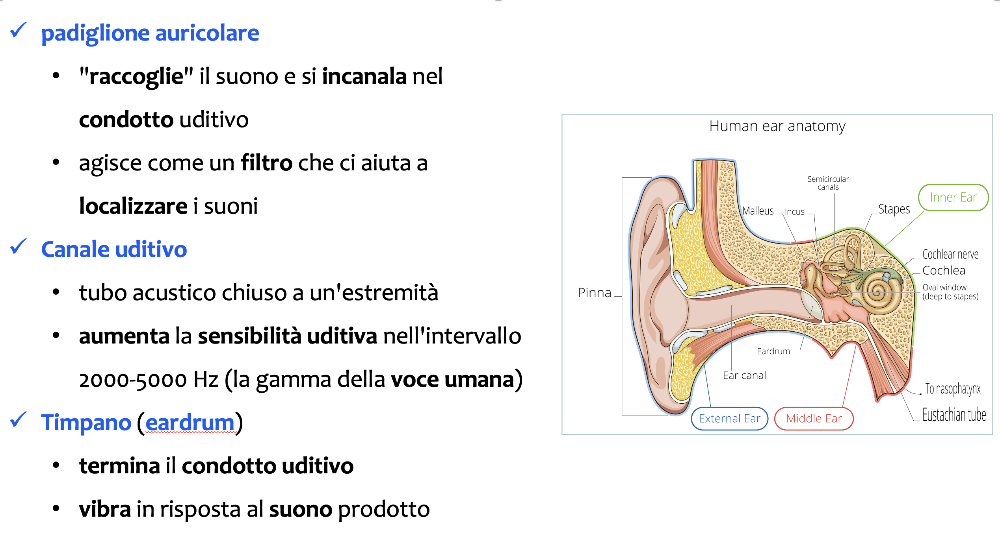
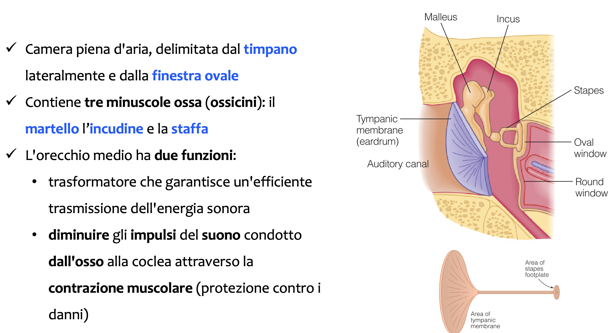
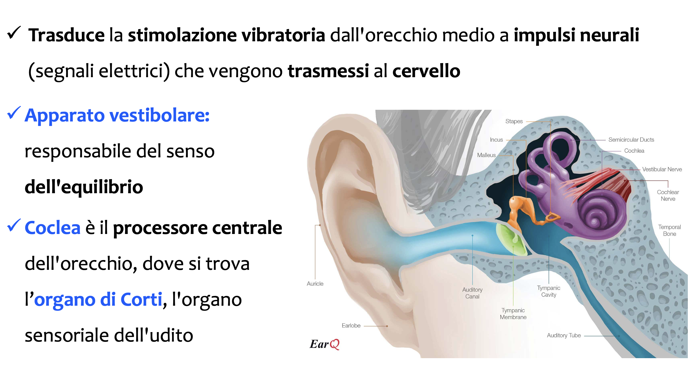
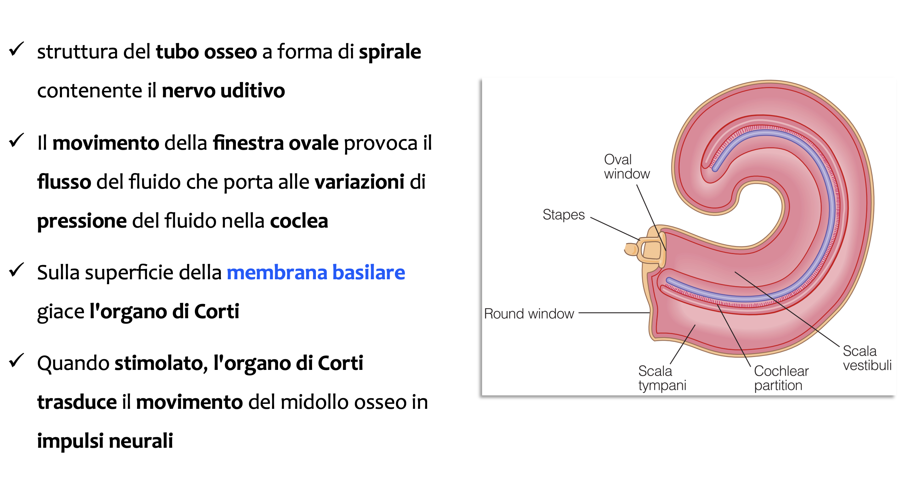
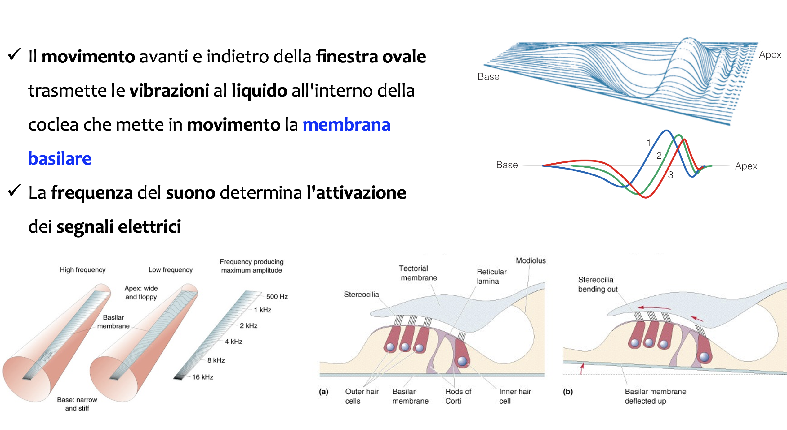
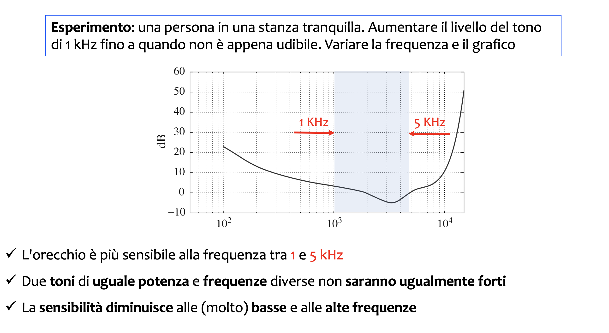
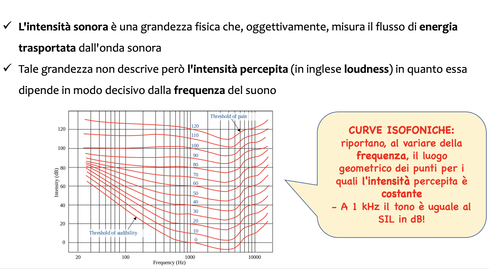

Il suono
=====
---

##### Introduzione

Il suono è una parte integrante della nostra vita. È uno dei modi più importanti per percepire il mondo che ci circonda. Inoltre, è fondamentale per la nostra comunicazione con l’ambiente e con gli altri esseri umani. È anche un mezzo di espressione e di esperienza artistica, sotto forma, ad esempio, di musica. Per la maggior parte di noi, sarebbe difficile immaginare una vita senza suono.

Il suono viene spesso definito come una sensazione uditiva o come la perturbazione in un mezzo che provoca tale sensazione. Come fenomeno fisico, che è il modo in cui lo considereremo qui, il suono si riferisce a onde che originano in un punto e si propagano attraverso un mezzo fino a raggiungere un altro punto, dove possono essere udite o misurate. Queste onde sonore viaggiano in solidi, liquidi e gas, e si presentano in due forme: longitudinali e trasversali. Nelle onde longitudinali, lo spostamento del mezzo avviene nella direzione di propagazione dell’onda, mentre nelle onde trasversali, lo spostamento è ortogonale alla direzione di propagazione. Entrambi i tipi di onde causano variazioni di pressione, misurate in un singolo punto, che possono provocare una sensazione uditiva. Le onde sonore possono essere generate da corpi in vibrazione, cambiamenti nel flusso d’aria, fonti di calore, ecc. È chiaro quindi che nella creazione e propagazione del suono sono coinvolti alcuni principi fisici.

I capitoli seguenti trattano ciò che viene chiamato elaborazione audio, ovvero la teoria e i metodi per l’elaborazione dei segnali audio. I segnali audio si riferiscono semplicemente a segnali sonori udibili, mentre un segnale è qualcosa che viene misurato nel tempo (e/o nello spazio). Questo qualcosa, in questo contesto, è la pressione, perché ciò che percepiamo con le nostre orecchie sono variazioni di pressione. Cosa significa allora elaborazione? L’elaborazione si riferisce a qualsiasi operazione che possiamo voler fare con o sui segnali audio. Potremmo voler manipolare i segnali audio per scopi artistici, per creare musica; potremmo voler comprimere i segnali di parlato o musicali per consentirne la trasmissione (come in Skype o nei nostri smartphone) o per immagazzinarli in modo efficiente (come nei formati mp3, OGG o AAC); potremmo voler identificare chi sta parlando o cosa sta dicendo, determinare da dove proviene un suono, e così via. Nella tecnologia dei media, un esempio di elaborazione audio potrebbe essere un metodo per far sì che un parlato registrato per un videogioco suoni come se fosse pronunciato in un determinato ambiente acustico o da una certa angolazione. Potrebbe anche includere metodi per generare automaticamente contenuti, come musica di sottofondo e suoni ambientali, per un videogioco, oppure effetti audio per performance musicali dal vivo o strumenti per registrare e produrre musica.

Prima di approfondire l’elaborazione audio, è importante comprendere la natura dei segnali audio. Inizieremo quindi con l'esplorazione del suono come fenomeno fisico.

## La fisica del suono

La fisica del suono è una branca della scienza che si occupa dello studio delle onde sonore, della loro propagazione e delle loro interazioni con l’ambiente circostante. Il suono è un fenomeno onnipresente nella nostra vita quotidiana, essenziale per la comunicazione e l’interazione con il mondo. Comprendere la fisica del suono significa analizzare le sue proprietà fondamentali, come la natura ondulatoria, la velocità, la frequenza, l’ampiezza e l’energia che le onde sonore trasportano.

Sul piano percettivo, il suono è una sensazione uditiva provocata da una variazione della pressione dell’aria. L’onda sonora generata dalla vibrazione di un corpo elastico arriva al nostro orecchio dopo aver viaggiato lungo un altro materiale elastico (nella nostra esperienza più comune l’aria). Gli elementi necessari perché si verifichi un suono sono dunque tre:
- la sorgente sonora (il corpo vibrante)
- il mezzo di trasmissione dell’onda sonora (l’ambiente, anche non omogeneo, dove il suono si propaga)
- il ricevitore (l’ orecchio e il cervello)

Della natura delle vibrazioni e delle onde sonore e della loro propagazione nel mezzo si occupa la `acustica fisica`, del rapporto tra onda sonora e il ricevente (il sistema orecchio – cervello), e quindi di come l’uomo interpreta i segnali acustici, si occupa la `psicoacustica`.

##### La trasmissione del suono

Il suono è un’onda meccanica che si propaga attraverso un `mezzo`, sia esso solido, liquido o gassoso. A differenza delle onde elettromagnetiche, come la luce, le onde sonore hanno bisogno di un mezzo per spostarsi e non possono propagarsi nel vuoto. La propagazione del suono avviene per mezzo di `vibrazioni` che si trasmettono da una particella all’altra all’interno del mezzo: quando un oggetto vibra, genera una serie di `compressioni` e `rarefazioni` nell’aria circostante (o in altri mezzi), producendo l’onda sonora.

Nel contesto del suono e della fisica, le onde si distinguono in `onde longitudinali` e `onde trasversali` e si caratterizzano per la direzione del movimento delle particelle rispetto alla propagazione dell’onda:

- `Onde Longitudinali`: Le onde sonore sono generalmente onde longitudinali, dove le particelle del mezzo (ad esempio, aria, acqua o solido) vibrano parallelamente alla direzione di propagazione dell’onda. Le onde sonore si propagano creando regioni di compressione (dove le particelle sono più dense) e rarefazione (dove le particelle sono meno dense). Un esempio comune è il suono che viaggia nell’aria: quando un oggetto vibra, genera onde di compressione e rarefazione che si propagano attraverso il mezzo.
- `Onde Trasversali`: Le onde trasversali, invece, sono caratterizzate dal fatto che le particelle del mezzo oscillano perpendicolarmente alla direzione di propagazione dell’onda. Sebbene questo tipo di onda non rappresenti il modo comune con cui il suono si propaga nei fluidi come l’aria o l’acqua, può essere osservato nei solidi, dove onde di taglio possono propagarsi attraverso il materiale con le particelle che si muovono perpendicolarmente alla direzione dell’onda.

In sintesi, il suono nell’aria è principalmente un fenomeno longitudinale, mentre le onde trasversali sono più comuni in contesti come le onde sismiche o le vibrazioni in corde tese.

Un esempio classico di onde sonore longitudinali è il suono che si propaga nell’aria. Quando si parla, si emette un suono facendo vibrare le corde vocali, che a loro volta creano compressioni e rarefazioni nelle molecole d’aria.

Le particelle d’aria oscillano avanti e indietro parallelamente alla direzione in cui l’onda sonora si propaga, caratterizzando così il suono come un’onda longitudinale. Nell'immagine qui sotto si rappresentano le onde sonore longitudinali attraverso un grafico (realistico) di spostamento delle particelle per evidenziare le dinamiche dell’onda.

```{image} images/onda_longitudinale.png
:alt: long
:class: bg-primary mb-1
:width: 600px
:align: center
```

Un esempio comune di onde trasversali è la propagazione delle onde sulla superficie dell’acqua. In queste onde, le particelle d’acqua si muovono perpendicolarmente alla direzione di propagazione dell’onda stessa. Quando si getta un sasso in uno stagno, si osservano onde che si propagano verso l’esterno formando cerchi concentrici, mentre le particelle d’acqua oscillano su e giù. Altri esempi includono:
- Onde elettromagnetiche (come la luce e le onde radio), dove i campi elettrici e magnetici oscillano perpendicolarmente alla direzione di propagazione.
- Onde su una corda: Se si scuote una corda tesa su e giù, le onde viaggiano lungo la corda, ma il movimento delle particelle della corda è perpendicolare alla direzione dell’onda.

##### Velocità e propagazione del suono nei diversi materiali

Le onde più semplici sono quelle sinusoidali, formate da creste e da ventri. Se facciamo riferimento alle onde sull'acqua, le creste sono zone in cui il livello dell'acqua è più alto rispetto alla superficie in quiete e i ventri sono zone in cui il livello è più basso. La distanza fra due creste successive (o ventri) è la `lunghezza d'onda`. Quando l'onda si propaga nell'acqua, i punti del liquido perturbati dall'onda hanno un movimento periodico lungo la verticale. Si chiama ampiezza dell'onda lo spostamento massimo di un punto dalla sua posizione di equilibrio.

Il `periodo` dell'onda è l'intervallo di tempo che intercorre fra il passaggio di due creste successive (o due ventri) per lo stesso punto. In un mezzo omogeneo l'onda si propaga con velocità costante; il periodo, che indichiamo con T, è il tempo che l'onda impiega a percorrere una lunghezza d'onda. Perciò la velocità dell'onda è:
$$v=\frac{\lambda}{T}$$

La `frequenza` dell'onda $f$, invece, indica quante volte un punto dell'acqua oscilla in un secondo. Poiché la frequenza è il reciproco del periodo ($f= 1/T$), possiamo anche scrivere l'equazione fondamentale di un'onda come:

```{image} images/velocita-onda.png
:alt: long
:class: bg-primary mb-1
:width: 500px
:align: center
```

Il diagramma seguente mostra in forma grafica la relazione fra la lunghezza d’onda e la frequenza nel campo dell’udibile, cioè fra 20 e 20000 Hz (intervallo di notevole interesse applicativo poiché rappresenta l’intervallo di udibilità dell’Uomo medio).

```{image} images/freq_lambda.png
:alt: long
:class: bg-primary mb-1
:width: 500px
:align: center
```

Si osservi come a 20 Hz, frequenza minima udibile, la lunghezza d’onda corrispondente sia di $17 m$ mentre a $20.000 Hz$ è di $17 mm$. Queste dimensioni sono importanti nel valutare le interazioni che le onde acustiche hanno con la materia.

Il suono può propagarsi in vari mezzi, e le sue caratteristiche variano in base alla natura del mezzo attraversato:
- Nei `gas` (come l’aria): La velocità del suono dipende dalla temperatura e dalla densità del gas. Più alta è la temperatura, maggiore è la velocità del suono, poiché le particelle si muovono più velocemente e trasferiscono l’energia delle onde sonore in modo più efficiente.
- Nei `liquidi` (come l’acqua): La velocità del suono è generalmente superiore rispetto ai gas, poiché le molecole sono più vicine tra loro, facilitando la trasmissione delle onde sonore. Nell’acqua, ad esempio, la velocità del suono è di circa 1500 metri al secondo, quasi quattro volte superiore rispetto all’aria.
- Nei `solidi` (come i metalli o il legno): Nei materiali solidi, le particelle sono ancora più vicine rispetto ai liquidi, quindi il suono si propaga con una velocità ancora maggiore. Ad esempio, nel ferro la velocità del suono può raggiungere circa 5000 metri al secondo.

Nella tabella si riportano alcuni valori della velocità $v$ in m/s per alcune sostanze a temperatura ambiente.

```{image} images/tabella-velocita.png
:alt: long
:class: bg-primary mb-1
:width: 700px
:align: center
```


##### Riflessione, rifrazione e diffrazione del Suono

Le onde sonore possono subire vari fenomeni fisici quando incontrano ostacoli o cambiano mezzo:

- `Riflessione`: Avviene quando un’onda sonora colpisce una superficie e viene rimandata indietro. Questo fenomeno è alla base dell’eco. Quando un’onda sonora colpisce una superficie dura, come una parete di cemento, parte dell’energia viene riflessa, mentre il resto viene assorbito o trasmesso.
- `Rifrazione`: Si verifica quando un’onda sonora passa da un mezzo all’altro e cambia velocità, causando una deviazione della sua traiettoria. Questo effetto è evidente nell’acqua, dove i suoni possono sembrare più vicini o lontani in base alla temperatura e alla densità del mezzo.
- `Diffrazione`: È il fenomeno per cui un’onda sonora riesce a aggirare un ostacolo o a propagarsi attraverso un’apertura, permettendo di sentire suoni anche se non si trova direttamente in linea con la sorgente sonora.

Quando un'onda sonora che si sta propagando in un mezzo materiale incontra la superficie di separazione di un altro mezzo, si possono verificare tre fenomeni: l'onda si riflette; l'onda si trasmette nel secondo mezzo; l'onda viene assorbita dal secondo mezzo. In genere, i tre fenomeni sono presenti contemporaneamente, però uno solo prevale sugli altri due e perciò si parla di riflessione, trasmissione o assorbimento del suono. Per esempio, l'onda sonora che incide su una parete rocciosa viene riflessa e il suono resta nello stesso mezzo da cui proviene. Le onde sonore possono essere trasmesse attraverso un mezzo; per esempio, in un appartamento, il suono è trasmesso attraverso le pareti, i pavimenti, le porte. Infine, se il suono arriva su un materiale che non possiede le caratteristiche di elasticità necessarie, non riesce a propagarsi e in questo caso prevale l'assorbimento. I materiali che si comportano in questo modo sono detti materiali fonoassorbenti. Alcuni esempi di materiali fonoassorbenti sono la moquette, la lana di vetro, il sughero.

Se l'onda sonora incide in direzione perpendicolare alla superficie riflettente torna indietro nella stessa direzione. Se invece la direzione di propagazione dell'onda incidente non coincide con la perpendicolare alla superficie riflettente, l'onda riflessa si propaga in una direzione che forma con la stessa perpendicolare un angolo $r$ uguale a quello di incidenza $i$ (vedi figura).

```{image} images/onda-incid.png
:alt: onda
:class: bg-primary mb-1
:width: 200px
:align: center
```

La velocità dell'onda incidente è uguale a quella dell'onda riflessa, perché l'onda viaggia nello stesso mezzo. Poiché la frequenza è fissa, per l'equazione dell'onda $v =\lambda f$. Questo ci assicura che la lunghezza dell'onda riflessa è identica alla lunghezza d'onda incidente. L'eco è l'esempio più noto di riflessione di onde sonore. Quando lanciamo un grido davanti a una parete verticale posta a opportuna distanza, la parete riflette una parte dell'onda acustica lungo la direzione di incidenza. Dopo qualche istante riceviamo il grido di ritorno, cioè l'eco.
Poiché la velocità del suono è costante, il tempo che impiega per andare e tornare dalla parete riflettente si calcola con la formula:
$$t=\frac{2d}{v}$$
dove $d$ è la distanza della parete (vedi figura).

```{image} images/eco.png
:alt: eco
:class: bg-primary mb-1
:width: 600px
:align: center
```

Perché in una normale stanza non sentiamo l'eco? Per spiegare questo fatto bisogna tener presente che l'orecchio umano distingue due suoni solo se essi gli giungono distanziati nel tempo di almeno un decimo di secondo. Perciò il suono incidente e quello riflesso sulla parete saranno percepiti come distinti solo se il tempo impiegato dal suono per andare e tornare dalla parete è maggiore di un decimo di secondo. Con una velocità di 340 m/s, in un decimo di secondo il suono percorre 34 m.

##### La Percezione del suono e la psicoacustica

La percezione del suono coinvolge sia la fisica che la biologia. Il nostro sistema uditivo è progettato per captare onde sonore e convertirle in segnali nervosi interpretati dal cervello. Il modo in cui percepiamo il suono è influenzato da molteplici fattori, tra cui:

- `Intensità`: Il volume percepito dipende dall'ampiezza dell’onda sonora. Tuttavia, il nostro orecchio non percepisce le variazioni di intensità in modo lineare, poiché è più sensibile a certe frequenze (specialmente tra i 2.000 e i 5.000 Hz).
- `Frequenza`: Le frequenze comprese tra 20 Hz e 20.000 Hz sono quelle che l’orecchio umano è in grado di percepire. Tuttavia, con l’età, la capacità di udire le frequenze più alte tende a diminuire.
- `Timbro`: È la caratteristica del suono che ci permette di distinguere tra diversi strumenti musicali, anche se suonano la stessa nota. Il timbro dipende dalla presenza di armoniche e dal modo in cui si combinano con la frequenza fondamentale.

La fisica del suono rappresenta una combinazione affascinante di principi scientifici e applicazioni pratiche, che spaziano dalla musica all’ingegneria acustica, dalla medicina alla tecnologia delle comunicazioni. Comprendere questi principi fondamentali è il primo passo per esplorare in profondità il mondo dell’acustica e le sue infinite possibilità.


## Le onde sonore

##### Caratteristiche delle onde sonore

Le onde sonore possono essere descritte tramite alcune caratteristiche fondamentali:

- `Frequenza` ($f$): È il numero di oscillazioni complete dell’onda in un secondo, misurata in Hertz (Hz). La frequenza determina l’altezza del suono percepito: suoni con frequenze più alte vengono percepiti come acuti, mentre suoni con frequenze più basse vengono percepiti come gravi.
- `Ampiezza` ($A$): È la misura dell’intensità dell’onda sonora, corrispondente alla quantità di energia trasportata. Un’onda sonora con una maggiore ampiezza sarà percepita come più forte, mentre un’onda con un’ampiezza minore sarà più debole. L’ampiezza si manifesta nell’oscillazione delle particelle nel mezzo di propagazione.
- `Lunghezza d’onda` ($\lambda$): È la distanza tra due punti consecutivi che si trovano nella stessa fase dell’onda (ad esempio, due compressioni successive). La lunghezza d’onda è inversamente proporzionale alla frequenza: quando la frequenza aumenta, la lunghezza d’onda diminuisce e viceversa.
- `Velocità del suono` ($v$): La velocità con cui un’onda sonora si propaga dipende dal mezzo attraversato e dalla sua temperatura. Nel caso dell’aria, a temperatura ambiente (circa 20°C), la velocità del suono è di circa 343 metri al secondo. Nei solidi, il suono si propaga più velocemente rispetto ai liquidi e ai gas, poiché le particelle sono più vicine tra loro, facilitando la trasmissione delle vibrazioni.


##### Potenza e intensità sonora
La fisica elementare introduce i concetti di energia, potenza, forza, pressione e intensità nella fisica, con particolare attenzione alle loro definizioni e applicazioni.

1. `Energia`. L’energia è la capacità di un sistema di compiere lavoro o di produrre cambiamenti nel sistema stesso o nell’ambiente circostante. È una grandezza scalare e può assumere diverse forme, come energia cinetica (associata al movimento), energia potenziale (associata alla posizione in un campo di forza), energia termica, elettrica, chimica, ecc.
   - L’unità di misura dell’energia nel Sistema Internazionale (SI) è il joule ($J$).
	- Esempio: L’energia immagazzinata in una molla compressa è un esempio di energia potenziale, mentre l’energia che possiede un oggetto in movimento è energia cinetica.

2. `Potenza`. La potenza è la quantità di energia trasferita o convertita per unità di tempo. In altre parole, misura la velocità con cui viene compiuto il lavoro o viene trasformata l’energia.
	- L’unità di misura della potenza è il watt ($W$), dove $1$ watt equivale a $1$ joule al secondo ($1\,W = 1\,J/s$).
	- Esempio: Una lampadina da 60 watt consuma 60 joule di energia ogni secondo per illuminare.

3. `Forza`. La forza è un’azione che può causare l’accelerazione di un oggetto con massa. È una grandezza vettoriale, il che significa che ha una direzione e un’intensità. Le forze possono provocare il movimento di un corpo, modificarne la velocità o deformarlo.
	- L’unità di misura della forza è il newton ($N$), dove $1$ newton è definito come la forza necessaria per accelerare un chilogrammo di massa di un metro al secondo quadrato ($1\, N = 1\, kg\cdot m/s^2$).
	- Esempio: La forza di gravità che agisce su un oggetto è il peso, e viene calcolata come la massa dell’oggetto moltiplicata per l’accelerazione gravitazionale.

4. `Pressione`. La pressione è la forza esercitata per unità di superficie. È una grandezza scalare che indica quanto intensamente una forza è distribuita su una determinata area.
	- L’unità di misura della pressione è il pascal ($Pa$), dove $1$ pascal equivale a 1 newton per metro quadrato ($1\, Pa = 1\, N/m^2$).
	- Esempio: La pressione atmosferica è la forza che l’aria esercita sulla superficie terrestre, dovuta al peso della colonna d’aria sopra di essa.

5. `Intensità`. L’intensità è una misura della potenza trasferita per unità di area. Nella fisica del suono, l’intensità acustica rappresenta la potenza dell’onda sonora che attraversa un’unità di superficie perpendicolare alla direzione di propagazione.
	- L’unità di misura dell’intensità è il watt per metro quadrato ($W/m^2$).
	- Esempio: L’intensità di un suono aumenta quando aumenta l’energia dell’onda sonora, come quando si alza il volume di un altoparlante.

Questi concetti sono collegati tra loro: la forza può generare pressione, l’energia può essere trasferita attraverso la potenza, e l’intensità può descrivere l’energia trasportata per unità di superficie.

L'`ampiezza` dell'oscillazione è il parametro più significativo per l'intensità di un suono, cioè l'energia trasportata dall'onda. L'ampiezza di un suono viene misurata in un certo punto dello spazio interessato al passaggio dell'onda. Le particelle d'aria sulla traiettoria dell'onda oscillano rispetto alla posizione di equilibrio: maggiore è l'energia trasportata dall'onda, maggiore sarà lo spostamento della particella d'aria. Una misurazione intuitiva dell'ampiezza è data quindi dall'entità dello spostamento di una particella d'aria nel punto considerato. Tuttavia, questo tipo di misura dà luogo a inconvenienti, in quanto è molto piccola per la maggior parte dei suoni ordinari e la strumentazione non riesce a rilevarla. Esistono altri due tipi di misura a cui si fa di solito riferimento, e che sono strettamente legati: uno è la pressione sonora dell'aria dovuta alla compressione e rarefazione delle particelle (si parla di livello di pressione sonora, o Sound Pressure Level - SPL), l'altro è l'intensità sonora dovuta all'energia trasportata dall'onda sonora (si parla di livello di intensità sonora, o Sound Intensity Level - SIL). 

Partiamo dalla pressione sonora. La misura dell'ampiezza di pressione prende in esame la variazione di pressione dell'aria (rispetto alla pressione atmosferica) dovuta a un'onda sonora. Il silenzio puro corrisponde alla pressione atmosferica, la quale varia in modo cosi lento rispetto all'intervento di un'onda sonora da poter essere considerata una costante; un qualsiasi suono causa una variazione di pressione rilevabile. Anche in questo caso la grandezza misurata è irrisoria rispetto alla pressione atmosferica a cui siamo abituati (le variazioni si aggirano intorno a un milionesimo, cioè 1/1.000.000 = 1/10°, della pressione atmosferica). Nonostante ciò, tale quantità è facilmente misurabile con i diaframmi dei microfoni, che, come il timpano dell'orecchio, sono molto sensibili anche a differenze minime di pressione. 

Iniziamo ora un breve percorso tecnico che, a partire dalla pressione, arriverà a farci comprendere il significato dell'unità di misura comunemente adottata per l'ampiezza, il decibel (dB). Oltre ad alcune nozioni elementari di fisica, occorre far ricorso alla matematica dei logaritmi. La pressione è la forza applicata su una superficie, e quindi viene misurata come la forza per superficie unitaria.  Per avere un'idea intuitiva, la forza esercitata da un carico di ½ Kg corrisponde a circa 5 Newton; in questo caso la direzione è verso il basso (gravità). Il che vuol dire che, se una forza viene applicata a una superficie, la sua efficacia diminuisce con l'aumentare della superficie, in quanto i Newton applicati vanno divisi per i metri quadri. Un esempio classico è dato dal confronto della pressione esercitata su un pavimento da una donna con tacchi a spillo rispetto a un elefante (senza calzature!). Il peso (la forza) di una donna di 50 Kg (cioè circa 500 Newton) applicato a un'area di 2 cm (0,0002 $m^2$) data dai tacchi a spillo opera una pressione di 2.500.000 $N/m^2$ (500/0.0002). Il peso (la forza) di un elefante di 1000 Kg (circa 10.000 Newton) viene invece applicato a un'area di $0.1$ $m^2$, causando una pressione di soli 100.000 $N/m^2$ (10.000/0.1). La pressione operata dalla donna è 25 volte maggiore della pressione operata dall'elefante su un pavimento: su un parquet in legno i tacchi a spillo provocheranno molti più danni della zampa di elefante. 

Per comprendere qual è l'ampiezza di pressione per suoni che udiamo tutti i giorni, consideriamo il suono più debole e il suono più forte che una persona media riesce ad ascoltare (soglie di udibilità). Da studi statistici su vaste porzioni di popolazione, la `soglia minima dell'udibilità` si aggira intorno a 0.000025 $N/m^2$ ($2.5\times 10^{-5}$). La soglia, che come vedremo dipende dalla frequenza, è calcolata per un'onda sinusoidale (tono puro) a una frequenza di 1000 Hz. Il confronto con la pressione  atmosferica salta subito all'occhio: 0.000025 $N/m^2$ rispetto a 100.000 $N/m^2$ significa che il più debole segnale udibile corrisponde a una percentuale irrisoria della pressione atmosferica(0.00000025 %). All'altro estremo, la `soglia del dolore` in cui il suono è così forte da procurare danni irreparabili al timpano, corrisponde a una pressione di circa 30 $N/m^2$, cioè un milione di volte più grande della soglia minima di udibilità. Tuttavia, il rapporto con la pressione atmosferica è di nuovo irrisorio (circa 0.03 %): cioè anche i suoni più forti arrivano a variazioni di pressione che non vanno oltre pochi centesimi in percentuale rispetto alla pressione atmosferica.

Poiché il rapporto tra un suono appena udibile e un suono alla soglia del dolore fisico è così elevato (circa un milione), conviene schiacciare in qualche modo la scala di riferimento, per avere un'idea significativa delle grandezze relative in gioco. Introduciamo quindi una scala logaritmica, il `Livello di Pressione Sonora` (`Sound Pressure Level` - `SPI`), basata sul rapporto tra due suoni e misurata in decibel. Il Livello di Pressione Sonora SPL è dato dalla relazione:

$$SPL = 20 \log (p/p_0)$$

La scala dei decibel è una scala relativa, nella quale cioè un suono viene misurato in rapporto a un suono di riferimento: $p$ è la pressione del suono da misurare, e $p_0$ è la pressione del suono di riferimento. La pressione di riferimento $p_0$ corrisponde alla soglia minima di udibilità definita poc'anzi. Del rapporto tra la pressione $p$ e la pressione $p_0$, si prende il logaritmo e si moltiplica per 20. Il logaritmo del rapporto si definisce come bel (da Alexander Graham Bell). La moltiplicazione per 20 deve essere interpretata come una moltiplicazione per 10 e poi per 2. La moltiplicazione per 10 esprime la stessa quantita in decibel (cosi come avviene per i metri espressi in decimetri, o i litri in decilitri, moltiplicando per 10). L'ulteriore moltiplicazione per 2 sarà chiara tra qualche istante, quando avremo definito il secondo metodo di misura dell'ampiezza del segnale, che considera l'intensità sonora legata all'energia trasportata dall'onda.

L'intensità sonora è infatti una misura dell'energia trasportata dall'onda: in particolare, come avviene per l'intensità luminosa, l'intensità sonora è l'energia che passa attraverso una superficie unitaria ($1\, m^2$) per unità di tempo ($1$ sec). Poiché l'energia al secondo si misura in W	att, l'intensità si misura in $Watt/m^2$. Nel caso dell'intensità sonora, la scala dei decibel, che assume il nome di `Livello di Intensità Sonora` (`Sound Intensity Level` - SIL), è data dalla relazione:

$$SIL = 10 \log (I/I_0)$$

dove $I$ è l'intensità del suono in questione e $I_0$ è il valore di intensità del suono di riferimento. Si tratta di nuovo della soglia minima di intensità per un suono a 1000 Hz di frequenza e vale 0.000000000001 $Watt/m^2$ ($10^{-12}$). poiché $SPL$ e $SIL$ sono valori calcolati in relazione alla soglia di udibilità, nella maggior parte dei suoni standard si ha che i due valori sono identici: non entriamo nei dettagli, ma è opportuno sapere che i due valori differiscono dal punto di vista dell'interpretazione fisica. La pressione è il risultato di onde che arrivano da molteplici direzioni, mentre l'intensità viene definita per una direzione di flusso dell'energia e una superficie attraversata. Il motivo per avere entrambe le misure è che a volte conviene lavorare con l'intensità e altre volte con la pressione, ed è facile, come vedremo subito, passare da una formula all'altra.

Prima di concludere con alcuni valori significativi di ampiezza sonora (vedi Tabella), che daranno un'idea della forza del suono in alcuni casi familiari, occorre precisare cosa avviene con l'introduzione dei decibel. 

```{image} images/SIL.png
:alt: eco
:class: bg-primary mb-1
:width: 800px
:align: center
```

Abbiamo visto che il decibel non è una quantità di suono, ma un rapporto tra due suoni; per avere una scala assoluta, il rapporto si determina in relazione a un suono sulla soglia dell'udibilità. Prendiamo ora tre suoni qualsiasi $x$, $y$ e $z$ (vedere le relazioni schematiche in basso). Se l'intensità del suono $x$ è 10 volte maggiore dell'intensità del suono $y$, allora la differenza tra i livelli di intensità dei due suoni è di 10 decibel (dB). Inoltre, se l'intensità del suono $y$ è 10 volte maggiore dell'intensità del suono $z$, allora la differenza tra i livelli di intensità dei due suoni è di nuovo di 10 dB. Infine, notiamo che il rapporto tra l'intensità del suono $x$ è 100 volte maggiore dell'intensità del suono $z$, ma la differenza tra i livelli di intensità del suono $x$ e del suono $z$ è solo di 20 dB. 

##### Frequenza e altezza del suono
La `frequenza` di un suono, cioè il numero di vibrazioni complete che la sorgente compie in un secondo, o alternativamente il numero di compressioni/rarefazioni che subisce una particella d'aria in un secondo, è la principale responsabile dell'altezza di un suono. L'`altezza` di un suono è il parametro legato alla sensazione di gravità/acutezza che si percepisce di un suono. Non tutti i suoni hanno un'altezza definita. L'altezza è una caratteristica che risulta dalla periodicità di un segnale, cioè dal fatto che il segnale ripeta lo stesso andamento per un po' di tempo, al limite per un tempo infinito. In quest'ultimo caso,infatti, l'altezza 
è ben definita e invariante	e il suono non induce  generalmente
errori di giudizio riguardanti la sua altezza (almeno quella relativa). Il diapason approssima molto bene la produzione di questi suoni. I suoni per i quali si parla di altezza per eccellenza sono i suoni musicali di tipo periodico.

Questo spiega in parte la differenza che sussiste tra un suono puro e un suono complesso. Un suono puro (detto anche `tono puro`) è costituito da una sola frequenza ed è quindi descritto da un'onda sinusoidale semplice (Figura sotto, in alto); l'andamento del segnale è molto arrotondato; il periodo è composto da una singola compressione e una singola rarefazione ben definite; l'ascolto non è particolarmente interessante. Un `suono complesso` consiste invece di più frequenze sommate in un'onda dall'andamento articolato (Figura sotto, in basso); in un singolo periodo possono essere comprese più alternanze di compressioni e rarefazioni intermedie; l'ascolto rivela il timbro caratteristico di una sorgente (se esiste in natura o convenzionalmente fissata per i suoni di origine elettronica) e dell'ambiente circostante.

```{image} images/tono_puro_complesso.png
:alt: eco
:class: bg-primary mb-1
:width: 800px
:align: center
```
Come vedremo nei prossimi capitoli, un suono complesso qualsiasi contiene molte frequenze. Perché in un suono si possa individuare una frequenza speciale, detta fondamentale, che caratterizza la sensazione globale di gravità/acutezza trasmessa dal suono, occorre che il segnale sia periodico. Un’oscillazione periodica complessa può essere considerata come una somma di una serie di oscillazioni sinusoidali semplici, le cui frequenze costituiscono una progressione aritmetica. Cioè, un segnale periodico lo posso sviluppare come somma di (in)finiti termini armonicamente correlati, ciascuno dei quali è caratterizzato da una frequenza multipla della frequenza fondamentale. 


##### Onde sinusoidali

Una funzione sinusoidale è una rappresentazione matematica di un’onda periodica che può essere utilizzata per descrivere fenomeni oscillatori come il suono, la luce o le onde meccaniche. La forma generale di una funzione sinusoidale nel tempo è:
$$s(t)=A \sin(2\pi ft + \phi) = A\sin(\omega t + \phi)$$
dove:
- $s(t)$ rappresenta il valore dell’onda al tempo $t$. 
- $A$ è l’ampiezza della funzione. L’ampiezza rappresenta il massimo valore assoluto raggiunto dalla funzione sinusoidale rispetto alla sua posizione di equilibrio (o valore medio). È una misura dell’intensità o energia dell’onda. Un’onda con ampiezza maggiore avrà oscillazioni più ampie rispetto al punto di equilibrio.
- $\omega$ è la frequenza angolare, espressa in rad/s, e si collega alla frequenza ordinaria $f$ tramite la relazione $\omega=2\pi f$.
- $t$ è il tempo. Il tempo è la variabile indipendente della funzione sinusoidale, e rappresenta la progressione dell’onda nel tempo. Man mano che il tempo avanza, la funzione sinusoidale oscilla tra i valori $-A$ e $+A$ con un andamento periodico.
- $\phi$ è la fase dell’onda, misurata in radianti. La fase iniziale indica l’offset orizzontale dell’onda al tempo $t=0$. Se la fase è diversa da zero, l’onda inizia il suo ciclo in un punto diverso rispetto al punto di origine della sinusoide standard (che parte da zero quando $\phi=0$). La fase determina quindi lo spostamento orizzontale dell’onda nel grafico.

La relazione che sussiste tra i parametri ci dice che la combinazione di ampiezza, frequenza e fase determina la forma e il comportamento della funzione sinusoidale. Ad esempio:
- Cambiando l’ampiezza, si altera l’altezza dell’onda.
- Cambiando la fase, si sposta l’onda verso sinistra o destra.
- Modificando la frequenza, si cambia la rapidità con cui l’onda completa i suoi cicli nel tempo.

L'insieme, questi parametri consentono di descrivere accuratamente la natura e il comportamento di onde periodiche in molti ambiti della fisica del suono.

##### produzione del suono 

Come detto in precedenza, all'origine di un suono vi è sempre una vibrazione. Tutte le sorgenti sonore (incluse quelle musicali) vibrano: ogni vibrazione completa è detta ciclo. Facciamo riferimento al movimento di una corda fissata alle due estremità (Figura sotto). 

```{image} images/corda.png
:alt: eco
:class: bg-primary mb-1
:width: 800px
:align: center
```

La corda parte da una posizione A (dove si trova a riposo) e si muove verso una direzione. Raggiunta la massima distanza dalla posizione di partenza (punto B), la corda ritorna verso la posizione di equilibrio A. Riprende quindi il cammino in direzione opposta alla precedente, raggiungendo la massima distanza nel punto C. Infine, ritorna verso la posizione di partenza A, e tutto ricomincia. Ogni segnale sonoro comprende molti di questi cicli. I moti di questo tipo in fisica sono detti moti oscillatori. Si ha un moto oscillatorio quando una particella oscilla (o vibra) intorno a una posizione di equilibrio. Moti oscillatori sono il moto di un pendolo, il moto di un peso attaccato a una molla, il moto degli atomi in un corpo solido, il moto della corda in figura. Dei moti oscillatori, il più semplice e, come vedremo, anche il più importante, è il moto armonico semplice, che si ha quando la forza che riporta l'oggetto nella posizione di riposo è proporzionale allo spostamento dell'oggetto. Il pendolo e la massa attaccata a una molla sono tipici esempi di moto armonico semplice.  Se oltre all'informazione sulla posizione della particella vogliamo rappresentare la successione delle variazioni della distanza dall'origine con la variazione dell'angolo a cui si trova la particella occorre disegnare un diagramma cartesiano con una funzione trigonometrica, ad esempio il seno. Il seno di un angolo, infatti, non è altro che la posizione della particella sull'asse verticale rispetto all'origine

La funzione disegnata descrive quindi un movimento sinusoidale; il fenomeno ondulatorio connesso a tale vibrazione è detto `onda seno`. Tutta la scienza delle onde sonore è costruita a partire dalle onde sinusoidali. Inseriamo ora il tempo nelle nostre descrizioni. La particella in moto armonico, sia essa una corda o la punta di un diapason, si sposta nel tempo anche se ripete le stesse posizioni. Nella figura si suppone di vincolare un pennino alla punta di un diapason: vibrando, essa disegna nel tempo una curva sinusoidale (simile al funzionamento di un elettrocardiografo).

```{image} images/diapason.png
:alt: eco
:class: bg-primary mb-1
:width: 800px
:align: center
```

Quindi, se sull'asse orizzontale rappresentiamo il tempo, la curva che rappresenta la posizione della particella avrà lo stesso andamento sinusoidale. In particolare, l'angolo che corrisponde alla posizione della particella in un certo istante di tempo dipende dalla velocità della vibrazione. In figura vengono rappresentate le caratteristiche importanti dell'oscillazione nel tempo. Innanzitutto, l'ampiezza dell'oscillazione: maggiore è la distanza percorsa dalla particella allontanandosi dalla posizione di equilibrio, maggiore è l'intensità sonora.  L'ampiezza si potrebbe misurare con la distanza massima dalla posizione di equilibrio (quindi in metri) . Suoni deboli (un bisbiglio) compieranno delle oscillazioni molto vicine alla posizione di equilibrio; suoni forti (un'esplosione) compieranno ampie oscillazioni intorno alla posizione di equilibrio. La velocità con cui la particella oscilla, cioè la velocità di rotazione sul cerchio, si misura con il numero di cicli che la particella completa nell'unità di tempo: questa grandezza è la frequenza $f$ che è l'inverso del periodo $T$. La frequenza è il fattore determinante per l'altezza di un suono: maggiore è la frequenza, più acuto è un suono. Per calcolare la frequenza occorre sapere quanti cicli (e frazioni di ciclo) sono stati completati in un secondo. Questo calcolo necessita della nozione di fase di un segnale. Infatti, la fase indica un istante preciso in un ciclo di un segnale. Per calcolare la frequenza, un ciclo si considera completato tutte le volte che un segnale si presenta nella stessa fase. Poiché un ciclo consta di 360°, un modo per misurare la fase è l'angolo corrispondente all'istante di tempo considerato. Non
ha molto senso considerare la fase di un segnale sinusoidale isolato, ma è importante quando si analizzano le differenze tra più segnali. Se due (o più) onde hanno la stessa frequenza e raggiungono il massimo nello stesso istante, allora le onde si dicono in fase; se viceversa una è al minimo e l'altra è al massimo, le due onde si dicono in opposizione di fase, e presentano una differenza di fase di 180°. In generale, la fase è misurata in gradi di differenza tra le onde (ad esempio, 30°). La fase è particolarmente importante nella spazializzazione del suono, in quanto permette di esprimere una delle differenze che caratterizzano i due segnali percepiti alle due orecchie, ma che riguardano la stessa sorgente sonora. Oltre al periodo, un altro modo alternativo di caratterizzare la velocita di oscillazione di un segnale è la nozione di lunghezza d'onda. La lunghezza d'onda è la distanza tra due punti identici in cicli adiacenti di un segnale. Nel caso delle onde sonore, è la distanza tra due particelle d'aria che si trovano nella stessa fase in cicli adiacenti. Si misura quindi in metri e centimetri. La lunghezza d'onda è inversamente proporzionale alla frequenza: maggiore è la frequenza di un segnale, minore è la sua lunghezza d'onda.


##### Onde stazionarie

```{image} images/onda-riflessa.png
:alt: riflessa
:class: bg-primary mb-1
:width: 200px
:align: center
```

Nella figura qui sopra è illustrata la propagazione di un'onda su una corda fissata alla parete. Quando incontra la parete, l'onda torna indietro. Questo fenomeno si chiama riflessione. Nell'esempio, l'onda riflessa ha la stessa forma di quella incidente sulla parete ma, dove prima c'era una cresta, ora c'è un ventre e viceversa. L'onda risulta 'capovolta' rispetto a quella incidente. L'onda che viaggia verso sinistra si riflette e ritorna verso destra; viene riflessa sulla parete di destra e così via. In condizioni ideali, cioè quando l'attrito è trascurabile, l'onda va avanti e indietro fra le due pareti e il movimento continua indefinitamente. Quando l'onda è di tipo sinusoidale e la distanza fra le pareti ha un valore particolare, si ha il fenomeno delle onde stazionarie. L'onda di andata e quella di ritorno si sovrappongono, alcuni punti del mezzo stanno sempre fermi (nodi) e altri punti oscillano con la massima ampiezza (ventri). Il nome deriva dal fatto che l'onda, pur oscillando nel tempo, rimane ferma nella sua posizione. Se pizzichiamo con attenzione la corda di una chitarra nel suo centro possiamo ottenere un moto come quello rappresentato nella figura. 

```{image} images/onda.png
:alt: onda
:class: bg-primary mb-1
:width: 400px
:align: center
```

Questa onda stazionaria ha due punti sempre fissi (detti nodi) agli estremi della corda; tutti gli altri punti della corda si muovono di moto armonico nello stesso verso: o tutti verso l’alto, o tutti verso il basso. Hanno tutti la stessa frequenza
e si muovono in fase, cioè raggiungono insieme sia il punto massimo dell’oscillazione, sia il punto minimo. Pizzicando opportunamente una corda si possono ottenere onde stazionarie
con un numero maggiore di nodi. Per esempio, si possono ottenere onde con due o tre nodi come queste sotto in figura.

```{image} images/piu-nodi.png
:alt: onda
:class: bg-primary mb-1
:width: 400px
:align: center
```

La figura sotto mostra che il primo modo normale di oscillazione, quello con due nodi, ha una lunghezza d’onda $\lambda_1=2L$, dove $L$ è la lunghezza della corda che vibra. Il modo normale successivo, con tre nodi, ha lunghezza d’onda $\lambda_2=L$. Poi c’è il modo normale con quattro nodi, che ha lunghezza d’onda $\lambda_3=2/3L$

```{image} images/nodi-onde.png
:alt: nodi
:class: bg-primary mb-1
:width: 400px
:align: center
```

In generale, la lunghezza d’onda del modo normale numero n (che ha $n+1$ nodi) è $$\lambda_n=\frac{2L}{n},\qquad n=0,1,2,\dots$$ Se indichiamo con $v$ la velocità delle onde sulla corda, possiamo ottenere la frequenza $f_n$ del modo normale numero $n$:
$$f_n=\frac{v}{\lambda_n}=n\frac{v}{2L},\qquad n=0,1,2,\dots$$
Le frequenze dei modi normali sulla corda sono tutte multipli della frequenza
$$f_1=\frac{v}{2L}$$
detta fondamentale o prima armonica.Tutte le altre frequenze da $f_2$ in poi sono multiple di $f_1$ e sono dette armoniche superiori.

:::{iframe} https://www.youtube.com/embed/6JeyiM0YNo4
:width: 100%
Onde stazionarie, demo!
:::

--- 

## L'orecchio umano

L’orecchio ha il compito di tradurre in stimoli nervosi le variazioni di pressione che lo colpiscono. L’orecchio umano `e divisibile in tre parti: l’orecchio esterno, l’orecchio medio
o timpano e l’orecchio interno o labirinto.


##### L’orecchio esterno
Esso è costituito da una parte esterna visibile di forma ovoidale, detta padiglione, fatta di cartilagine, una media, detta conca auricolare, associata alla messa a fuoco ed all’esaltazione dei suoni, e una esterna, chiamata anche elica, associata alla separazione spaziale verticale, che ci permette di poter giudicare l’altezza di una sorgente sonora. La parte centrale spedisce i suoni al canale uditorio, detto anche meato acustico. Esso è un tubo lungo circa 2.7 cm e avente diametro pari a 0.7 cm, che termina con una membrana, la
membrana del timpano, sensibile alle onde sonore che vanno a infrangersi su di essa e che divide proprio l’orecchio esterno da quello medio. 



##### L’orecchio medio

La membrana del timpano è collegata a tre ossicini, i più piccoli del corpo umano: il martello, con cui è direttamente a contatto l’incudine, e la staffa, che è invece a contatto
con il labirinto. Essi formano un sistema di leve di collegamento tra il timpano e una membrana che copre una piccola apertura presente nell’orecchio interno, chiamata finestra ovale. Queste tre ossa sono contenute in una cavità, la cassa del timpano, che comunica all’esterno attraverso un piccolo canale lungo 3-4 cm, la tromba di Eustachio, che sbocca
poi nella faringe.



##### L’orecchio interno

E\' costituito da un insieme di cavità ossee scavate nell’osso temporale, dette labirinto osseo, all’interno delle quali sono presenti altre cavità più piccole, che costituiscono il labirinto membranoso e le cui pareti risultano membranose. Tra le due porzioni di labirinto è presente un liquido, la perilinfa, mentre internamente agli organi del labirinto membranoso è presente un liquido diverso, l’endolinfa. Entrambi i labirinti possono essere a loro volta
divisi in tre parti: una cavità centrale detta vestibolo, tre canali a forma anulare, detti canali semicircolari, che giocano un ruolo fondamentale nell’equilibrio, e un canale a
forma di serpente detto coclea o chiocciola. Quest’ultima ha lo scopo di separare i suoni in diverse componenti di frequenza prima di trasmetterli ai nervi. La coclea, situata in
basso e lateralmente rispetto al vestibolo, sviluppa al suo interno il canale cocleare, che inizia in corrispondenza del pavimento del vestibolo e si avvolge ad elica, formando circa
tre giri a partire dalla cassa timpanica fino alla cupola della chiocciola. La chiocciola è formata da una lamina spirale, sottile ed ossea, che attraversa nel senso della lunghezza il dotto cocleare. Dal lato esterno della lamina partono due membrane: quella vestibolare o del Reissner e quella basilare. Entrambe raggiungono la parete laterale del dotto cocleare. L’interno della coclea è quindi diviso in uno spazio al di sopra della lamina di Reissner, che corrisponde alla rampa vestibolare, uno al di sotto della membrana basale o
rampa timpanica ed uno situato in mezzo, chiamato rampa media. Compresa tra la cassa timpanica e la rampa si trova la finestra rotonda, chiusa da una membrana di connettivo,
atta a regolare e a garantire la giusta pressione dell’orecchio interno quando si verificano
vibrazioni della finestra ovale, che corrisponde alla comunicazione della cassa timpanica con
l’orecchio interno. Sulla membrana basilare, rivestita da epitelio, si differenzia l’organo spirale o del Corti, che rappresenta l’organo acustico vero e proprio, perch´e contiene
i recettori dell’udito, e ha una struttura cellulare fatta di un doppio ordine di cellule acustiche ciliate, interne ed esterne, in numero di circa 20000.



Dunque l’orecchio esterno focalizza e amplifica le onde sonore, che mettono in vibrazione il timpano auricolare, e le dirige verso l’orecchio medio. Nell’orecchio medio, l’energia di queste onde viene trasformata in vibrazioni meccaniche della struttura ossea dell’orecchio medio (energia cinetica). Uno dei tre ossicini della catena, la staffa, muovendosi avanti e indietro entro la finestra ovale della coclea trasmette l’impulso cinetico alla perilinfa in essa contenuta; attraverso l’endolinfa del condotto cocleare le onde vengono trasmesse dalla rampa vestibolare alla rampa timpanica (e quindi entrano in vibrazione anche le membrane che separano le rampe, o stanze, della coclea). 



Il segnale arriva così alla membrana basilare, che separa la rampa vestibolare da quella timpanica, e dove si trova l’organo del Corti. Le cellule acustiche in esso contenute sono in contatto con le cellule nervose che fanno parte del nervo vestibolo cocleare. Di lì il segnale, che nella coclea viene trasdotto (l’energia cinetica diventa energia elettro-chimica), giunge all’area acustica della corteccia cerebrale, e poi al lobo temporale del cervello: qui avviene la decodificazione dell’impulso elettrico, e si giunge così alla percezione del suono.




##### Limitazioni dell’orecchio umano
In musica le frequenze sono misurate in Hertz (Hz). Lo spettro approssimativo delle frequenze che l’orecchio umano può udire va da circa 20 Hz fino a 20.000 Hz. Per frequenze al di fuori di questo intervallo non c’è risonanza nella membrana basilare. L’intensità del suono è misurata in decibel (dB). Zero decibel rappresentano un’intensità di potenza pari
a 10−12 watt per metro quadrato, che è quindi in qualche modo il suono più debole che possiamo percepire. Aggiungere 10 dB equivale a moltiplicare l’intensità di potenza per
un fattore 10. Viceversa moltiplicare l’intensità per un fattore b equivale ad aggiungere 2 log10(b) decibel al livello del segnale. Quindi possiamo concludere che la scala per misurare l’intensità dei suoni è logaritmica e n decibel rappresentano una densità di potenza di $10^{(n/10)^{-12}}$ watt per metro quadrato. La soglia di udibilità è il livello del suono più debole che possiamo udire. Il suo valore in decibel varia da una parte dello spettro di frequenze a un’altra. Le nostre orecchie sono più sensibili alle frequenze leggermente sopra i 2000 Hz, dove la soglia di udibilità della maggior parte delle persone è leggermente superiore a 0 dB. A 100 Hz la soglia di udibilità è di circa 50 dB e a 10 Hz è di circa 30 dB. Una conversazione normale avviene a circa 60-70 dB, mentre il bisbiglio è circa 15-20 dB, e la soglia del dolore `e a circa 130 dB.

Vi è dunque una relazione stretta, anche se non un’identità, fra l’intensità del suono e la percezione di rumorosità. Il grafico seguente, che si deve a Fletcher e Munson, mostra attraverso una serie di curve il rapporto, per tutte le frequenze udibili, tra la pressione acustica e la corrispondente “rumorosità” percepita dall'orecchio, per vari gradi d’intensità, dalla soglia di udibilità a quella del dolore. L’unità di misura per la sensazione che recepiamo (cioè per la rumorosità) è il phon. L’ascoltatore regola il livello del segnale fino a quando lo si giudica di intensità pari a un’intensità standard di 1000 Hz. Il livello
del phon è definito come livello di pressione del segnale di 1000 Hz della stessa intensità.




Le curve di questo grafico sono chiamate curve isofone.

