Audio digitale
====
---
## Introduzione

Il suono, definito come effetto uditivo, è il risultato della percezione delle vibrazioni sonore da parte di un sistema sensoriale dedicato, come l’orecchio umano o microfoni artificiali. Queste vibrazioni sono generate da sorgenti sonore e si propagano attraverso diversi mezzi, con l’aria che è il più comune, ma anche l’acqua e i solidi come le rocce possono trasmettere suoni in modo simile. In sostanza, il suono nasce in natura come vibrazioni meccaniche, si propaga nella stessa forma e viene percepito come tali. Sin dai tempi antichi, scienziati e inventori hanno cercato di migliorare la propagazione naturale del suono, sviluppando dispositivi artificiali per aumentarne l’efficienza di trasmissione. L’obiettivo era quello di permettere al suono di viaggiare su distanze più lunghe senza subire significativi disturbi, comunemente noti come “rumore”. Inoltre, si è cercato di memorizzare il suono su supporti che permettessero il trasporto nel tempo e nello spazio, consentendo una conservazione permanente delle informazioni sonore.

La svolta decisiva in questo campo si è avuta con l’invenzione del telefono, attribuita a Antonio Meucci, ma brevettata per primo da Alexander Graham Bell. Questo dispositivo ha rivoluzionato la comunicazione, trasformando i segnali sonori in segnali elettrici, in grado di mantenere gran parte delle informazioni originali del suono. I segnali elettrici possono essere trasmessi più facilmente e rapidamente, inizialmente attraverso cavi elettrici e, successivamente, tramite onde elettromagnetiche con l’avvento della radio, sviluppata da Guglielmo Marconi. Per garantire che il suono potesse essere nuovamente ricostruito all’arrivo, si è stabilita una relazione rigorosa tra il suono originale e le grandezze fisiche associate. Questo processo, noto come trasduzione, consiste nella trasformazione del suono in corrente elettrica, permettendo così di trasmettere informazioni sonore in forma di segnali elettrici. Al ricevitore, questi segnali vengono convertiti nuovamente in suono tramite un altoparlante. La registrazione dei suoni ha seguito principi simili. Utilizzando variazioni di campo magnetico nei registratori a bobina o i parametri fisici dei solchi nei dischi in vinile, i segnali sonori venivano trascritti su supporti fisici. 

Con l’avvento delle tecnologie informatiche, la digitalizzazione ha introdotto un nuovo modo di codificare i suoni. In questo caso, i parametri acustici delle onde sonore vengono rappresentati come lunghe sequenze numeriche, dette “digit”, che consentono una rappresentazione precisa dei suoni originali e una riconversione di alta qualità. Il processo di digitalizzazione implica la conversione delle grandezze fisiche continue (analogiche) in serie numeriche di cifre digitali. Queste sequenze numeriche possono essere memorizzate in vari tipi di supporti, come pen drive, hard disk o memorie ottiche (CD, DVD, Blu-Ray), rendendo così possibile il trasporto e la conservazione delle informazioni sonore nel tempo.

È importante notare che i segnali digitali differiscono qualitativamente e quantitativamente da quelli analogici. Tuttavia, con una frequenza di campionamento adeguata e una buona connessione durante la trasmissione, le differenze possono risultare impercettibili ai sensi umani, sia nell’udito che nella vista. Attualmente, la conversione del suono in segnali elettrici avviene attraverso l’uso di microfoni, che producono un segnale elettrico ininterrotto quando colpiti da onde sonore. Questo segnale, rappresentato in un certo range di tensione, è considerato un segnale analogico. La conversione in digitale avviene attraverso la lettura ripetuta dei valori di tensione, con l’obiettivo di mantenere una rappresentazione accurata della forma d’onda originale. Il teorema del campionamento stabilisce che, se la frequenza di campionamento è sufficientemente alta, non si perdono informazioni significative.

Le frequenze di campionamento per i segnali audio possono variare da 8000 campioni al secondo per la voce telefonica a 44100 campioni al secondo per audio di qualità musicale. Ogni singolo campione può assumere valori compresi tra un minimo e un massimo, offrendo potenzialmente infiniti valori di lettura. Per completare la conversione analogico-digitale, è necessario suddividere l’intero range dinamico del segnale in intervalli finiti e codificare ciascun intervallo con un valore digitale. Questo processo si compone di due fasi: quantizzazione e codifica. La quantizzazione suddivide il range in intervalli che sono potenze di due, permettendo che ogni campione venga catalogato in uno di questi intervalli e codificato con n bit. Le applicazioni comuni della digitalizzazione utilizzano un minimo di 8 bit per campione per la telefonia e fino a 20 bit o più per la musica, consentendo una rappresentazione fedele del suono originale.

L’aumento dei bit per campione migliora la qualità del segnale e riduce l’impatto del rumore di quantizzazione, ma già 8 bit sono sufficienti per soddisfare gli standard di alta fedeltà (HiFi). La sequenza numerica risultante, nota come segnale audio digitale, contiene tutte le informazioni necessarie per riprodurre fedelmente la forma d’onda elettrica originale, che a sua volta è un’immagine quasi perfetta del suono originale. 

Infine, il segnale audio digitale può essere convertito nuovamente in analogico mediante convertitori D/A, permettendo di ottenere la forma elettrica originaria, che, se inviata a un altoparlante, riproduce il suono originale. Sebbene questo processo introduca rumore, le tecnologie moderne consentono di mantenere il rumore a livelli accettabili. Un ulteriore passo consiste nella codifica del segnale audio digitale, che prevede la compressione delle informazioni per ridurre lo spazio occupato. Tecniche di codifica moderne, come lo standard MP3, sono ampiamente utilizzate per la diffusione efficace di musica e suoni in generale.

## Segnale audio digitale

Come discusso in precedenza, il fenomeno del suono può riferirsi sia a una sensazione uditiva nell’aria sia alla perturbazione in un mezzo che causa tale sensazione. Una domanda interessante è come si passi da tali fenomeni a numeri all’interno di un computer, memorizzati in un array di interi, ad esempio, che possiamo manipolare a piacimento. E poi, se (e in caso affermativo, come) sia possibile ricostruire un segnale acustico partendo da questi numeri.

Come fenomeno fisico, il suono può essere inteso come una vibrazione, come il movimento di molecole che causa variazioni nella pressione di un mezzo, come l’aria che ci circonda. Queste vibrazioni nell’aria possono quindi essere misurate con un microfono, nel quale la variazione di pressione fa muovere un diaframma (supponendo che si tratti di un microfono dinamico). Questo movimento viene poi tradotto in un segnale di tensione tramite una bobina mobile e un magnete. Abbiamo quindi un’idea di come un segnale passi dall'essere movimento di molecole in un gas a un segnale elettrico. Il segnale di tensione prodotto da un microfono è un segnale continuo, cioè può assumere un valore in qualsiasi momento, come accade per la pressione in un punto nello spazio. Inoltre, anche in un istante di tempo specifico, può assumere un numero infinito di valori diversi, anche se l’intervallo è limitato.

Il segnale audio digitale è una rappresentazione discreta di un segnale audio continuo, ottenuta attraverso processi di campionamento e quantizzazione. A differenza del segnale analogico, che varia in modo continuo nel tempo e nell’ampiezza, il segnale digitale è caratterizzato da valori discreti in intervalli di tempo definiti. L’audio digitale sfrutta principi matematici e tecnici per rappresentare segnali continui in forma discreta e comprensibile per le tecnologie digitali. La frequenza di campionamento e la profondità di bit determinano la fedeltà della rappresentazione, mentre il processo di quantizzazione introduce una piccola distorsione inevitabile. Il risultato finale è un segnale che, pur essendo discreto, conserva gran parte delle caratteristiche del segnale analogico originale, consentendo una riproduzione precisa e flessibile.

Un computer può memorizzare solo un numero finito di valori numerici, e tali valori possono assumere solo un numero finito di possibili valori. Quindi, dobbiamo passare dalla misurazione di infiniti valori temporali, che possono assumere un numero infinito di valori diversi, a una rappresentazione finita. In altre parole, dobbiamo passare da segnali analogici a segnali digitali. In relazione a ciò, si pone anche la questione di come possiamo ricostruire i segnali analogici. I processi coinvolti in tutto ciò si chiamano campionamento, quantizzazione e ricostruzione, rispettivamente.

In termini hardware, un convertitore analogico-digitale (ADC) è un dispositivo, o chip, che converte segnali da analogici a digitali tramite campionamento e quantizzazione, mentre un convertitore digitale-analogico (DAC) converte i segnali digitali in analogici tramite ricostruzione. Nella Figura è mostrato un esempio di sistema di elaborazione audio.

&nbsp;
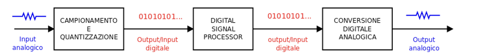
&nbsp;

Le vibrazioni nell’aria, rappresentate dal segnale analogico, vengono convertite da un segnale di pressione a uno elettrico dal microfono. Il segnale analogico dal microfono viene poi trasformato in uno digitale tramite l’ADC, dopodiché il segnale digitale può essere elaborato da un computer. Il segnale digitale elaborato può quindi essere convertito in uno analogico tramite il DAC e, infine, riconvertito in un segnale di pressione da inviare, per esempio, ad un altoparlante attivo.

Per quanto riguarda il motivo per cui preferiamo elaborare segnali digitali piuttosto che analogici, ci sono molte ragioni tecniche; le più importanti sono che i computer sono flessibili, possono fare cose che potremmo solo sognare con l’hardware analogico e sono generalmente molto più economici rispetto alla corrispondente soluzione analogica. 

La rappresentazione digitale di un segnale audio analogico come sequenza di numeri è ottenuta tramite un convertitore analogico-digitale (ADC). L’ADC esegue il campionamento delle ampiezze del segnale analogico $x(t)$ su una griglia equidistante lungo l’asse orizzontale del tempo e la quantizzazione delle ampiezze in campioni fissi rappresentati da numeri $x(n)$ lungo l’asse verticale dell’ampiezza (come in figura). 

&nbsp;
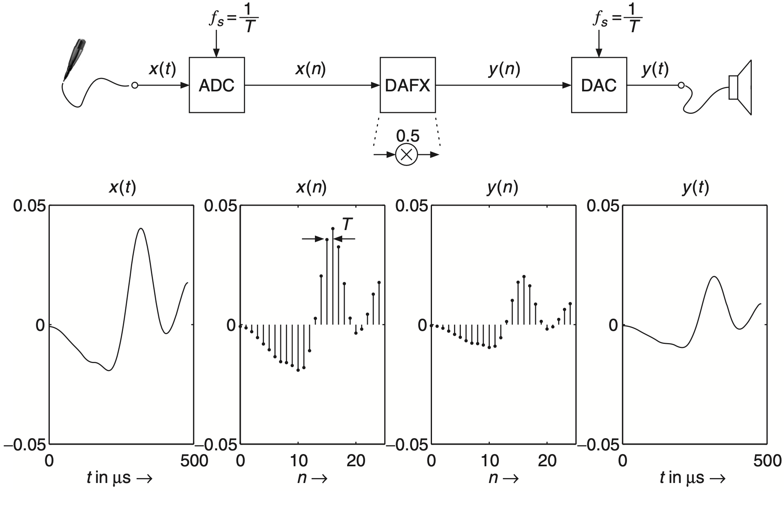
&nbsp;

I campioni sono mostrati come linee verticali con punti in alto. Il segnale analogico $x(t)$ indica l’ampiezza del segnale su un tempo continuo $t$in microsecondi. A seguito dell’ADC, il segnale digitale (tempo discreto e ampiezza quantizzata) è una sequenza (flusso) di campioni $x(n)$ rappresentati da numeri sull'indice di tempo discreto $n$. La distanza temporale tra due campioni consecutivi è chiamata intervallo di campionamento $T_s$ (periodo di campionamento) e il reciproco è la frequenza di campionamento $F_s$.

In questo capitolo, spiegheremo cosa sono il campionamento e la quantizzazione, come funzionano e anche come possiamo ricostruire segnali analogici partendo da quelli digitali.

##### Campionamento

Il processo di campionamento trasforma un segnale analogico in un segnale discreto, raccogliendo valori a intervalli di tempo regolari. In linea di principio, il teorema di campionamento di Nyquist-Shannon afferma che, affinché un segnale possa essere rappresentato senza ambiguità, la frequenza di campionamento deve essere almeno il doppio della frequenza massima del segnale originale. 

Supponiamo di avere un segnale nel tempo continuo, $x(t)$, definito per ogni valore reale di $t$ e che vogliamo elaborare con un DSP. Il processo di campionamento comporta la misurazione del valore di questa funzione in istanti di tempo specifici, $t_n$, indicizzati da $n= 0,1,2,\dots$, per ottenere il segnale $x(n)=x(t_n)$, che chiamiamo `segnale a tempo discreto`. Il modo più semplice e comune di campionare è il campionamento uniforme, che significa campionare a punti equidistanti, cioè,

$$t_n = T_s n, \qquad n = 0,1,2,\dots$$

dove $T_s$ è il tempo (in secondi) tra due campioni consecutivi ed è chiamato `periodo di campionamento`. Possiamo osservare che un segnale campionato, o digitale, è in realtà solo una sequenza ordinata di numeri. Più piccolo è $T_s$, più finemente campioniamo il segnale continuo originale, $x(t)$. Possiamo rappresentare il numero di campioni ottenuti per secondo utilizzando la `frequenza di campionamento`, definita come

$$F_s=\frac{1}{T_s}.$$

La frequenza di campionamento è misurata in Hertz (Hz). L’audio viene solitamente campionato a $44.1$ kHz e oltre, mentre la voce può essere campionata fino a $8$ kHz, il che risulta in segnali comprensibili ma certamente non di alta qualità. Nella figura, il processo di campionamento è esemplificato da un segnale continuo, $x(t)$ (blu), che viene campionato per ottenere il segnale a tempo discreto $x(n)$ (rosso).

&nbsp;
```{image} images/sampling.png
:alt: long
:class: bg-primary mb-1
:width: 400px
:align: center
```
&nbsp;

Per esplorare ulteriormente il campionamento, consideriamo un esempio. Supponiamo che $x(t)$ sia una singola sinusoide di frequenza $f$ in Hertz, cioè,

\begin{equation}\label{eq1}
x(t)=\sin\left( 2\pi ft \right).
\end{equation}

Usando la definizione di frequenza di campionamento, otteniamo 

$$x(n)=\sin\left( 2\pi \frac{f}{F_s}n \right)$$

da cui possiamo definire le seguente quantità

$$\omega=2\pi \frac{f}{F_s}$$

che chiamiamo `frequenza digitale`. Essa esprime il numero di radianti per campione [rad/sample], mentre il rapporto $f/F_s$ esprime il numero di cicli per campione [cycle/sample]. Da una tale frequenza digitale da sola, quindi, non possiamo determinare quale sarebbe la frequenza in Hertz, a meno che non conosciamo la frequenza di campionamento. Una frequenza digitale di $\omega=2\pi$ corrisponde alla frequenza di campionamento, indipendentemente dal valore che essa assume. Questo spiega intuitivamente il fatto che un segnale digitale è semplicemente una sequenza di numeri; quindi, senza ulteriori conoscenze, non avremmo modo di dedurre nulla riguardo alla frequenza di campionamento.

Ora, la domanda fondamentale che dovremmo porci è questa: quale frequenza di campionamento dobbiamo scegliere per campionare il seno nell’equazione {eq}`eq1`? Parlando tecnicamente, ciò di cui ci preoccupiamo quando campioniamo è se lo spettro, ossia i contenuti in frequenza, del segnale campionato è lo stesso di quello del segnale continuo originale. Se lo è, significa che abbiamo una rappresentazione digitale perfetta del segnale analogico. Si può dimostrare che se campioniamo il segnale con una frequenza di campionamento che è più del doppio della frequenza del seno, il segnale campionato avrà lo stesso spettro dell’originale. Ora, sorgono un paio di domande. In primo luogo, come generalizziamo questo risultato a qualsiasi segnale, non solo ai seni? La risposta a questa domanda è che, come abbiamo già accennato, (quasi) qualsiasi segnale può essere considerato composto da un numero di seni, e possiamo utilizzare il principio di prima, secondo cui la frequenza di campionamento deve essere più del doppio delle frequenze dei seni. Quindi, se la frequenza più alta di un seno in un segnale è , allora la frequenza di campionamento dovrebbe rispettare

$$F_s>2f_{max}.$$

Questo è conosciuto come il `teorema di campionamento`. A volte, a seconda del campo, è attribuito e denominato in base a diverse persone, tra cui Nyquist, Shannon, Whittaker e Kotelnikov. La seconda domanda è: come possiamo sapere qual è la frequenza massima dei seni nel nostro segnale? La risposta a questa domanda è che generalmente non lo sappiamo. Invece, possiamo semplicemente assicurarci che, per una frequenza di campionamento selezionata, $F_s$, per il nostro sistema audio, rimuoveremo tutti i contenuti superiormente da $F_s/2$! Questo viene fatto con un cosiddetto `filtro anti-aliasing`, che è semplicemente un filtro passa-basso analogico con una frequenza di stop pari a $F_s/2$, il che significa che tutte le frequenze al di sopra della frequenza di stop vengono rimosse o attenuate. Questo è illustrato in figura.

&nbsp;
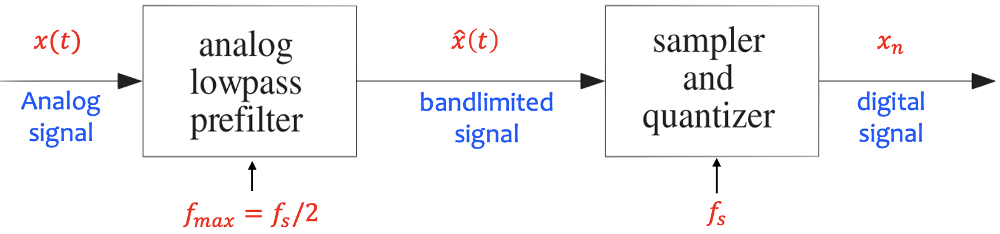
&nbsp;

##### Aliasing

Diciamo che il segnale è quindi a banda limitata. `L’aliasing` si riferisce al fenomeno che si verifica quando non rispettiamo il teorema di campionamento. Quando campioniamo a una frequenza di campionamento che è inferiore al doppio della frequenza massima ciò che accade è che le parti dello spettro al di sopra della metà della frequenza di campionamento si ripiegano attorno alla metà della frequenza di campionamento e appaiono nello spettro inferiore come immagini speculari di sorta. Poiché queste immagini speculari si mescolano con i contenuti in frequenza e non possono essere recuperate o rimosse, abbiamo distorto il nostro segnale. Ad esempio, tornando all’esempio in cui il segnale è un singolo seno di 5 Hz ma campionato a 4 Hz, il segnale campionato subirebbe aliasing risultando identico a un seno di 1 Hz!, come si nota anche dallo spettro nella figura. 

&nbsp;
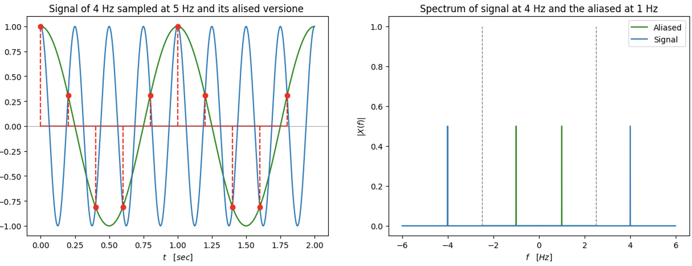
&nbsp;

La frequenza $F_s/2$ è molto importante, ed è chiamata `frequenza di Nyquist`. Nella successiva figura, è invece mostrato un esempio di un segnale continuo e del segnale digitale risultante. Il segnale continuo è un seno con una frequenza di 2 Hz ed è campionato a una frequenza di 5 Hz. In quel caso, il teorema di campionamento è soddisfatto, e possiamo vedere che i campioni rappresentano bene il segnale. 

&nbsp;
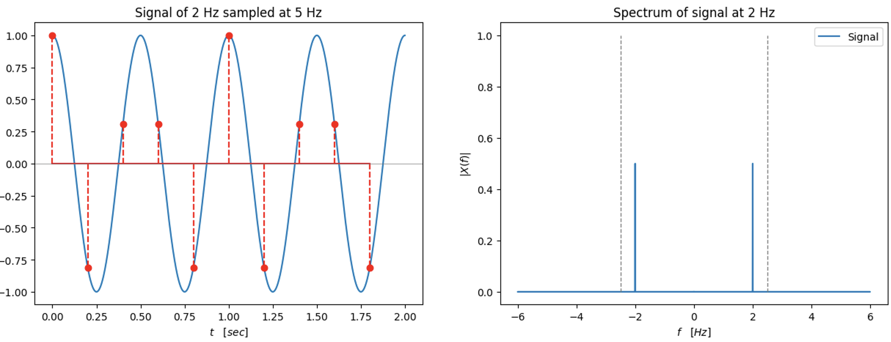
&nbsp;

Una regola semplice che definisce quali frequenze spurie compariranno nello spettro per effetto dell'aliasing è la seguente: ogni frequenza $f\in [-F_s/2, 𝐹_s/2]+ k 𝐹_𝑠$, con  $k\in\mathbb{N}$, ha un unico valore corrispondente che si trova all'interno dell'intervallo di Nyquist $[-F_s/2, 𝐹_s/2]$ e si ottiene aggiungendo o sottraendo da $f$ un numero pari a $k$ multipli di $F_s$, fino a quando non cade all'interno dell'intervallo di Nyquist. L'operazione è un'operazione modulare come riportata in figura qui sotto.

&nbsp;
```{image} images/mod_alias.png
:alt: long
:class: bg-primary mb-1
:width: 600px
:align: center
```
&nbsp;

Per riassumere le frequenze in gioco nel processo di campionamento, riportiamo in tabella di seguito le principali definizioni e in particolare la loro relazione con l'intervallo di Nyquist. 

&nbsp;
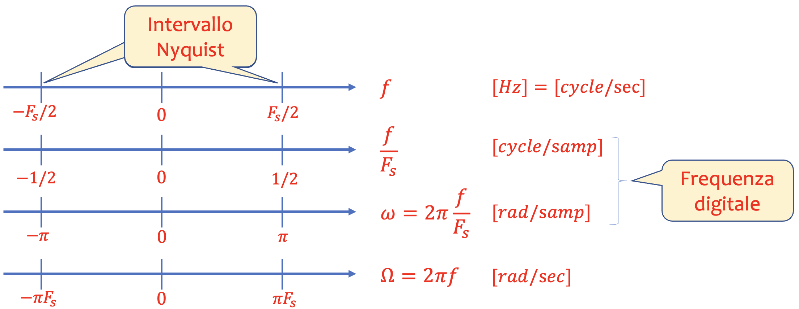
&nbsp;

Nella Tabella sotto sono elencate alcune delle frequenze di campionamento audio più comuni e le loro applicazioni. Le moderne schede audio supportano solitamente un’ampia gamma di frequenze di campionamento e sono quindi piuttosto flessibili. È importante notare che, per ragioni tecniche, è spesso vantaggioso utilizzare una frequenza di campionamento più alta nella registrazione originale e durante l’elaborazione rispetto a quella che verrà utilizzata nel prodotto finale, come un CD. Accenniamo brevemente al fatto che il processo di passaggio da una frequenza di campionamento a un’altra, un’operazione comune in molti sistemi audio, si chiama ricampionamento.

:::{table} Frequenze di campionamento audio comuni e alcuni esempi di applicazioni
:align: center

| Frequenza di campionamento | Applicazioni |
| ---    | ---                               |
|8 kHz   | Narrowband speech, telephony     |
|16 kHz  | Wideband speech, telephony, VoIP |
|44.1 kHz| CD, audio equipment, sound cards |
|48 kHz  | DAT, video recorders|
|96 kHz  | DVD-audio, HD DVD, Blu-ray|
|192 kHz | DVD-audio, Blu-ray|
:::


##### Quantizzazione

Come discusso, un segnale analogico misurato in un dato istante, ad esempio $n T_s$, può, in linea di principio, assumere qualsiasi valore. Tuttavia, abbiamo a disposizione solo un numero finito di bit e quindi un numero finito di valori diversi per rappresentare una misurazione in un computer. Di conseguenza, dobbiamo mappare questo numero infinito di valori su un numero finito di valori. Questo processo è chiamato `quantizzazione`.  Un modo semplice di quantizzare consiste nel prefissare un un insieme finito di $l$ valori numerici $\{x_1,\dots,x_l\}$ e di associare ad ogni valore campionato $x(n)$, che tipicamente rappresenta una tensione, il valore numerico $x_k$ che è più vicino a $x(n)$. Il passo ulteriore è quello della codifica dei valori dell'insieme $\{x_1,\dots,x_l\}$ in parole binarie di $m$ bit, con risoluzione dipendente dal numero $m$ di bit impiegati.

Se i segnali che prendiamo in considerazione hanno ampiezze comprese tra $-V/2$ e $V/2$, la quantizzazione può essere ottenuta dividendo l'insieme $\left[-V/2,V/2\right]$ in $l$ intervalli, detti `livelli` ed attribuendo ad ogni campione $x(n)\in\left[-V/2,V/2\right]$ il centro del livello in cui $x(n)$ cade.  Detti $\{x_1,\dots,x_l\}$ i centri dei vari livelli, l'operazione di quantizzazione può essere allora descritta dalla funzione $\mathcal{Q}$ che ad ogni $x(n)$ associa il centro più vicino:

$$
y(n)=\mathcal{Q}[x(n)]=\underset{x_i\in \{x_1,\dots,x_l\}}{\arg\min}|x(n)-x_i|.
$$(Q)

Il sistema che realizza l'operazione di quantizzazione è detto `quantizzatore` e non è in generale un sistema lineare. Poiché inoltre la quantizzazione $\mathcal{Q}$ è una funzione molti-uno, essa introduce un errore irreversibile nel segnale quantizzato $y(n)$: dato il segnale quantizzato, non è possibile ricostruire in modo esatto il segnale d'origine $x(t)$.


Un sistema quantizzatore in cui l'intervallo $[-V/2,V/2]$ è suddiviso in $l$ livelli di uguale ampiezza $V/l$, è detto `quantizzatore uniforme`. In questo caso i livelli hanno dimensione
$$ \Delta=\frac{V}{l}=x_i-x_{i+1} ,\quad \text{con}\quad 1\le i\le l-1,
$$ anche chiamato `passo di quantizzazione`.

Se abbiamo a disposizione $m$ bit, possiamo rappresentare $l=2^{m}$ livelli i cui centri $\{x_1,\dots,x_l\}$ possono essere codificati con parole di $m$ bit:

$$
x_i=b_{i1}\cdots b_{im},\qquad \text{con}\qquad b_{ik}\in\{0,1\}\;\;(1\le i\le l)
$$ 

e il passo di quantizzazione diventa $\Delta = \frac{V}{2^{m}}.$

Il quantizzatore uniforme è il sistema di quantizzazione più comune per l'audio. La dimensione del passo, $\Delta$, ovviamente diminuisce all'aumentare del numero di bit $m$. Il numero di bit usati per campione nell'audio è tipicamente di 16, 24 o 32 bit. Va notato che quando il segnale in ingresso è al di fuori dell'intervallo specificato $[-V/2,V/2]$, si verifica solitamente un fenomeno di `clipping` (taglio alla massima capacità di risoluzione), un problema noto che può introdurre un errore arbitrario. Questo significa che tutti i valori del segnale $x(n)$ superiori a $V/2$ vengono troncati a $V/2$ e, in modo simile, i valori negativi inferiori a $-V/2$ vengono troncati a $-V/2$. Ciò causa artefatti piuttosto gravi e udibili, che dovrebbero essere evitati, ove possibile.

Nella figura è illustrato il processo di conversione analogico-digitale mediante un diagramma a blocchi. Il processo comprende il filtraggio del segnale analogico tramite un filtro anti-aliasing, seguito dal campionamento del segnale. Infine, i campioni vengono quantizzati singolarmente.

&nbsp;
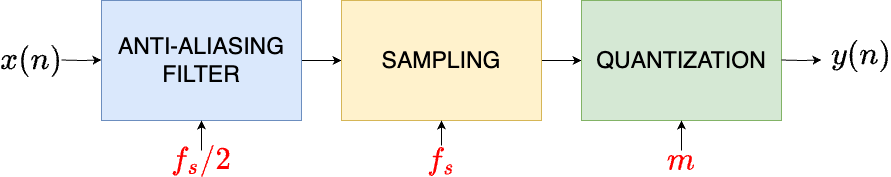
&nbsp;

Il filtro anti-aliasing è un filtro passa-basso che rimuove, o meglio attenua, le frequenze superiori alla metà della frequenza di campionamento. Spesso, questo causa anche una leggera attenuazione delle frequenze vicine alla metà della frequenza di campionamento. Il processo di campionamento causa quindi aliasing dei contenuti di frequenza superiori alla metà della frequenza di campionamento (se presenti), mentre la quantizzazione aggiunge rumore, il cui livello dipende dal numero di bit utilizzati. La Figura seguente mostra il risultato del campionamento (pallino giallo) e campionamento più quantizzazione uniforme a quattro livelli (pallino verde) di un segnale $x(t)$.

&nbsp;
```{image} images/quant.png
:alt: long
:class: bg-primary mb-1
:width: 1000px
:align: center
```
&nbsp;

##### Errore di quantizzazione e SNR

Una volta fissata la dimensione del passo di quantizzazione $\Delta$, l'intervallo $V$ e il numero di bit $m$, possiamo definire una funzione che il quantizzatore uniforme applica per mappare i valori di ingresso $x(n)$ ai valori di uscita $y(n)$.  Ogni livello rappresenta un possibile valore di output, in modo che il segnale $x(n)$ sia mappato al livello $y(n)$ più vicino, secondo la seguente espressione:

$$
y(n) = \mathcal{Q}[x(n)] = \Delta \cdot \text{round}\left(\frac{x(n)}{\Delta}\right),
$$

dove $\text{round}(\cdot)$ indica l’arrotondamento al numero intero più vicino. Qui, ogni valore $x(n)$ viene quindi mappato sul livello $k$-mo di ampiezza $\Delta$ che produce l’output $y(n)=k\cdot \Delta$.

L'errore di quantizzazione, $e(n)$, è la differenza tra l'ingresso e l'uscita, ovvero:

$$
e(n) = x(n) - y(n) = x(n) - \mathcal{Q}[x(n)]
$$

e siamo interessati a comprendere l'effetto della quantizzazione sulla qualità del segnale. Un buon modo per capire l'effetto della quantizzazione è il cosiddetto modello di rumore additivo della quantizzazione. Esso afferma che possiamo considerare l'effetto della quantizzazione come l'aggiunta di rumore al segnale di ingresso, ovvero,

$$
y(n) = x(n) + e(n)
$$

Questo è illustrato nella figura precedente in cui si vede l'errore di quantizzazione per un quantizzatore uniforme di due bit (quattro livelli). La quantità di rumore è quindi determinata dalla dimensione del passo $\Delta$. Più piccolo è $\Delta$, minore sarà il rumore aggiunto al segnale. Infatti, possiamo osservare che gli errori di quantizzazione si trovano tra $-\frac{\Delta}{2}$ e $\frac{\Delta}{2}$, a causa dell'arrotondamento in {eq}`Q`. La figura seguente mostra l’errore di quantizzazione per un quantizzatore uniforme di due bit (quattro livelli).

&nbsp;
```{image} images/erroreQ.png
:alt: long
:class: bg-primary mb-1
:width: 1000px
:align: center
```
&nbsp;

Nella figura seguente, invece, è mostrato un istogramma degli errori di quantizzazione per 50000 valori del segnale non periodico (frequenza non razionale $f_0=1/(2\pi 11))$
$$
𝑥(𝑛)= 0.99 \sin(2\pi f_0 n) =0.99 \sin(n/11)
$$
che assume valori compresi tra $-1$ e $1$. Come si nota, l'errore di quantizzazione segue una distribuzione empirica uniforme (istogramma su 50000 campioni) con una dimensione del passo di $\Delta = 0.125$. Come si può vedere, i diversi errori si verificano con frequenza approssimativamente uniforme e gli errori sono $ -\frac{\Delta}{2} \leq e(n) \leq \frac{\Delta}{2}$.

&nbsp;
```{image} images/esempioQ.png
:alt: long
:class: bg-primary mb-1
:width: 1000px
:align: center
```
&nbsp;

Per analizzare ulteriormente l'effetto della quantizzazione, occorre richiamare il concetto di potenza di un segnale, che per un segnale digitale è la somma calcolata su $N$ campioni:

$$
P_x = \sum_{n=0}^{N-1} x(n)^2.
$$

La `potenza` di un segnale è direttamente collegata a quanto forte esso sia percepito: maggiore è la potenza, più alto è il volume percepito. Ora abbiamo compreso cosa rappresenta la potenza di un segnale. Ritornando al modello di rumore additivo della quantizzazione, denotiamo la potenza del segnale di ingresso con $P_x$ e la potenza del rumore con $P_e$. Una misura della qualità della quantizzazione è il rapporto tra la potenza del segnale di ingresso e quella del rumore, ovvero:

$$
\frac{P_x}{P_e}
$$

Questo è chiamato `rapporto segnale-rumore` (`SNR`, Signal-to-Noise Ratio). Più alto è questo valore, migliore è la nostra quantizzazione e minore sarà l'errore di quantizzazione percepito. Le potenze e i rapporti di potenza sono spesso rappresentati su una scala logaritmica in decibel, e l'SNR è tipicamente calcolato in dB, ovvero

$$
\text{SNR}_{\text{dB}} = 10 \cdot \log_{10} \left( \frac{P_x}{P_e} \right).
$$

Per molti segnali deterministici inoltre l'errore è uniformemente distribuito in $\left[-\Delta/2,\Delta/2\right]$. Questo significa che la probabilità che l'errore sia compreso fra $e$ ed $e+de$ è $de/\Delta$.  La varianza o potenza del rumore con $P_e$ è allora:

$$
P_e=\sigma_e^2=\int_{-\frac{\Delta}{2}}^{\frac{\Delta}{2}}e^2
\frac{de}{\Delta}=\frac{\Delta^2}{12}.
$$

Ipotizziamo che il segnale di riferimento per il calcolo della potenza sia il segnale sinusoidale analogico $x(t)=A\sin(\omega\, t)$, la cui potenza è del tutto analoga al segnale discreto $x(n)=A\sin(\omega\, nT_s)$. La media di $x(t)$ è 0, poiché:

$$
\lim_{T\rightarrow \infty}\frac{\int_{-T}^{T}A \sin(\omega t)\,dt}{2T}=0.
$$

La varianza o potenza del segnale $\sigma_s^2$ di $x(t)$ è invece $A^2$. Infatti per $T$ grande si ha:

$$
P_s=\sigma_s^2=\frac{1}{2T}\int_{-T}^{T}(A\sin(\omega\, t)-0)^2\,
dt=\frac{A^2}{2T}\int_{-T}^{T}(1+\cos(2\omega\, t))\,dt=A^2.
$$

In tal caso, se $A^2=\alpha V^2$, con $\alpha\in(0,1)$:

\begin{align*}
\text{SNR}_{\text{dB}}&=10\log_{10}12\alpha \frac{V^2}{\Delta^2}\\
&=20\log_{10}\frac{V}{\Delta}+10\log_{10}12\alpha\\
&=20\log_{10}2^{m}+cost\qquad\quad(\text{poiché } \Delta=V/2^m)\\
&=6.02\, m+cost
\end{align*}

Possiamo concludere con il seguente risultato: in un quantizzatore ogni bit aggiunto comporta un incremento di 6.02 dB al rapporto segnale rumore. Se inoltre il range dinamico $A$ del segnale sfrutta tutto il range $V$ del quantizzatore (cioè $\alpha=1$ e $A=V$) risulta 

$$\text{SNR}_{\text{dB}}\approx 6.02\, m+10.8\quad \text{dB.} $$ 

La tabella seguente mostra il livello di miglioramento del rapporto segnale-rumore di un quantizzatore uniforme per gruppi di bit tipicamente usati.

:::{table} $\text{SNR}_{\text{dB}}$ del quantizzatore al variare del numero di bit
:align: center

| Numero bit | $\text{SNR}_{\text{dB}}$ |
| ---    | ---        |
|$m=8$   | 48 dB  |
|$m=10$  | 60 dB    |
|$m=16$  | 96 dB    |
:::


## Conversione analogico-digitale (ADC)

Gli ADC o convertitori analogico-digitale, convertono i valori di tensione in ingresso nel numero corrispondente espresso in binario. La Risoluzione $R$ di un convertitore A/D è definita come la minima variazione della grandezza analogica in ingresso che provoca una variazione di un LSB (Least Significant Bit) nel numero di uscita: tale variazione è definita come quanto $Q$. La risoluzione $R$ di un ADC coincide, dunque, col quanto $Q$.

##### ADC bipolare
Un `convertitore analogico-digitale bipolare (ADC bipolare)` è un tipo di convertitore che può acquisire e convertire segnali analogici sia positivi che negativi in un formato digitale. A differenza degli ADC unipolari, che possono gestire solo segnali positivi, un ADC bipolare è progettato per misurare tensioni che oscillano attorno a zero, come quelle che si trovano spesso nei segnali audio o nelle trasmissioni RF (Radio Frequenza). 

Ecco i dettagli chiave su come funziona e perché è utile:

1. Gamma di Tensione
   - Gli ADC bipolari hanno un intervallo di misurazione simmetrico che va da un valore negativo massimo a un valore positivo massimo, come $ -V_{\text{ref}} $ a $ +V_{\text{ref}} $, dove $ V_{\text{ref}} $ è la tensione di riferimento.
   - Ad esempio, un ADC bipolare con $ V_{\text{ref}} = 5 \, \text{V} $ può misurare tensioni nell'intervallo $[-5 \, \text{V}, +5 \, \text{V}]$.

2. Quantizzazione e Codifica
   - Poiché il segnale può essere sia positivo che negativo, l'ADC bipolare utilizza un codice a complemento a due o offset binario per rappresentare i numeri negativi nel formato digitale.
   - Ad esempio, in un ADC a 8 bit, una tensione di $0 \, \text{V}$ potrebbe essere rappresentata da $10000000_2$ (offset binario) o $00000000_2$ (complemento a due), a seconda della codifica scelta.
   
3. Uso del Bit di Segno
   - Molti ADC bipolari utilizzano un bit di segno per indicare se il valore misurato è positivo o negativo. Ad esempio, con una codifica a 12 bit, l'ADC può dedicare 11 bit per il valore e 1 bit per il segno, permettendo così una buona risoluzione su un intervallo di tensione completo.

4. Applicazioni e Vantaggi
   - Gli ADC bipolari sono utili per segnali che oscillano attorno a zero, come segnali audio o segnali AC.
   - Risultano particolarmente vantaggiosi per segnali analogici bilaterali (che possono variare sopra e sotto zero) e riducono la necessità di pre-elaborazione del segnale per adattarlo all’intervallo di conversione.

5. Esempio di Implementazione
   - Immagina un sistema che acquisisce un segnale audio. Un ADC bipolare può convertire l’intero segnale, senza troncare o saturare valori negativi. Se il segnale va da $ -2.5 \, \text{V} $ a $ +2.5 \, \text{V} $ e il sistema ha un ADC a 10 bit con riferimento di $ 2.5 \, \text{V} $, ogni valore digitale rappresenta un piccolo intervallo uniforme di tensione (passo di quantizzazione) su tutto l’intervallo bipolare.

In sintesi, un ADC bipolare è ideale per applicazioni in cui il segnale analogico è bilaterale, garantendo una rappresentazione digitale precisa ed efficiente dei segnali a polarità variabile. In figura si mostra lo schema di funzionamento di un ADC caratterizzato da un full-scale range $𝑅$ diviso equamente (per un quantizzatore uniforme) in $l=2^𝑞$ livelli di quantizzazione. La spaziatura tra i livelli è chiamata `Risoluzione del quantizzatore` ed è pari a $Q=𝑅/2^𝑞$.

&nbsp;
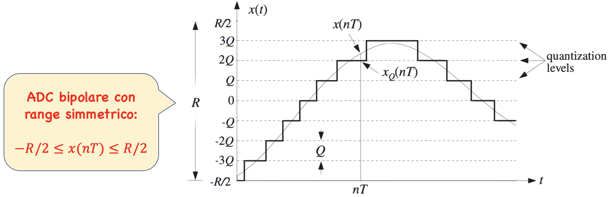
&nbsp;

In figura si mostra un modello di convertitore ADC Sample and Hold (S&H) a $q+1$ bit di risoluzione, che è un elemento fondamentale nei sistemi di conversione.

&nbsp;
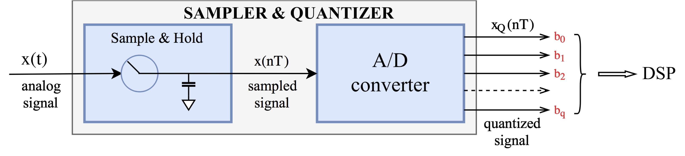 
&nbsp;

Questo modello consente di “campionare” un segnale analogico in un determinato istante di tempo e di mantenere, o “tenere”, il valore del segnale fino al campionamento successivo, rendendolo disponibile per l’ADC e garantendo una conversione precisa. Questo è essenziale perché il processo di conversione richiede un certo tempo e il segnale può variare rapidamente. In ogni ciclo di campionamento, il circuito S&H esegue due operazioni: la fase di campionamento (Sample) e la fase di mantenimento (Hold). Nella fase di campionamento (Sample) il circuito chiude un interruttore per un breve periodo, consentendo al condensatore (il componente principale per mantenere la tensione) di caricare il valore istantaneo del segnale analogico. Nella fase di mantenimento (Hold) l’interruttore si apre, isolando il condensatore dal segnale in ingresso. Il condensatore ora mantiene (o trattiene) il valore della tensione catturata finché non avviene il campionamento successivo. Le componenti principali sono:
- Interruttore: Generalmente realizzato con un transistor MOSFET o un interruttore elettronico, che si apre e chiude per controllare il flusso del segnale al condensatore.
- Condensatore: Memorizza la tensione campionata, trattenendola durante la fase di mantenimento. La capacità del condensatore influenza il tempo di mantenimento e la precisione.
- Buffer: Spesso è presente un buffer (come un amplificatore operazionale) tra il condensatore e il carico, per evitare che il segnale decada a causa della scarica del condensatore.

Lo schema del circuito  è mostrato sotto e lo scopo è quello di acquisire la tensione di ingresso in un determinato istante (campionamento) e di mantenerlo invariato all'uscita fino ad una nuova lettura.

&nbsp;
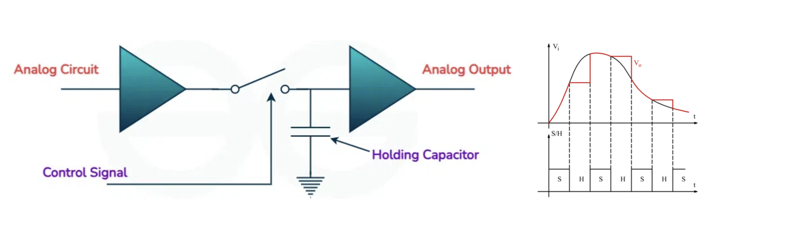 
&nbsp;

In sintesi, il modello Sample and Hold è cruciale per isolare e trattenere il segnale analogico prima della conversione digitale, riducendo errori di quantizzazione e migliorando la fedeltà dei dati digitali.

## Conversione Digitale-Analogica (DAC)

Un convertitore DAC (Digital-to-Analog Converter) è un dispositivo che trasforma segnali digitali in segnali analogici. Questa conversione è fondamentale per applicazioni in cui segnali digitali devono essere presentati o utilizzati in un ambiente analogico, come in dispositivi audio, video, comunicazioni, e attuatori di controllo. Il Principio di Funzionamento di un DAC è il seguente.
- Il DAC prende una sequenza di numeri digitali, che rappresentano il valore discreto del segnale, e li converte in una tensione o corrente continua che varia analogamente ai valori digitali di ingresso.
- Ogni numero digitale (tipicamente espresso in bit) corrisponde a un livello di tensione specifico in uscita. Maggiore è il numero di bit, maggiore sarà la risoluzione del segnale analogico, poiché ogni bit aggiunto permette di raddoppiare i livelli di tensione rappresentabili.

La trasformazione di bit in livelli di tensione in un convertitore digitale-analogico (DAC) avviene assegnando a ogni combinazione di bit un valore di tensione corrispondente, che rispecchia l’informazione digitale in un formato analogico.

##### Codifica Binaria e Livelli di Tensione

- In un sistema digitale a $m$ bit, ogni configurazione dei bit rappresenta un valore discreto, compreso tra $0$ e $2^{m}-1$.
- L’intervallo di tensione totale del DAC è definito dai valori di tensione $V_{\text{min}}$ e $V_{\text{max}}$, dove $V_{\text{min}}$ è il livello di tensione più basso (di solito $0$ V) e $V_{\text{max}}$ il livello più alto.
- Il passo di quantizzazione $\Delta V=(V_{\text{max}}-V_{\text{max}})/(2^{q}-1)$ è la differenza di tensione tra due livelli consecutivi 
- La precisione del DAC è legata al numero di bit e alla stabilità dei livelli di tensione. Più bit ha il DAC, più livelli di tensione può rappresentare e quindi maggiore è la risoluzione, riducendo la differenza tra livelli di quantizzazione ($\Delta V$) e rendendo la rappresentazione analogica più fedele all’originale digitale.

In sintesi, un DAC trasforma combinazioni di bit in livelli di tensione specifici usando un passo di quantizzazione per mappare ciascun valore binario a un livello di tensione proporzionale, permettendo così di convertire segnali digitali in forma analogica per molteplici applicazioni.

##### Conversione unipolare
Nella conversione unipolare, il `DAC Unipolare` converte i segnali digitali in livelli di tensione che si trovano esclusivamente in un intervallo positivo o zero-positivo. Questo tipo di conversione è tipico in applicazioni dove l’intervallo di tensione deve essere limitato, ad esempio tra $0$ e $V_{\text{max}}$. Il circuito di un convertitore a scala R-2R a quattro bit, tra i più diffusi anche in ambito audio, è quello di figura.

&nbsp;
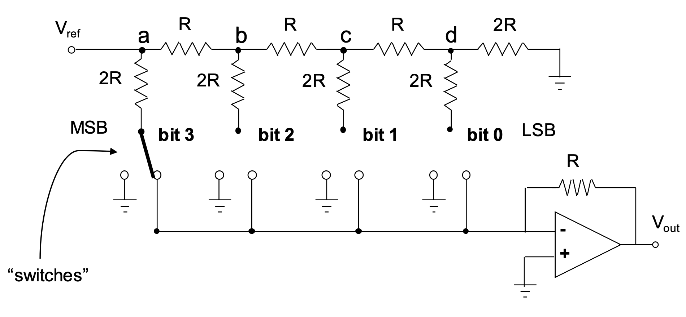
&nbsp;

Per ottenere la tensione in uscita $V_{out}$ per una configurazione di bit specifica $b_1,\dots,b_m$ (un valore binario tra 0 e $2^m-1$), la formula è:

$$
V_{out}=\frac{V_{\text{ref}}}{2^m}(𝑏_0 2^{0}+𝑏_1 2^{1}+\cdots+b_{N-1}2^{N-1})=\frac{V_{\text{ref}}}{2^m}D
$$

dove $D\in\{0,1,\dots,2^m-1\}$.

## Formati Audio

##### Wave

A livello superiore, un file Wave consiste in un singolo chunk RIFF (”RIFF”), che contiene tutti i dati del file wave. Il corpo del chunk RIFF inizia con il codice di formato “WAVE”, il quale indica che il file è un file Wave (poiché un file RIFF può contenere anche altri tipi di dati). Questo è seguito dai chunk figli, annidati all’interno del chunk principale RIFF. Come minimo, i chunk figli devono includere un chunk di formato (”fmt “) e un chunk di dati (”data”), e il chunk di formato deve precedere il chunk di dati. Di seguito elencati i significati dei campi della struttura del formato.

`Codice di Formato` – Indica come i dati del campione per il file wave sono memorizzati. Il formato più comune è PCM intero, con un codice di 1. Altri formati includono PCM in virgola mobile (3), ADPCM (2), A-law (6), μ-law (7) e WaveFormatExtensible (65534).

`Numero di canali` – Tipicamente, un file avrà 1 canale (mono) o 2 canali (stereo). Un file audio surround 5.1 avrà 6 canali.

`Frequenza di campionamento` – Il numero di frame campione che si verificano ogni secondo. Un valore tipico è 44.100, lo stesso di un CD audio.

`Bit per campione` – Per i dati PCM interi, i valori tipici sono 8, 16 o 32. Se il formato del campione non richiede questo campo, dovrebbe essere impostato a 0.

`Chunk Dati PCM Intero` (Codice di formato: 1) - Questo è il formato più comune e consiste in campioni PCM grezzi come numeri interi. I campioni in un file wave PCM multicanale sono interlacciati. Cioè, in un file stereo, un campione per il canale sinistro sarà seguito da un campione per il canale destro, seguito da un altro campione per il canale sinistro, quindi destro, e così via.

`Chunk Dati PCM in Virgola Mobile` (Codice di formato: 3) - In alternativa, i campioni PCM possono essere memorizzati come valori in virgola mobile. Questo è essenzialmente lo stesso del formato PCM intero (cioè codice di formato 1), tranne per il fatto che i campioni sono nel range da -1,0 a 1,0. Il campo bit per campione deve essere impostato a 32 o 64 per indicare la precisione dei valori. I frame campione devono essere disposti nello stesso modo descritto nella sezione “Chunk Dati PCM Intero” sopra. 

La struttura generale del file wave è riportata in figura.

&nbsp;
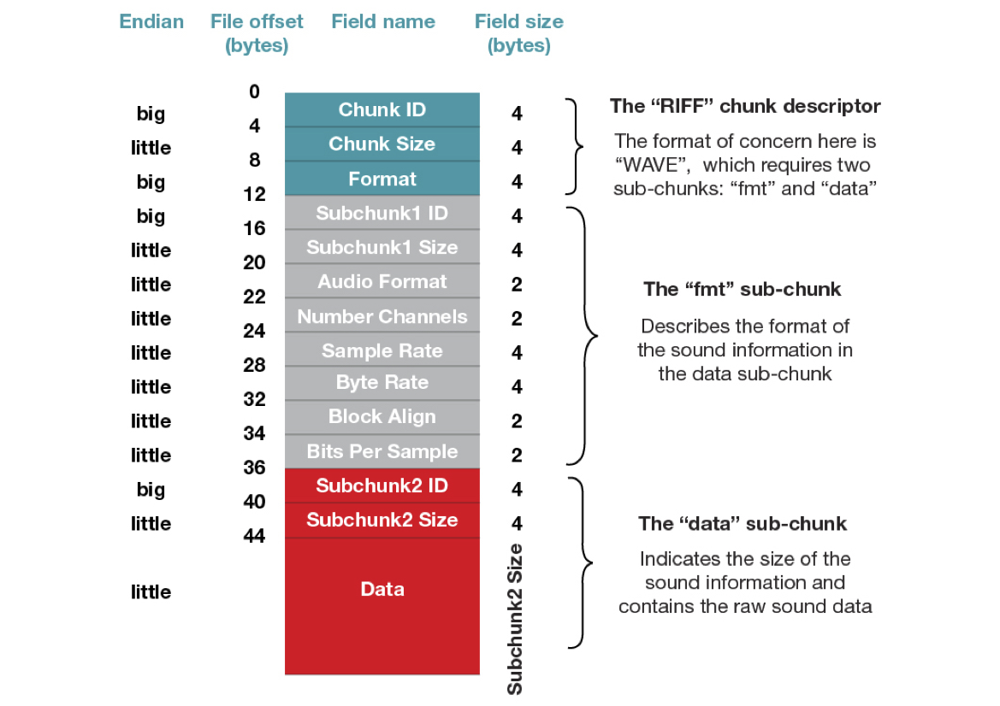
