Spettro del segnale audio 
====

---

## Introduzione

La trasformata di Fourier è uno strumento matematico che ci permette di capire quali frequenze compongono un segnale, come un’onda sonora o un segnale elettrico. Immagina di avere una canzone e di poter “vedere” le singole note musicali che la compongono: la trasformata di Fourier fa proprio questo, prendendo un segnale e scomponendolo nelle sue parti fondamentali, le frequenze, che sono come le singole note della canzone.

In pratica, quando ascoltiamo un suono complesso (come un accordo di chitarra o il rumore del traffico), le nostre orecchie e il cervello lo scompongono automaticamente nelle frequenze dei suoni che lo compongono. La trasformata di Fourier è una versione matematica di questa operazione: prende un segnale variabile nel tempo e lo rappresenta in funzione della frequenza, rivelandoci quali componenti a frequenza bassa, media e alta sono presenti e in che quantità.

Grazie a questo, possiamo passare da una rappresentazione nel tempo (dove vediamo il segnale cambiare momento per momento) a una rappresentazione in frequenza (dove vediamo solo le “note” fondamentali che compongono il segnale). Questo è fondamentale in tanti campi, come la musica, l’ingegneria audio, le telecomunicazioni, e l’elaborazione delle immagini, perché ci permette di analizzare e manipolare i segnali in modo molto efficiente e mirato.

La Short-Time Fourier Transform (STFT) è un’estensione della trasformata di Fourier usata per analizzare segnali che cambiano nel tempo, come una traccia audio o un segnale vocale. Mentre la trasformata di Fourier classica ci dà una visione globale delle frequenze presenti in un segnale, la STFT ci permette di vedere come queste frequenze variano nel tempo. Per fare questo servirà  operare un finestramento del segnale: La STFT divide il segnale in piccole porzioni, chiamate finestre, ognuna delle quali contiene un piccolo intervallo temporale del segnale. La durata della finestra è fondamentale: deve essere abbastanza breve per catturare le variazioni del segnale, ma non così corta da rendere imprecisa l’informazione sulle frequenze.	Per ogni finestra, viene poi calcolata la trasformata di Fourier, producendo una rappresentazione in frequenza di quel breve intervallo del segnale. Questo ci dice quali frequenze sono presenti e con quale intensità in quel preciso istante temporale. Ripetendo il processo su tutto il segnale e spostando la finestra di analisi (a intervalli sovrapposti), otteniamo una serie di trasformate di Fourier locali. Il risultato è una rappresentazione in 2D detta spettrogramma, dove l’asse orizzontale rappresenta il tempo, l’asse verticale rappresenta le frequenze, e i colori o le intensità mostrano la potenza di ogni frequenza in ogni intervallo temporale.

La STFT è particolarmente utile quando abbiamo segnali non stazionari, cioè segnali le cui caratteristiche cambiano nel tempo. Esempi tipici sono: la musica in cui le frequenze cambiano nelle diverse parti di un brano musicale, l'elaborazione vocale in cui si vuole analizzare come i suoni e le parole variano nel tempo, facilitando compiti come il riconoscimento vocale; altre discipline come la sismologia, le telecomunicazioni o la biomedicina.

In sintesi, la STFT permette di ottenere una visione dinamica del contenuto in frequenza di un segnale, fornendo una rappresentazione tempo-frequenza che ci dice non solo “quali” frequenze sono presenti, ma anche “quando” esse appaiono.

---

## Frequenza, timbro e pitch nei suoni

##### Pitch
Il `pitch` (o `“altezza”`) di un suono è una qualità percepita che ci permette di distinguere se un suono è acuto o grave. È ciò che ci fa riconoscere, ad esempio, che la voce di una persona è più alta (acuta) o più bassa (grave) rispetto a un’altra, oppure che una nota suonata su un violino è più acuta di una suonata su un contrabbasso. Sebbene la frequenza sia una misura fisica e oggettiva, il pitch è una percezione umana e può variare da persona a persona o con l’età. Ad esempio, alcune persone possono percepire differenze molto sottili tra frequenze simili, mentre altre no. Inoltre, il pitch percepito può essere influenzato dal contesto sonoro e dall'esperienza dell’ascoltatore.

I fattori che influenzano il pitch sono i seguenti.
1. Frequenza: Il pitch è strettamente legato alla frequenza del suono, ovvero al numero di oscillazioni al secondo dell’onda sonora, misurato in Hertz (Hz). In generale:
   - Suoni a frequenze più alte (come quelli prodotti da un fischio o un soprano) vengono percepiti come acuti.
	- Suoni a frequenze più basse (come quelli prodotti da un tamburo o un basso) vengono percepiti come gravi. 
   - Ad esempio, la nota La standard per l’accordatura ha una frequenza di 440 Hz. Se aumentiamo la frequenza, il pitch aumenta; se la riduciamo, il pitch diminuisce.
2. Intensità: L’intensità del suono, o volume, può influenzare leggermente la percezione del pitch, soprattutto a livelli estremi. Suoni molto forti tendono a sembrare leggermente più acuti.
3.	Struttura dell’Onda Sonora: La presenza di armoniche e la forma dell’onda influenzano il pitch percepito. Alcuni strumenti, come l’organo e la chitarra, producono armoniche che fanno percepire il pitch in modo leggermente diverso, anche se la frequenza fondamentale è la stessa.

In sintesi, il pitch è una delle proprietà fondamentali del suono che ci permette di distinguere le note musicali e di identificare la tonalità di una voce o di un suono.

##### Suoni armonici

I `suoni armonici` sono suoni prodotti da onde che includono una frequenza fondamentale e una serie di armoniche, ovvero frequenze multiple della fondamentale che conferiscono un timbro caratteristico. Ecco alcuni esempi:

1.	Corde di strumenti musicali: La vibrazione di una corda (come quella di una chitarra o di un pianoforte) produce un suono armonico. Quando la corda vibra, la frequenza fondamentale si combina con le armoniche superiori, creando il suono complesso che riconosciamo come il timbro dello strumento.
2.	Voci umane: Quando parliamo o cantiamo, le corde vocali generano un suono con una frequenza fondamentale (pitch percepito) e armoniche. Queste armoniche variano a seconda della struttura e della forma del tratto vocale, dando ad ogni voce il proprio timbro unico.
3.	Fiati e ottoni: Strumenti come il flauto, il clarinetto o la tromba producono suoni armonici grazie alla vibrazione dell’aria al loro interno. La lunghezza del tubo e il modo in cui l’aria viene soffiata creano una frequenza fondamentale e armoniche che danno a ciascun strumento il proprio suono distintivo.
4.	Campane: Anche se la forma d’onda delle campane è più complessa, il suono prodotto contiene armoniche che conferiscono al suono il caratteristico timbro metallico e risonante. A differenza di strumenti a corda o fiato, le armoniche delle campane non sono perfetti multipli della fondamentale, dando loro un suono unico e inconfondibile.
5.	Organo: Gli organi creano suoni armonici combinando diverse canne, ognuna delle quali suona una frequenza fondamentale e armoniche specifiche. Variando l’insieme di canne attivate, l’organista può produrre un’ampia gamma di timbri complessi.

La seguente figura illustra lo spettro di un Do ottenuto dall'arpeggio della corda della chitarra che genera un'onda stazionaria di diverse frequenze. Si possono notare infatti al fondamentale di circa $261$ Hz e le armoniche correlate distribuite nello spettro limitato dalla frequenza di campionamento $F_s=10$ kHz.   

&nbsp;
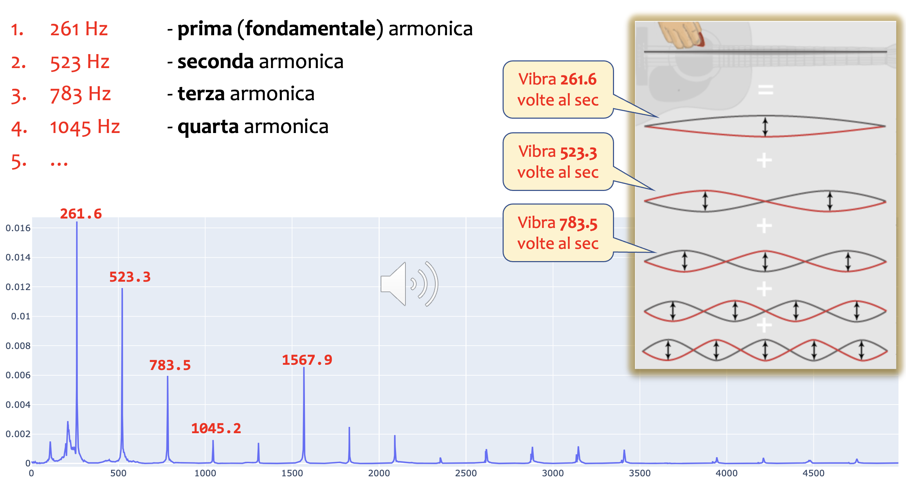
&nbsp;

Come si nota dalla figura, nello spettro sono presenti degli `ipertoni`, che sono le componenti di un suono complesso dotate di una frequenza superiore a quella della fondamentale. Se le frequenze degli ipertoni sono multipli interi della frequenza della fondamentale, essi si dicono armoniche. Nello spettrogramma del suono, gli ipertoni sono evidenziati dai massimi del grafico. In natura è estremamente difficile trovare un suono che contenga una sola frequenza, pertanto le note suonate dagli strumenti classici sono come degli accordi di più note, solo con l'avvento degli strumenti elettronici è possibile produrre agilmente suoni monofrequenza. In particolare, gli ipertoni si presentano negli strumenti a corda, nei fiati e nella voce umana.

In tutti questi esempi, gli ipertoni e le armoniche giocano un ruolo fondamentale nel definire la “colorazione” o timbro del suono, rendendo il suono di ciascun strumento o voce riconoscibile e unico.

##### Timbro

La `colorazione` o `timbro` del suono è la qualità che ci permette di distinguere tra suoni di uguale altezza (o pitch) e intensità, ma provenienti da sorgenti diverse. È ciò che ci fa capire, ad esempio, la differenza tra un violino e una chitarra che suonano la stessa nota, oppure tra la voce di due persone diverse. Il timbro è determinato dalle componenti armoniche e dalle caratteristiche dell’onda sonora prodotta da ciascuna sorgente sonora: la relazione tra il livello della fondamentale, i livelli delle armoniche o degli ipertoni, e la loro evoluzione nel tempo. I suoni puri tendono ad avere solo poche armoniche a bassi livelli, mentre i suoni brillanti tendono ad avere molte armoniche a livelli elevati. Anche le armoniche mancanti possono essere importanti e possono produrre timbri che suonano “vuoti”. Se i rapporti tra la frequenza della fondamentale e le altre frequenze non sono numeri interi, allora il timbro può suonare simile a quello di una campana o persino al rumore.

La capacità dell’orecchio umano di percepire il timbro è correlata alla frequenza. A basse frequenze, l’orecchio può rilevare differenze di fase e seguire i cambiamenti di un gran numero di armoniche. Man mano che la frequenza aumenta, la capacità dell’orecchio di discriminare la fase diminuisce sopra A4 (440 Hz), e il numero di armoniche udibili si riduce a causa della risposta dell’orecchio. Ad esempio, un suono con una frequenza fondamentale di 100 Hz ha armoniche a intervalli di 100 Hz, quindi la 150ª armonica si trova a 15 kHz. Ma un suono con una fondamentale di 1 kHz ha la sua 15ª armonica a 15 kHz. Il numero di armoniche udibili risulta quindi limitato all’aumentare della frequenza fondamentale. I sintetizzatori forniscono un controllo completo sulla frequenza, fase e livello delle armoniche, consentendo all’utente di controllare il timbro. Le caratteristiche del timbro si possono osservare nella seguente figura in cui la fondamentale del suono è alla frequenza $f$, mentre c’è un’armonica al doppio di questa frequenza, $2f$ e poi compare anche un ipertono o frequenza parziale a $3.75f$. 

&nbsp;
```{image} images/timbro.png
:alt: long
:class: bg-primary mb-1
:width: 600px
:align: center
```
&nbsp;

Alcuni dei principali fattori che contribuiscono al timbro sono:

1.	Armoniche: Quando un oggetto vibra per produrre un suono, genera una frequenza fondamentale (quella del pitch percepito) e una serie di frequenze superiori (armoniche) che sono multipli della fondamentale. La distribuzione e l’intensità di queste armoniche creano un’impronta unica per ogni strumento o voce.
2.	Forma dell’Onda Sonora: Diverse sorgenti producono onde sonore con forme diverse (onda sinusoidale, triangolare, quadra, ecc.). Queste differenze influiscono sul timbro, dando una qualità unica al suono.
3.	Attacco e Decadimento: Ogni suono ha una fase di attacco (iniziale) e di decadimento (finale). La velocità con cui il suono inizia e termina influisce sul timbro. Ad esempio, un pianoforte ha un attacco rapido, mentre un violino suona più dolcemente.
4.	Risonanze: Ogni strumento ha una particolare struttura fisica che amplifica certe frequenze più di altre. Questa risonanza naturale influenza il timbro e rende unico ogni strumento.
5.	Distorsione e Rumore Aggiuntivo: In alcuni strumenti, il rumore o la distorsione contribuiscono al timbro. Ad esempio, il soffio in un flauto o le impurità nel suono di una tromba possono aggiungere carattere al timbro.

Esempi di Timbro sono i seguenti. Un Do suonato da un pianoforte, da un flauto e da un clarinetto: anche se la nota è la stessa, la qualità del suono sarà molto diversa. Questo perché ogni strumento produce una combinazione unica di armoniche e ha un attacco e un decadimento caratteristici che ne modificano il timbro.

Il timbro è quindi fondamentale per riconoscere e differenziare le sorgenti sonore, sia negli strumenti musicali che nelle voci, arricchendo la nostra percezione sonora del mondo.

##### Suoni inarmonici

I `suoni inarmonici` sono suoni in cui le componenti frequenziali (cioè le onde che lo compongono) non sono multipli interi di una frequenza fondamentale, come avviene nei suoni armonici. Mentre nei suoni armonici le armoniche sono distribuite in modo regolare e conferiscono al suono un timbro stabile e riconoscibile, nei suoni inarmonici la distribuzione delle frequenze è irregolare, dando un timbro più complesso o, talvolta, “metallico” e “disordinato”. Esempi di suoni inarmonici sono i seguenti.

1.	Campane: Le campane producono suoni inarmonici perché le vibrazioni del loro materiale non generano frequenze multiple della fondamentale. Questo conferisce loro un suono risonante e talvolta “disperso”.
2.	Piatti e Gong: Quando si colpisce un piatto o un gong, le vibrazioni che si generano sono altamente irregolari e producono molte frequenze che non seguono una relazione armonica. Il risultato è un suono ricco, ma anche caotico e inarmonico.
3.	Bacchette e Barre Metalliche: Colpendo una barra metallica o una bacchetta, si ottiene una vibrazione complessa che non segue le armoniche naturali. I metallofoni (strumenti a barre metalliche), come il vibrafono, generano suoni che hanno una certa componente inarmonica, specialmente quando le barre non sono accordate con precisione.
4.	Suoni Naturali come il Rombo del Tuono o il Fruscio delle Foglie: Molti suoni naturali sono inarmonici, poiché non hanno una frequenza fondamentale dominante o un sistema regolare di armoniche.

I suoni inarmonici sono percepiti dall'orecchio umano come “più ruvidi” o “disordinati” rispetto ai suoni armonici. A volte vengono descritti come privi di una nota chiara o “distonici”, poiché mancano di quella chiarezza e stabilità tipica dei suoni armonici. Tuttavia, i suoni inarmonici sono molto usati in musica, specialmente per ottenere effetti specifici di tensione, mistero o drammaticità, come nelle percussioni orchestrali o nella musica elettronica. In sintesi, i suoni inarmonici sono caratterizzati dalla mancanza di armoniche regolari e hanno un timbro complesso, spesso associato a suoni metallici, percussivi o naturali che creano un senso di instabilità o di “caos musicale”.


##### Rumore bianco e rosa

Il `rumore bianco` è uno di questi. Con rumore bianco (in inglese: white noise ) un rumore di ampiezza mediamente costante su tutto lo spettro di frequenza. Ciò significa che questo tipo di segnale possiede tutte le frequenze disponibili nello spettro, che ogni frequenza ha ampiezza casuale con ampiezza massima fissata. In sostanza si tratta di un rumore termico solo che in questo caso si intende un rumore appositamente generato con finalità di test. Per vedere infatti il comportamento di un componente audio, per esempio di un canale di un mixer, si invia in ingresso un rumore bianco e si esamina il segnale di uscita. Generalmente l'obiettivo sarà quello di ottenere un segnale in uscita mediamente costante a tutte le frequenze, questo significherà che il componente è affidabile a tutte le frequenze. In generale il rumore bianco viene usato per i test sui componenti elettronici. Di seguito viene riportato un esempio di rumore bianco nel tempo e nelle frequenze.

&nbsp;
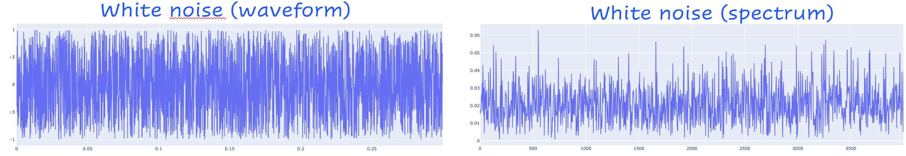
&nbsp;

Dato che il rumore bianco è costante a tutte le frequenze, vuol dire che l'energia associata ad ogni ottava non è costante. Per esempio l'energia compresa nella banda $20$ Hz - $40$ Hz non sarà la stessa di quella della banda $5$ KHz - $10 $KHz. Ovviamente quest'ultima banda avrà un'energia associata molto maggiore pur essendo sempre la larghezza pari a un'ottava in quanto il secondo intervallo di frequenze è molto più largo del primo; in altre parole contiene più frequenze dunque complessivamente più energia. Il `rumore rosa` (in inglese: pink noise ), usato anch'esso con finalità di test, presenta un decremento di 3dB ogni volta che una frequenza viene raddoppiata. In questo modo l'energia associata ad ogni ottava rimane costante su tutto lo spettro. Viene comunemente utilizzato per la taratura di sistemi di rinforzo sonoro dove il rumore bianco risulta essere un segnale non rappresentativo del segnale audio che alimenterà il sistema di rinforzo stesso. Questo è dovuto al fatto che un segnale audio ha un contenuto di energia sulle alte frequenze minore rispetto alle basse frequenze e dunque viene mal rappresentato dal rumore bianco in cui l'energia associata ad ogni ottava è doppia rispetto all'ottava precedente.

&nbsp;
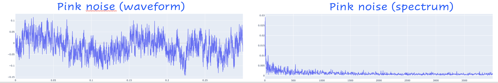
&nbsp;

##### Inviluppo
I suoni non iniziano e non terminano istantaneamente. Ci vuole un tempo finito affinché una corda inizi a vibrare e un certo tempo perché essa riduca la vibrazione a uno stato stazionario. Il tempo necessario affinché un oggetto inizi a vibrare si chiama `tempo di attacco`, mentre il tempo impiegato dalla vibrazione per decrescere a uno stato stazionario è detto `tempo di decadimento`. Per gli strumenti che possono produrre un suono continuo, come l’organo, il tempo di decadimento è definito come il tempo necessario affinché il suono decresca fino al livello di sostegno stazionario, mentre la fine della vibrazione si chiama `tempo di rilascio` (in figura).

&nbsp;
```{image} images/ADSR.png
:alt: long
:class: bg-primary mb-1
:width: 500px
:align: center
```
&nbsp;

Alcuni strumenti hanno tempi di attacco, decadimento e rilascio lunghi: per esempio, gli strumenti a corda ad arco. Gli strumenti a corda pizzicata hanno tempi di attacco più brevi. Alcuni strumenti, come il pianoforte o le percussioni, hanno tempi di attacco molto rapidi. Tempi molto brevi sono spesso chiamati transienti. La combinazione di tutte le fasi di un suono è chiamata inviluppo e rappresenta il cambiamento del volume del suono tracciato nel tempo. Il termine inviluppo può anche essere utilizzato in un senso più ampio.

---

## Note musicali

Nella musica, il termine nota è spesso usato in modo piuttosto generico e può riferirsi sia a un simbolo musicale (quando si parla di rappresentazioni in notazione) sia a un suono con `altezza` definita (quando si parla di rappresentazioni audio). In questa sezione, utilizziamo il termine per riferirci ai simboli musicali utilizzati nella notazione musicale occidentale. Ogni nota ha diversi attributi che determinano la `durata` relativa e l’altezza del suono che il musicista deve eseguire. Ad esempio, nel caso del pianoforte, l’altezza di una nota indica al musicista quale tasto deve essere premuto sulla tastiera, e la durata della nota stabilisce per quanto tempo quel tasto deve essere tenuto premuto.

Il concetto di altezza non è rigido e si riferisce a una proprietà percettiva che permette a un ascoltatore di ordinare un suono su una scala legata alla frequenza. Come si vedrà in seguito, suonare una nota su uno strumento produce un suono (più o meno) periodico di una certa frequenza fondamentale. Questa frequenza fondamentale è strettamente legata a ciò che si intende per altezza di una nota. Nel seguito, usiamo il termine “altezza” in modo intuitivo, per ordinare i suoni con altezza da “più bassa” a “più alta” — in modo simile ai tasti di una tastiera di pianoforte ordinati da sinistra a destra.

Due note con frequenze fondamentali in rapporto pari a una qualsiasi potenza di due (ad esempio, metà, doppio o quattro volte) sono percepite come molto simili. Per questo motivo, tutte le note con questo tipo di relazione possono essere raggruppate nella stessa classe di altezza. Questa osservazione porta anche alla nozione fondamentale di `ottava`, definita come l’intervallo tra una nota musicale e un’altra con metà o doppia della sua frequenza fondamentale. Con questa definizione, una classe di altezza è un insieme di tutte le altezze o note che distano un numero intero di ottave.

Per descrivere la musica usando un numero finito di simboli, è necessario discretizzare lo spazio di tutte le possibili altezze. Questo porta alla nozione di `scala musicale`, che può essere considerata come un insieme finito di altezze rappresentative. A causa della stretta relazione di ottava delle altezze, le scale sono generalmente considerate in un’unica ottava, con ottave superiori o inferiori che semplicemente ripetono il modello. Una scala musicale può quindi essere specificata da una divisione dello spazio di un’ottava in un certo numero di passi di scala. Gli elementi di una scala sono spesso chiamati semplicemente le note della scala e sono ordinati secondo le rispettive altezze.

Nella storia della musica, sono state proposte e utilizzate molte scale differenti, e ci sono state accese discussioni sull'idoneità di scale specifiche. L'appropriatezza di una scala dipende molto dal tipo di musica da descrivere, dagli strumenti usati, dal genere musicale o dal contesto culturale. Una scala adatta a rappresentare la musica per pianoforte occidentale potrebbe non essere adatta a rappresentare la musica per sitar indiano. Una scala usata per il canto gregoriano del X secolo potrebbe non essere una buona scelta per descrivere la musica sperimentale del XX secolo. Non esiste una scala musicale universalmente valida, e la scelta di una scala musicale comporta inevitabilmente delle semplificazioni imposte dalle considerazioni pratiche.

Qui consideriamo solo il caso della `scala cromatica temperata` a dodici toni, in cui un’ottava è suddivisa in dodici passi di scala. Le frequenze fondamentali di questi passi sono equidistanti su una scala logaritmica di frequenze. La differenza tra le frequenze fondamentali di due passi successivi nella scala è detta `semitono`, che rappresenta l’intervallo più piccolo possibile in questa scala. Nella scala temperata a dodici toni, ci sono dodici classi di altezza. Nella notazione musicale occidentale, queste classi di altezza sono indicate combinando una lettera con un’alterazione. Sette di queste classi (corrispondenti alla scala di Do maggiore) sono rappresentate dalle lettere `C, D, E, F, G, A, B`. Queste classi corrispondono ai tasti bianchi di una tastiera di pianoforte. Le restanti cinque classi di altezza corrispondono ai tasti neri del pianoforte e sono rappresentate da una combinazione di una lettera e di un’alterazione (♯, ♭). Un diesis (♯) alza la nota di un semitono, mentre un bemolle (♭) la abbassa di un semitono. Le alterazioni sono scritte dopo il nome della nota. Ad esempio, D♯ rappresenta il Re diesis e D♭ il Re bemolle. Nella scala temperata, le restanti cinque altezze possono essere indicate come C♯, D♯, F♯, G♯, A♯ o come D♭, E♭, G♭, A♭, B♭. Per esempio, C♯ e D♭ rappresentano la stessa classe di altezza, anche se musicalmente si distingue tra i due concetti.

Per nominare le note della scala temperata a dodici toni, oltre a indicare la classe di altezza, è necessario fornire un identificatore per l’ottava. Seguendo la Notazione Scientifica, ogni nota è specificata dal nome della classe di altezza, seguito da un numero che indica l’ottava. La nota A4 ha una frequenza fondamentale di 440 Hz e serve da riferimento. Il numero dell’ottava aumenta di uno passando da una nota con classe di altezza B a una con classe di altezza C. Ad esempio, la nota B4 è seguita dalla nota C5. Analogamente, il numero dell’ottava diminuisce di uno passando da una C a una B. La nota più bassa, C0, ha una frequenza fondamentale intorno ai 16 Hz, al di sotto della soglia di percezione acustica umana. La figura seguente mostra le note da C3 a C5, insieme ai tasti corrispondenti di una tastiera di pianoforte.

&nbsp;
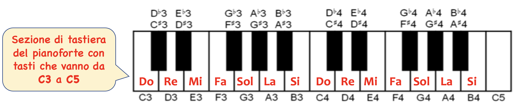
&nbsp;

Ordinando tutte le note della scala temperata secondo le loro altezze, si ottiene una scala cromatica temperata, in cui tutte le note della scala sono equidistanti. Il termine cromatico deriva dal greco chroma, che significa colore. Nel contesto musicale, il termine `croma` è strettamente legato alle dodici differenti Classi di altezza. Ad esempio, le note C2 e C5 hanno entrambe lo stesso valore di croma, C. In altre parole, tutte le note che hanno lo stesso valore di croma appartengono alla stessa classe di altezza. Ricordiamo che le note che appartengono alla stessa classe di altezza (o che hanno lo stesso valore di croma) vengono percepite come simili in un certo modo. Al contrario, le note che appartengono a classi di altezza diverse (o che hanno valori di croma diversi) vengono percepite come dissimili. Questo giustifica l’uso del termine “croma” nel senso che note con valori di croma differenti hanno un “colore sonoro” differente.

Nella figura seguente si vede la lista delle frequenze in Hertz dei tasti di un moderno pianoforte standard a 88 tasti in temperamento graduale a dodici toni, dove il quarantanovesimo tasto, il LA centrale (o A4), ha la sua fondamentale a $440$ Hz (in evidenza). Ogni ottava divide la frequenza in dodici passi identici (per esempio, il quinto LA è $440$ Hz e la sua ottava superiore è $880$ Hz), ogni frequenza successiva si deriva moltiplicando (in crescendo) o dividendo (in descrescendo) per la radice dodicesima di due (come mostrato di seguito). Per esempio, la frequenza del semitono superiore al la centrale A4 (A4\#), si ottiene moltiplicando $440$ per la radice dodicesima di due. Per passare dal la centrale A4 al $SI$ centrale $B4$ (salendo di un tono, o due semitoni), si moltiplica $440$ per la radice dodicesima di due, due volte. Per passare da A4 a C5 (il DO superiore), si moltiplica $440$ tre volte per la radice di due.

&nbsp;
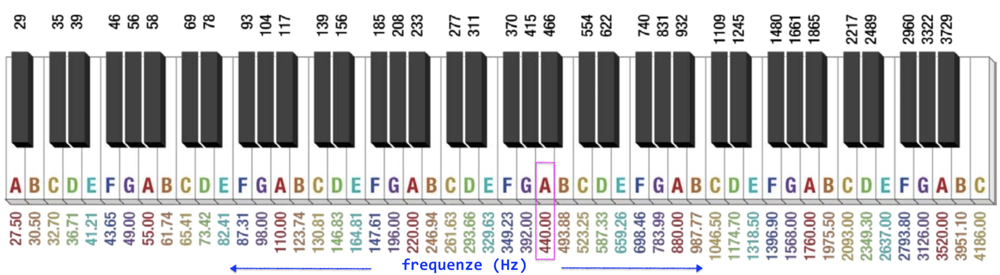
&nbsp;

##### Scala temperata

La differenza in altezza tra due suoni musicali, costituita dalla differenza di numero delle loro vibrazioni, si chiama `intervallo`. L'intervallo si determina contando le linee e gli spazi che separano le due note sul rigo musicale. Due intervalli sono uguali se è uguale il rapporto (e non la differenza) delle frequenze dei suoni dell'intervallo.

Alla fine del XVII sec. Andreas Werckmeister adottò, per costruire una scala, un procedimento matematico molto rigido rispetto ai criteri di ricerca precedenti: partendo dall'intervallo di un'ottava divise la scala in dodici parti uguali. Trovò in tal modo la costante dta dalla radice dodicesima di due, il cui valore è approssimato a 1.059.

Il rapporto fra la frequenza di una nota e la successiva è costante ed è detto semitono temperato. Indicando con $x$ il valore del semitono temperato, possiamo scrivere:

$$ 
\frac{f_\text{C4\#}}{f_\text{C4}}=\frac{f_\text{D4}}{f_\text{C4\#}}=\cdots=\frac{f_\text{B4}}{f_\text{A4\#}}=\frac{f_\text{A4\#}}{f_\text{C5}}=x
$$

Se inoltre si aggiunge il vincolo che la frequenza di una qualsiasi nota di un’ottava raddoppia nell’ottava successiva:

$$ 
\frac{f_\text{C5}}{f_\text{C4}}=\frac{f_\text{C4}}{f_\text{C3}}=\cdots=\frac{f_\text{A5}}{f_\text{A4}}=\frac{f_\text{A4}}{f_\text{A3}}=2\qquad \text{etc.}
$$

allora si ricava che la ragione $x$ di una progressione geometrica che in 12 passi porta al raddoppio di una frequenza rispetto ad un'altra è data da:

$$
2=\frac{f_\text{C5}}{f_\text{C4}}=x^{12}\frac{f_\text{C4}}{f_\text{C4}}\quad \Rightarrow \quad x^{12}=2 \quad \Rightarrow \quad x=\sqrt[12]{2}=2^\frac{1}{12}
$$

che si può approssimare a 1.06.

Dunque, moltiplicare la frequenza di una nota per $2^{1/12}$ corrisponde a salire di un semitono nella scala temperata, mentre moltiplicare la frequenza di una nota per $2^{k/12}$ corrisponde a salire di $k$ semitoni nella scala temperata, come rappresentato in figura.

&nbsp;
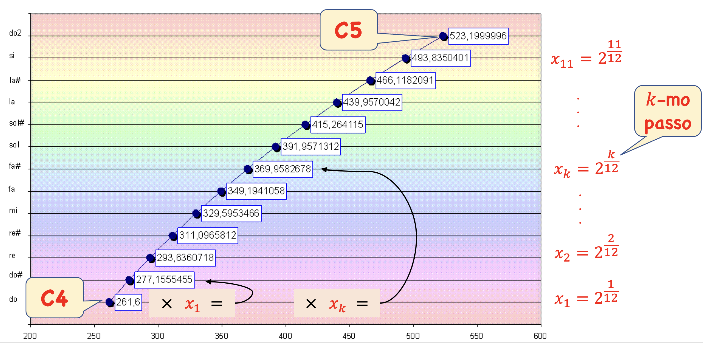
&nbsp;

Inoltre, per la proprietà dei logaritmi (il logaritmo di un quoziente è uguale alla differenza dei logaritmi del dividendo e del divisore) la scala logaritmica trasforma i rapporti di frequenza in differenze, così un’ottava si traduce in un intervallo costante fra i logaritmi delle frequenze. Per esempio (ma vale per tutte le coppie di note con lo stesso nome, ma appartenenti a ottave contigue):

$$
1=\log_2 2=\log_2\left(\frac{f_\text{C5}}{f_\text{C4}}\right)
=\log_2 \left(f_\text{C5}\right)-\log_2\left(f_\text{C4}\right)
$$

La musica occidentale si basa sul sistema temperato equabile. La sua scala si distingue anzitutto in `cromatica` e `diatonica`. La scala cromatica è la scala che comprende tutti i suoni possibili del sistema, quindi nel temperamento equabile è definita dalla successione di 12 semitoni contigui (in figura). Il semitono cromatico è formato da due note con lo stesso nome ma diversa altezza (es: Do - Do\#, Mi$\flat$ - Mi).

&nbsp;
```{image} images/scala_do_maggiore.png
:alt: long
:class: bg-primary mb-1
:width: 400px
:align: center
```
&nbsp;

La scala diatonica è una scala di 7 note e ad essa appartengono due grandi tipi di scale: la scala maggiore (in figura sotto), costituita da 5 toni e 2 semitoni, e diverse forme di scale minori. Il semitono diatonico è formato con due note consecutive con diverso nome e diversa altezza (es: Mi - Fa , Si - Do)

```{image} images/scala_diatonica.png
:alt: long
:class: bg-primary mb-1
:width: 250px
:align: center
```

:::{figure} video/do_major.mp4
:width: 30%
:align: left
:::

---

## Analisi in frequenza del segnale audio

Come abbiamo visto in precedenza, i segnali musicali sono generalmente complessi mix sonori che consistono in una moltitudine di componenti sonore differenti. A causa di questa complessità, l’estrazione di informazioni musicalmente rilevanti da un’onda costituisce un problema difficile. Un primo passo per comprendere meglio un segnale dato è scomporlo in blocchi costitutivi che siano più accessibili per i successivi passaggi di elaborazione. Nel caso in cui questi blocchi siano costituiti da funzioni sinusoidali, tale processo è anche chiamato `analisi di Fourier`. Le funzioni sinusoidali sono particolari in quanto possiedono un significato fisico esplicito in termini di frequenza. Di conseguenza, la scomposizione risultante rivela lo spettro di frequenze del segnale, simile a un prisma che può essere usato per scomporre la luce nei suoi colori spettrali costituenti. La trasformata di Fourier converte un segnale dipendente dal tempo in una rappresentazione che dipende dalla frequenza. Essendo uno degli strumenti più importanti nell’elaborazione dei segnali, incontreremo la trasformata di Fourier in una varietà di compiti di elaborazione musicale.

Per comprenderne la portata, iniziamo con un segnale audio che rappresenta il suono di un brano musicale. Ad esempio, analizziamo il suono di una singola nota suonata su un pianoforte il cui tracciato temporale è mostrata in figura. 

&nbsp;
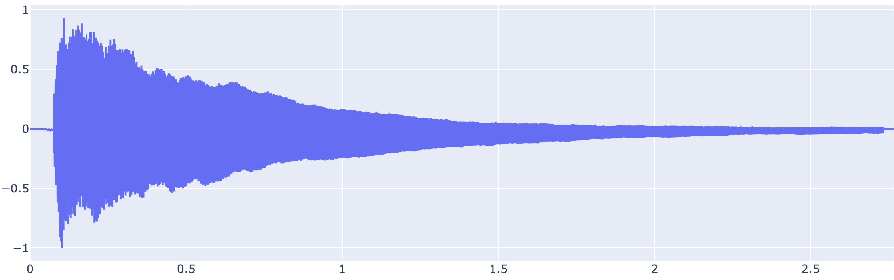
&nbsp;

Per comprendere quale nota sia stata effettivamente suonata, ricordiamo che l’altezza di un suono musicale è strettamente legata alla sua frequenza fondamentale, ovvero la frequenza della componente parziale più bassa del suono. Pertanto, dobbiamo determinare il contenuto in frequenza, ossia le principali oscillazioni periodiche del segnale. Ingrandiamo il segnale considerando solo una sezione di circa 20 ms e di 220 campioni (come in figura). 

&nbsp;
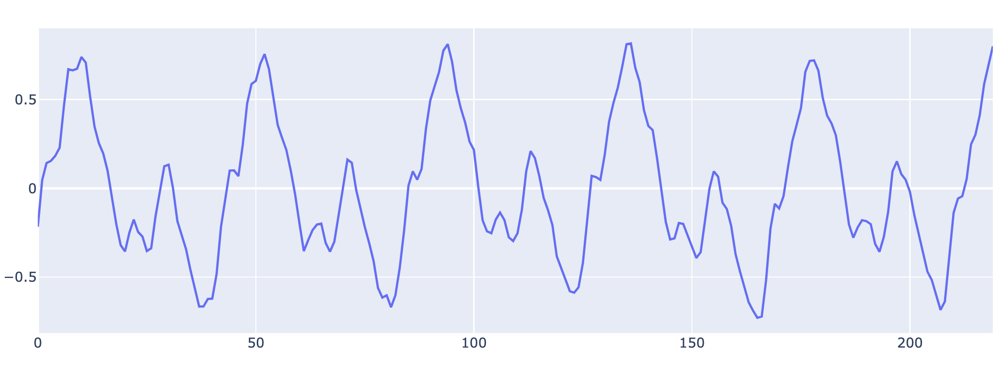
&nbsp;

La figura mostra che il segnale si comporta in modo quasi periodico in questa sezione. In particolare, si possono osservare 5 creste principali di un’oscillazione simile a una sinusoide. La presenza di circa 5 cicli di oscillazione in una sezione di 20 ms indica che il segnale contiene una componente di frequenza di circa 262 Hz.

L'idea principale dell'analisi di Fourier è confrontare il segnale con sinusoidi di varie frequenze $f\in\mathbb{R}$ (in Hz). Ciascuna di queste sinusoidi, o toni puri, può essere vista come un'oscillazione prototipo (o appartenente alla base - potenzialmente infinita - di Fourier). Come risultato, otteniamo per ogni frequenza considerata $f \in \mathbb{R}$ un coefficiente di ampiezza $c_f \in \mathbb{R}$ che ne caratterizza il "peso" nella scomposizione (o composizione additiva) del segnale. Nel caso in cui il coefficiente $c_f$ sia elevato in magnitudine, vi è un'alta somiglianza tra il segnale e la sinusoide di frequenza $f$, e il segnale contiene un'oscillazione periodica a quella frequenza. Nel caso in cui $c_f$ sia molto basso o quasi nullo, il segnale non contiene una componente periodica a quella frequenza. 

Tracciamo ora i coefficienti $c_f$ rispetto ai vari parametri di frequenza $f \in \mathbb{R}$. Questo genera un grafico come quello mostrato nella prossima figura. In questo grafico, il valore massimo si trova per il parametro di frequenza $f_0=261.7$ Hz che rappresenta all'incirca la `frequenza fondamentale` della nota C4. Infatti, questa è esattamente la nota suonata nell'esempio al pianoforte. Inoltre, attraverso i coefficienti che spiccano nel grafico, si può anche osservare la presenza di numerose sinusoidi di frequenza multipla della fondamentale ad indicare, all’incirca, le componenti in frequenza delle parziali del tono C4, anche detto `spettro di frequenza` del segnale.

&nbsp;
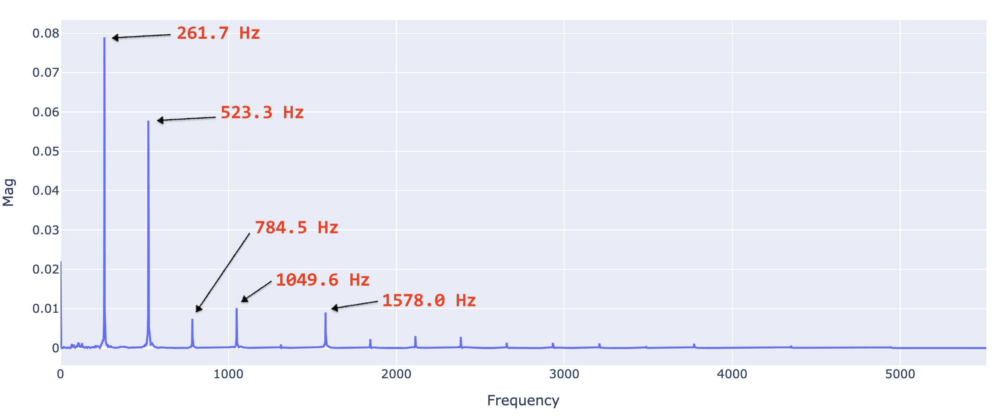
&nbsp;

Per osservare nel dettaglio il contributo delle armoniche nell'approssimazione del segnale si osservi la figura seguente. Come detto il segnale è un segnale quasi periodico in cui si possono osservare oscillazioni che rimandano all'dea di una sovrapposizione di sinusoidi di varia frequenza ed ampiezza. Infatti si nota direttamente dal secondo grafico in figura il peso della prima armonica, o fondamentale, di frequenza $f_0$. Le creste tra segnale e fondamentale mostrano una indubbia corrispondenza. Tuttavia sono necessarie altre armoniche per ottenere migliore ricostruzione: nella seconda e nella terza immagine sono infatti riportati i grafici con rispettivamente 3 e 10 armoniche linearmente combinate con i coefficienti mostrati prima. Le armoniche sono multiple della fondamentale secondo la legge $f_k=(k+1)f_0$, con $k=0,1,2,\cdots$.

&nbsp;
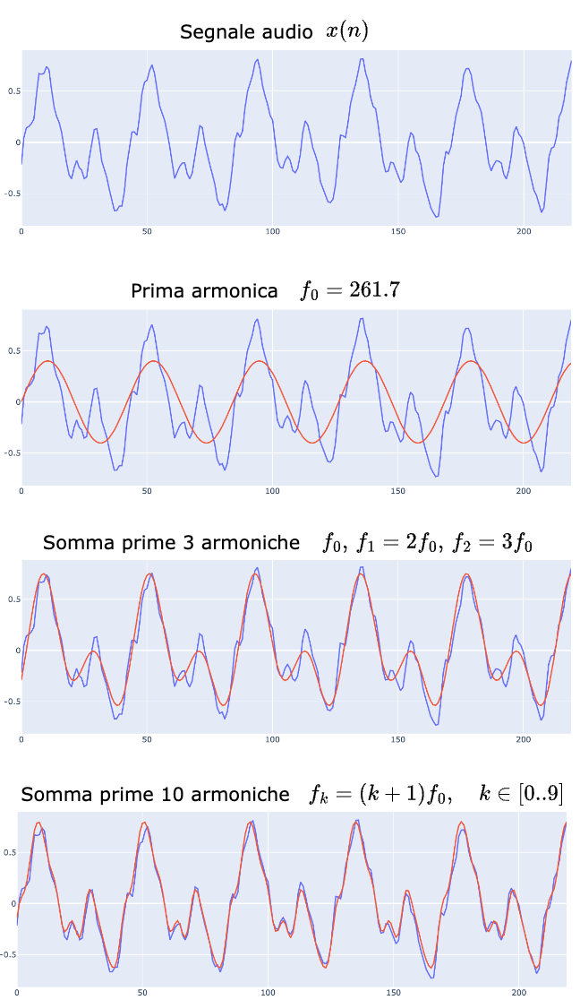
&nbsp;

Con questo esempio, abbiamo già visto l'idea principale della trasformata di Fourier. La trasformata di Fourier scompone un segnale nelle sue componenti di frequenza. Per ciascuna frequenza $f$, la trasformata di Fourier fornisce un coefficiente $c_f$ (e una fase $\varphi_f$) che ci dice in che misura il segnale dato corrisponde a un'oscillazione prototipo sinusoidale di quella frequenza. Sotto ipotesi molto larghe dunque, un qualsiasi segnale può essere visto come somma di un numero, eventualmente infinito, di componenti armoniche.  Ad ogni componente armonica è associata una frequenza di oscillazione. Quindi è possibile studiare quali e quante frequenze siano presenti in un dato segnale. La trasformata di Fourier è una trasformazione matematica reversibile che permette tutto questo: aumentando il numero di componenti armoniche, ovvero il numero dei segnali armonici a diversa frequenza, si può migliorare l’approssimazione del segnale fino a ridurre a zero la differenza.
Questa sovrapposizione ponderata viene anche chiamata rappresentazione di Fourier del segnale originale. Il segnale originale e la trasformata di Fourier contengono la stessa quantità di informazioni. Queste informazioni, tuttavia, sono rappresentate in modi diversi. Mentre il segnale visualizza le informazioni nel dominio del tempo, la trasformata di Fourier le visualizza nel dominio della frequenza. Come affermato da Hubbard [9], il segnale ci dice quando determinate note vengono suonate nel tempo, ma nasconde le informazioni sulle frequenze. Al contrario, la trasformata di Fourier della musica mostra quali note (frequenze) vengono suonate, ma nasconde le informazioni su quando le note vengono eseguite.

---

##### Trasformata di Fourier di segnali analogici

Senza seguire una trattazione rigorosa, ricordiamo qui l'importante risultato relativo alla trasformata di Fourier di un segnale (audio) analogico. Richiamiamo poi che per calcolare lo spettro di un segnale analogico in digitale, si campiona una registrazione di durata finita del segnale e i campioni risultanti vengono trasformati nel dominio della frequenza mediante un algoritmo DFT o FFT. La frequenza di campionamento $F_s$ deve essere sufficientemente veloce da minimizzare gli effetti dell'aliasing. Se necessario, un prefiltro analogico anti-aliasing può precedere l'operazione di campionamento.

Iniziamo rivedendo le principali definizioni. Un segnale analogico è descritto da una funzione del tempo $x_a(t)$. La `trasformata di Fourier` $X_a(f)$ di $x_a(t)$ è lo spettro di frequenza del segnale:

$$
X_a(f)=\int_{-\infty}^{+\infty} x(t)e^{-j2\pi f t} dt 
$$

dove $f$ è la frequenza ordinaria f in [Hertz] o [cicli/sec]. Si noti che occorre integrare su tutti i tempi da $-\infty$ a $+\infty$ anziché su un intervallo limitato e conseguentemente, dalle medie integrali relative alle diverse armoniche adesso si deve passare agli integrali. Il significato fisico di $X_a(f)$ è evidenziato dalla `trasformata di Fourier inversa`, che esprime il segnale arbitrario $x_a(t)$ come una sovrapposizione lineare di sinusoidi di diversa frequenza:

$$
x_a(t)=\frac{1}{2\pi}\int_{-\infty}^{+\infty} X_a(f)e^{+j2\pi f t} df 
$$

##### Esempi

Consideriamo alcuni esempi. La figura seguente mostra la forma d'onda e la trasformata di Fourier in ampiezza per alcuni segnali audio, dove viene suonata una singola nota C4 su strumenti diversi: un pianoforte, una tromba, un violino e un flauto. Abbiamo già incontrato questo esempio in precedenza, dove abbiamo discusso l'aspetto del timbro. Ricordiamo che l'esistenza di determinati parziali e la loro forza relativa hanno un'influenza cruciale sul timbro di un tono musicale. 

&nbsp;
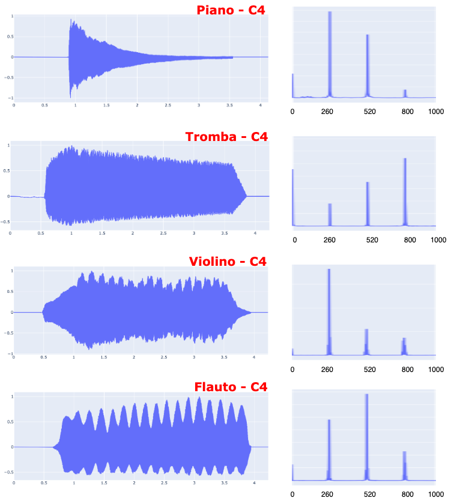
&nbsp;

Nel caso del tono del pianoforte, la trasformata di Fourier mostra un picco netto a 262 Hz, il che rivela che la maggior parte dell'energia del segnale è contenuta nel primo parziale o nella frequenza fondamentale della nota C4. Ulteriori picchi (anche oltre l'intervallo di frequenza mostrato da 0 a 1000 Hz) si trovano a multipli interi della frequenza fondamentale, corrispondenti ai parziali superiori. La successiva mostra che la stessa nota suonata su una tromba genera uno spettro di frequenza simile, dove i picchi appaiono nuovamente a multipli interi della frequenza fondamentale. Tuttavia, la maggior parte dell'energia è ora contenuta nel terzo parziale, e le altezze relative dei picchi sono diverse rispetto al pianoforte. Questo è uno dei motivi per cui una tromba suona diversa da un pianoforte. Per un violino, la maggior parte dell'energia è di nuovo contenuta nel primo parziale. Si noti che i picchi sono sfocati in frequenza, un risultato del vibrato. Le modulazioni di frequenza del vibrato, dipendenti dal tempo, sono mediate dalla trasformata di Fourier. In questo modo si ottiene un singolo coefficiente per ogni frequenza, indipendente dalle fluttuazioni spettro-temporali. Una spiegazione simile vale per il tono del flauto mostrato in ultimo.

---

##### Trasformata di Fourier a tempo discreto

Assumiamo ora di effettuare il campionamento di segnali a tempo continuo, come per esempio quelli ottenuti dai suoni degli strumenti mostrati sopra.  Ricordiamo che un segnale a tempo discreto $x(n)=x_a(nT_s)$, ottenuto per campionamento con tasso $F_s$ da un segnale a tempo continuo $x_a(t)$, ha trasformata di Fourier:

$$
X_s(f)=\sum_{-\infty}^{+\infty} x(n)e^{-j2\pi f T_sn}=\sum_{-\infty}^{+\infty} x(n)e^{-j2\pi \frac{f}{F_s}n}.
$$

Questa trasformazione è nota come `Trasformata di Fourier a tempo discreto` (`DTFT`) della sequenza di campioni $x(n)=x_a(nT_s)$. La funzione $X_s(f)$ è una funzione periodica di $f$ con periodo $F_s$, quindi $X_s(f+F_s)=X_s(f)$. A causa di questa periodicità, si può restringere l'intervallo di frequenza a un solo periodo, cioè l'intervallo di Nyquist, $[-F_s/2, F_s/2]$. La periodicità in f implica che $X_s(f)$ si estenderà sull'intero asse delle frequenze, in accordo con la nostra aspettativa che il processo di campionamento introduca alte frequenze nello spettro originale. 

E\' anche utile aggiungere che data la periodicità di $X_s(f)$ sì può ricostruire $x_a(nT_s)$ da $X_s(f)$ mediante la `trasformata di Fourier inversa` (`I-DTFT`):

$$
x_a(nT_s)=\frac{1}{F_s}\int_{-F_s/2}^{+F_s/2} X_s(f)e^{j2\pi f T_sn}=\frac{1}{2\pi}\int_{-\pi}^{+\pi} X_s(\omega)e^{j\omega n}
$$

dove il cambio di variabile $\omega=j2\pi f/F_s$ esprime la `frequenza digitale` definita in precedenza e che riporta la periodicità nell'intervallo $[-\pi, \pi]$.

Un legame molto importante tra la trasformata a tempo continuo $X_a(f)$ e quella a tempo discreto $X_s(f)$ è che quest'ultima ci consente di calcolare in modo approssimato lo spettro del segnale analogico $x_a(t)$. Infatti, utilizzando la definizione di integrale secondo Riemann, possiamo scrivere approssimativamente

$$
X_a(f)=\int_{-\infty}^{+\infty} x(t)e^{-j2\pi f t} dt \approx
T_s\cdot \sum_{-\infty}^{+\infty} x(n)e^{-j2\pi f T_sn}
$$

oppure 

$$
X_a(f)\approx T_s\cdot X_s(f).
$$

Questa approssimazione diventa esatta al limite del tempo continuo:
$$
X_a(f)=\lim_{T_s\to 0} T_s\cdot X_s(f)
$$

Anche se non giustificato qui, la periodicità in $f$ è legata alla replica periodica dello spettro originale $X_a(f)$, come si vede in figura.

&nbsp;
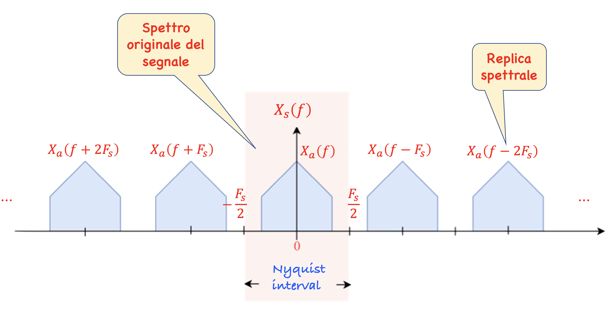
&nbsp;

--- 

##### Trasforma Discreta di Fourier 
 
Per eseguire calcoli su macchine digitali (DSP), dobbiamo risolvere ancora alcuni problemi. Un problema è che la somma nelle approssimazioni precedenti coinvolge un numero infinito di addendi. Un altro problema è che il parametro di frequenza $f$ (oppure $\omega$) è un parametro continuo. Per entrambi i problemi esistono alcune soluzioni pragmatiche. Per quanto riguarda il primo problema, assumiamo che la maggior parte dell'informazione rilevante di $f$ sia limitata a una certa durata nel tempo. Ad esempio, la registrazione di una canzone difficilmente dura più di dieci minuti. Avere una durata finita significa che il segnale analogico $f$ è assunto come nullo al di fuori di un intervallo compatto. Eventualmente spostando il segnale, possiamo assumere che questo intervallo inizi al tempo $t=0$. Questo significa che dobbiamo considerare solo un numero finito di campioni $x(0),x(1),\dots,x(N -1)$ per un numero intero opportuno $N$. Di conseguenza, la somma diventa finita. Per quanto riguarda il secondo problema, si calcola la trasformata di Fourier solo per un numero finito di frequenze. Analogamente al campionamento dell'asse del tempo, in genere si campiona l'asse delle frequenze considerando le frequenze $\omega= k/M$ per un certo numero di $M$ e $k\in [0,\dots,M-1]$. In pratica, spesso si accoppiano il numero di campioni $N$ e il numero $M$ che determina la risoluzione in frequenza impostando $N=M$.  L'approssimazione in pratica si avvale della seguente somma parziale

$$\label{eq:DFT}
X_s(f_k)\approx X(k)=\sum_{n=0}^{N-1} x(n)e^{-j2\pi \frac{k}{N}n}
$$

dove le frequenze espresse dal coefficiente di Fourier $X(k)$ di indice k corrispondono alle frequenze fisiche

$$
f_k=\frac{k}{NT_s}=k\cdot \frac{F_s}{N}, \quad k=0,\dots,N-1
$$

in Hertz. Questa trasformazione è nota anche come `Trasformata di Fourier Discreta `(`DFT`). In pratica si usa una finestra temporale che produce effetti di smearing e leakage dello spettro. Questi concetti sono centrali nell'ambito dell'analisi spettrale e non saranno discussi qui. 

Per completezza, richiamiamo la coppia DFT e IDFT (DFT inversa) definita su $N$ punti per un segnale $x(n)$ di pari  lunghezza e valutata in $N$ frequenze equidistanti sull'intero intervallo di Nyquist, $0\leq ω\leq 2\pi$, espresse in radianti per campione, come segue:

$$
\omega_k=k\cdot \frac{2\pi}{N},\qquad \quad k=0,\dots,N-1
$$

da cui DFT e IDFT, per $k=0,\dots,N-1$ e $n=0,\dots,N-1$, risultano:

$$
X(k)=\sum_{n=0}^{N-1} x(n)e^{-j\omega_k n}\qquad \text{e}\qquad x(n)=\frac{1}{N}\sum_{k=0}^{N-1} X(k)e^{j\omega_k n}
$$

I coefficienti $X(k)$ devono essere considerati tuttavia con attenzione. In primo luogo, la qualità dell'approssimazione nella {eq}`eq:DFT` può essere piuttosto scarsa, in particolare per frequenze vicine alla frequenza di Nyquist. In secondo luogo, per un segnale $x(t)$ a valore reale, la trasformata di Fourier soddisfa alcune proprietà di simmetria. Di conseguenza, la metà superiore dei coefficienti di Fourier è ridondante e occorre considerare solo i coefficienti $X(k)$ per $k\in [0,\dots,N/2]$. Infine, consideriamo alcuni aspetti di efficienza nel calcolo della DFT. Per calcolare un singolo coefficiente di Fourier $X(k)$, è necessario un numero di moltiplicazioni e addizioni lineare in $N$. Pertanto, per calcolare tutti i coefficienti $X(k)$ per $k\in [0,\dots,N/2]$ è richiesto un numero di operazioni dell'ordine di $N^2$. Nonostante sia un numero finito di operazioni, un approccio computazionale di questo tipo è troppo lento per molte applicazioni pratiche, specialmente quando $N$ è grande. Il numero di operazioni può essere drasticamente ridotto utilizzando un algoritmo efficiente noto come la `trasformata veloce di Fourier` (`FFT`). L'algoritmo FFT, scoperto da Gauss e Fourier duecento anni fa, ha rivoluzionato intere industrie ed è ora utilizzato in miliardi di dispositivi di telecomunicazione e altri dispositivi. La FFT sfrutta le ridondanze tra sinusoidi di diverse frequenze per calcolare congiuntamente tutti i coefficienti di Fourier tramite una ricorsione. Questa ricorsione funziona particolarmente bene nel caso in cui $N$ sia una potenza di due. Di conseguenza, la FFT riduce il numero complessivo di operazioni dall'ordine di $N^2$ all'ordine di $N \log_2 N$. I risparmi sono enormi. Ad esempio, usando $N = 2^{10} = 1024$, l'FFT richiede approssimativamente $N \log_2 N = 10240$ operazioni invece di $N^2 = 1048576$ operazioni nell'approccio naive, con un fattore di risparmio di circa 100. Nel caso di $N = 2^{20}$, i risparmi ammontano a un fattore di circa 50000, etc.

##### Spettro di segnale a banda non limitata

In ossequio al monito riportato sopra circa il fatto che coefficienti $X(k)$ possono generare errore variabile di approssimazione dello spettro di un segnale analogico da cui prendono le mosse, si mostra di seguito l'analisi temporale e spettrale di un segnale a banda non limitata, come l'esponenziale negativo, con particolare attenzione all'errore che si commette a causa dell'ineludibile aliasing. Si mostra inoltre quale ruolo giochino due principali parametri del processo di campionamento, come la frequenza di campionamento $F_s$ e il numero di campioni osservati $N$, nell'estrarre sufficiente informazioni per il controllo di detto errore.  

Si considerino il segnale esponenziale negativo $x_a(t)=Ae^{-\alpha t} u(t)$, con $A,\alpha$ reali positivi, $u(t)$ la funzione gradino, e la sua trasformata di Fourier che può essere data in forma analitica $X_a(f)=A/(\alpha+j2\pi f)$ riportate nelle figure seguenti (in cui si mostra il segnale $x_a(t)$ e la risposta in frequenza $|X_a(f)|$, cioè il modulo dello spettro). 

&nbsp;
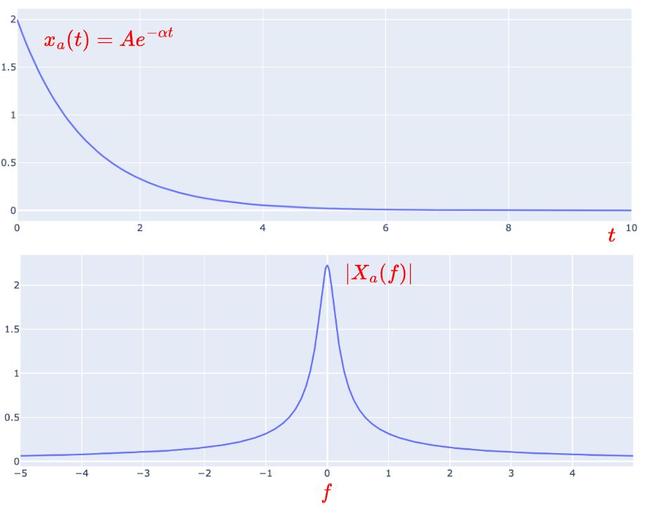
&nbsp;

E\' evidente che lo spettro $|X_a(f)|$ non è limitato e ha energia in tutte le frequenza $-\infty<f<+\infty$, benché mostri un profilo di decadimento (o andamento) iperbolico che rende le frequenze meno rilevanti in bande via via sempre più lontane dallo zero.

Per determinare la trasformata di Fourier di $x_a(t)$ mediante tecniche di analisi digitale è necessario campionare la funzione $x_a(t)$. Il risultato del campionamento è illustrato nella sottostante figura. Il segnale campionato, con frequenza $F_s$ risulta:

$$
x(n)=x_a(nT_s)=Ae^{-\alpha nT_s}, \quad 0\leq n\leq +\infty
$$

&nbsp;
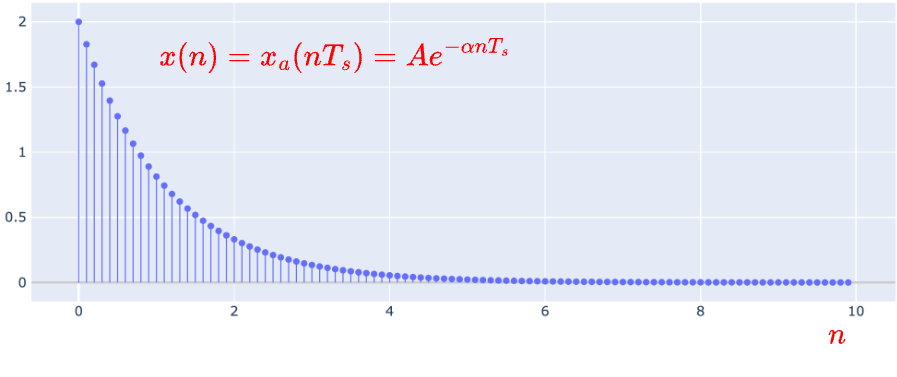
&nbsp;

Lo spettro di $x(n)$ può essere trovato facilmente se si utilizza un calcolo diretto della trasformata di Fourier a tempo discreto. Troviamo che

$$
X_s(f)=\sum_{-\infty}^{+\infty}x_a(nT_s)e^{-j2\pi fn 𝑇_𝑠}=
\frac{A}{1-e^{-T_s(\alpha+j2\pi f)}}
$$

La sequenza dei campioni ha una trasformata di Fourier che si ottiene replicando infinite volte la trasformata di Fourier del segnale originale, ciascuna replica essendo centrata su un
multiplo della frequenza di campionamento $F_s=1/T_s$. Se dunque tale frequenza non è sufficientemente grande compare il fenomeno dell’aliasing, per cui tali repliche risultano sovrapposte. Ciò è mostrato in figura, e fornisce una prima importante differenza dell’implementazione numerica rispetto
alla trasformata originale. Quella ottenuta è la DTFT ed ha il problema di dipendere da infiniti campioni, oltre ad essere una funzione continua nella variabile $f$, e quindi non trattabile numericamente.

&nbsp;
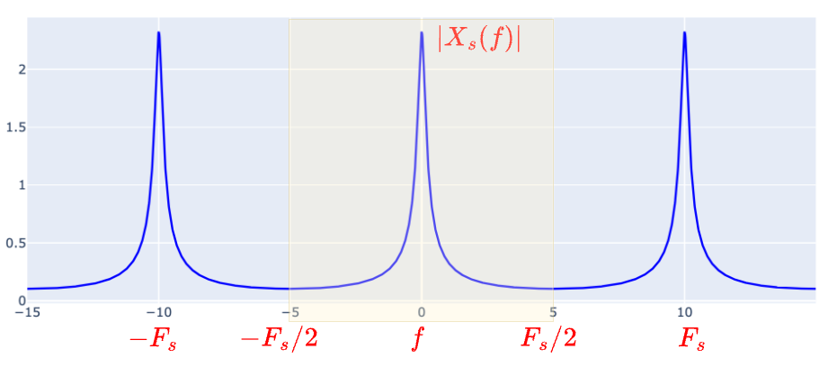
&nbsp;

La figura seguente invece mostra lo spettro $X_s(f)$ in banda base, cioè ristretta all'intervallo di Nyquist $[-F_s/2, F_s/2]=[-5,5]$, cioè con $F_s=10$ Hz, e corrispondente al lobo centrale della figura precedente.  

&nbsp;
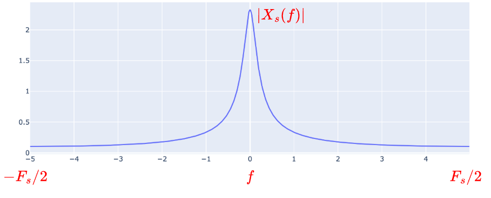
&nbsp;

Il problema dell’aliasing può essere eliminato (come è
noto dal teorema del campionamento) campionando con una frequenza almeno pari al doppio della massima frequenza nello spettro di $x_a(t)$. D’altro canto, se $X_a(f)$ ha estensione illimitata l’aliasing potrà essere soltanto ridotto assumendo per $T_s$ il valore più piccolo possibile. Una seconda differenza, causata dall'implementazione numerica, rispetto al risultato atteso, risulta evidente dalle figure mostrate sopra: il numero di campioni di $x_a(t)$ considerati non potrà essere arbitrariamente elevato. Se dunque $x_a(t)$ ha durata temporale molto grande (come in questo caso che si estende
per $-\infty<t<+\infty$) una porzione di segnale non sarà campionata. Graficamente, ciò corrisponde ad assumere una “finestra di campionamento” di $N$ campioni, come si vede dalla figura.

&nbsp;
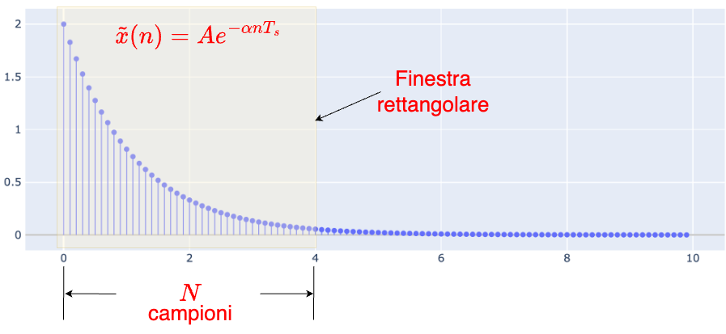
&nbsp;

Dal punto di vista dello spettro in frequenza, in virtù della proprietà del prodotto, la convoluzione tra la trasformata $X_a(f)$ e quella della finestra (per es. rettangolare) $W(f)$ danno luogo a classici ripple (dovuti al troncamento) che compaiono nello spettro della trasformata. Qui la frequenza di campionamento è fissata a $F_s=2$ Hz, mentre il numero di campioni prelevati dal segnale dato dalla lunghezza della finestra è $N=10$. Nell'immagine sotto è visibile l'effetto della convoluzione con la finestra rettangolare: il grafico mette assieme l'originale $X_a(f)$ (in blu), la DTFT $X_s(f)$ (in rosso) e la DFT $X(k)$ (in verde, ma plotatta con interpolazione continua).

&nbsp;
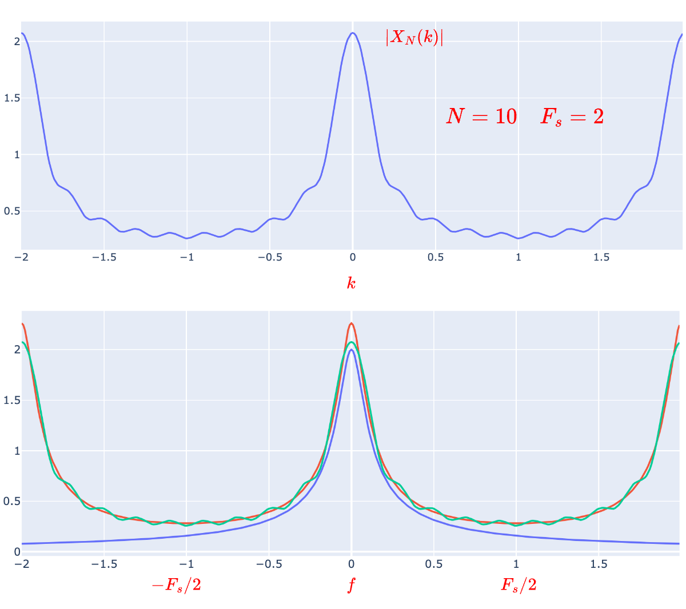
&nbsp;

Nell'immagine seguente si opera la stessa finestratura, ma questa volta con finestra ampia il doppio, cioè $N=20$, pur mantenendo la frequenza di campionamento a $F_s=2$ Hz. Come si nota l'ampiezza dei ripple si riduce significativamente, quindi il numero di campioni incide sull'approssimazione puntuale tra i due spettri (si riduce la discrepanza tra continuo e discreto per ogni frequenza $f_k$ considerata).

&nbsp;
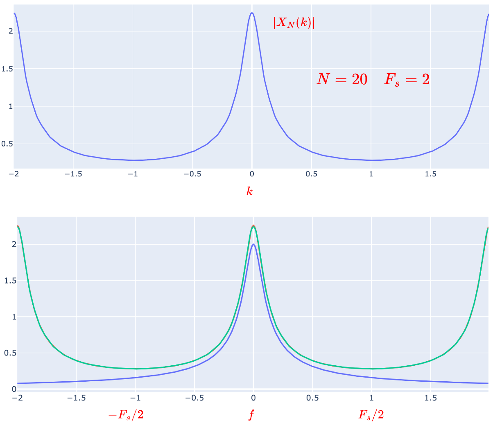
&nbsp;

Per migliorare ulteriormente l'approssimazione, cioè al fine di ottenere una buona ricostruzione per via numerica della trasformata di Fourier originale queste differenze (che, di fatto, si traducono in errori di valutazione) possono essere controllate da un numero sufficientemente elevato di campioni e un sufficiente passo di campionamento. La figura successiva mostra, mediante i plot dei tre spettri citati sopra, il livello di approssimazione usando $N=200$ campioni del segnale originale $x_a(nT_s)$ e un tasso di campionamento $F_s=20$. Come si nota, l'estensione della banda di frequenza in cui gli spettri sono per buona parte sovrapposti si estende fino a raggiungere il tasso di Nyquist $F_s/2$ (in entrambe le direzioni), anche se in quella regione l'errore si mantiene più alto, che cresce con $F_s$ naturalmente.

&nbsp;
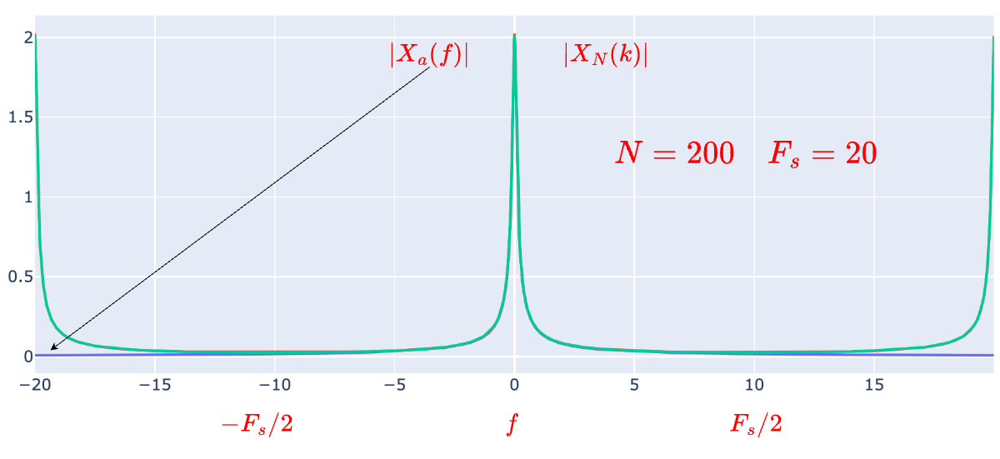
&nbsp;


##### Il decadimento esponenziale

Il decadimento esponenziale si verifica naturalmente quando una quantità decade a una velocità proporzionale alla quantità rimasta. In natura, tutti i risonatori lineari, come le corde degli strumenti musicali e le canne dei legni, mostrano un decadimento esponenziale nella loro risposta a un'eccitazione momentanea. Per fare un altro esempio, l'energia riverberante in una stanza decade esponenzialmente dopo la cessazione del suono diretto. In sostanza, tutte le oscillazioni non pilotate decadono in modo esponenziale (purché siano lineari e invarianti nel tempo). Non pilotate significa che non c'è una fonte continua di energia motrice. Esempi di oscillazioni non guidate sono le vibrazioni di un diapason, le corde percosse o pizzicate, la barra di una marimba o di uno xilofono e così via. Esempi di oscillazioni pilotate sono i corni, i fiati, gli archi e la voce. Le oscillazioni pilotate sono tipicamente periodiche, mentre quelle non pilotate non lo sono, tranne nei casi idealizzati (senza perdita).

La crescita esponenziale si verifica quando una quantità aumenta a un tasso proporzionale alla quantità attuale. La crescita esponenziale è instabile, poiché nulla può crescere in modo esponenziale per sempre senza incorrere in qualche limite. Si noti che una costante di tempo positiva corrisponde a un decadimento esponenziale, mentre una costante di tempo negativa corrisponde a una crescita esponenziale. Nell'elaborazione dei segnali, abbiamo quasi sempre a che fare esclusivamente con il decadimento esponenziale (costanti di tempo positive).

---

## La Short-Time Fourier Transform (STFT)

Abbiamo visto che la magnitudine della trasformata di Fourier ci informa sul contenuto complessivo di frequenza di un segnale, ma non ci dice in quale momento tale contenuto di frequenza si manifesta. La figura seguente illustra questo fatto, mostrando la forma d'onda e la magnitudine della trasformata di Fourier per due segnali. Il primo segnale è composto da due parti, con una sinusoide di frequenza $\omega = 1$ Hz e ampiezza $A = 1$ nella prima parte e una sinusoide di $\omega = 5$ Hz e ampiezza $A = 0.7$ nella seconda parte. Inoltre, il segnale è nullo all'esterno dell'intervallo $[0,10]$. Al contrario, il secondo segnale è una sovrapposizione di queste due sinusoidi ed è nullo all'esterno dell'intervallo $[0,5]$. Anche se i due segnali sono di natura diversa, le magnitudini delle rispettive trasformate di Fourier risultano più o meno identiche. Questo dimostra i limiti della trasformata di Fourier nell'analizzare segnali con caratteristiche variabili nel tempo.

&nbsp;
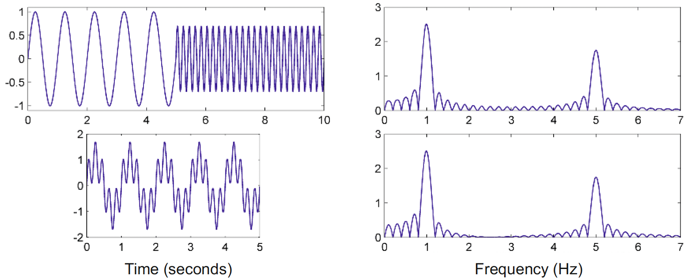
&nbsp;

La trasformata di Fourier fornisce informazioni sulle frequenze che sono mediate su tutto il dominio temporale. Tuttavia, l'informazione sul momento in cui tali frequenze si manifestano è nascosta nella trasformata. Per recuperare l'informazione temporale nascosta, Dennis Gabor introdusse, nel 1946, la `Short-Time Fourier Transform` (`STFT`). Invece di considerare l'intero segnale, l'idea principale della STFT è quella di considerare solo una piccola sezione del segnale. A tale scopo, si fissa una cosiddetta funzione finestra, che è una funzione non nulla solo per un breve intervallo di tempo (definendo la sezione considerata). Il segnale originale viene quindi moltiplicato con la funzione finestra per ottenere un segnale finestrato. Per ottenere informazioni sulle frequenze in diversi istanti temporali, si sposta la funzione finestra lungo il tempo e si calcola una trasformata di Fourier per ciascuno dei segnali finestrati risultanti.

Questa idea è illustrata nella figura seguente, che continua l'esempio dalla figura precedente. Per ottenere sezioni locali del segnale originale, si moltiplica il segnale con funzioni finestra rettangolari opportunamente traslate. Nel secondo grafico a partire dall'alto, la sezione locale risultante contiene solo contenuto di frequenza a $1$ Hz, il che porta a un singolo picco principale nella trasformata di Fourier a $\omega = 1$ Hz. Spostando ulteriormente la finestra temporale verso destra, la sezione risultante contiene componenti a $1$ Hz e $5$ Hz (terza figura). Queste componenti sono riflesse dai due picchi a $\omega = 1$ e $\omega = 5$. Infine, la sezione mostrata nella quarta figura contiene solo contenuto di frequenza a $5$ Hz.

&nbsp;

&nbsp;

Già a questo punto, desideriamo enfatizzare che la STFT riflette non solo le proprietà del segnale originale ma anche quelle della funzione finestra. Innanzitutto, la STFT dipende dalla lunghezza della finestra, che determina la dimensione della sezione. Inoltre, la STFT è influenzata dalla forma della funzione finestra. Ad esempio, i bordi netti della finestra rettangolare tipicamente introducono artefatti di tipo “ripple”. 

Nel seguito, consideriamo il caso di segnali a tempo discreto e specifichiamo le formule matematiche più importanti, necessarie per le applicazioni pratiche. Sia $x : \mathbb{Z} \rightarrow \mathbb{R}$ un segnale a valori reali ottenuto tramite campionamento equidistante rispetto a una frequenza di campionamento fissa $F_s$ espressa in Hertz. Inoltre, sia $w : [0 : N - 1] \rightarrow \mathbb{R}$ una funzione finestra campionata di lunghezza $N \in \mathbb{N}$. Ad esempio, nel caso di una finestra rettangolare, si ha $w(n) = 1$ per $n \in [0 : N - 1]$. Implicitamente, si assume che $w(n) = 0$ per tutti gli altri parametri temporali $n \in \mathbb{Z} \setminus [0 : N - 1]$ al di fuori di questa finestra. Il parametro di lunghezza $N$ determina la durata delle sezioni considerate, che corrisponde a $NT_s=N/F_s$ secondi. Si introduce anche un parametro aggiuntivo $H \in \mathbb{N}$, che è chiamato hop size. Il parametro hop size è specificato in campioni e determina la dimensione del passo con cui la finestra deve essere traslata lungo il segnale.

Rispetto a questi parametri, la STFT discreta $X$ del segnale $x$ è definita da

$$
X(m,k)=\sum_{n=0}^{N-1} w(n)x(n + mH)e^{-j \frac{2 \pi}{N}kn} 
$$

con $m \in \mathbb{Z}$ e $k \in [0 : K]$. Il numero $K=N/2$ (supponendo che $N$ sia pari) è l'indice di frequenza corrispondente alla frequenza di Nyquist. Il numero complesso $X(m, k)$ denota il $k$-esimo coefficiente di Fourier per il $m$-esimo frame temporale. Si noti che per ciascun frame temporale fisso $m$, si ottiene un vettore spettrale di dimensione $K + 1$ dato dai coefficienti $X(m, k)$ per $k \in [0 : K]$. Il calcolo di ciascun vettore spettrale di questo tipo corrisponde a una DFT di dimensione $N$ che può essere eseguita efficientemente utilizzando l'FFT.

Cosa abbiamo effettivamente calcolato in relazione al segnale analogico originale $f$? Per quanto riguarda la dimensione temporale, ogni coefficiente di Fourier $X(m, k)$ è associato alla posizione temporale fisica

$$
T_m = m \cdot \frac{H}{F_s} 
$$

espressa in secondi. Ad esempio, per il minimo valore possibile di hop size $H = 1$, si ottiene $T_m = m/F_s = m \cdot T_s$ sec. In questo caso, si ottiene un vettore spettrale per ciascun campione del segnale discreto $x$, il che comporta un enorme aumento del volume dei dati. Inoltre, considerare sezioni traslate di un solo campione produce generalmente vettori spettrali molto simili. Per ridurre questo tipo di ridondanza, si tende a correlare l'hop size alla lunghezza $N$ della finestra. Ad esempio, si sceglie spesso $H = N/2$, che costituisce un buon compromesso tra una risoluzione temporale ragionevole e il volume dei dati comprendente tutti i coefficienti spettrali generati.

Per quanto riguarda la dimensione della frequenza, abbiamo visto prima che l'indice $k$ di $X(m, k)$ corrisponde alla frequenza fisica

$$
f_k = k \cdot \frac{F_s}{N} 
$$

espressa in Hertz.

##### Spettrogramma

Introduciamo qui il concetto di spettrogramma, che denotiamo con $Y$. Lo spettrogramma è una rappresentazione bidimensionale del modulo quadro della STFT:

$$
Y(m, k) := |X(m, k)|^2.
$$

Esso può essere visualizzato tramite un'immagine bidimensionale, dove l'asse orizzontale rappresenta il tempo e l'asse verticale rappresenta la frequenza. In questa immagine, il valore dello spettrogramma $Y(m, k)$ è rappresentato dall'intensità o dal colore nell'immagine alla coordinata $(m, k)$. Si noti che nel caso discreto l'asse temporale è indicizzato dagli indici dei frame $m$ e l'asse delle frequenze è indicizzato dagli indici di frequenza $k$.

Continuando con l'esempio precedente, consideriamo ora una versione campionata del segnale analogico usando una frequenza di campionamento di $F_s = 32 \, \text{Hz}$. Avendo una durata fisica di $10 \, \text{sec}$, si ottengono 320 campioni (vedi figura). 

&nbsp;
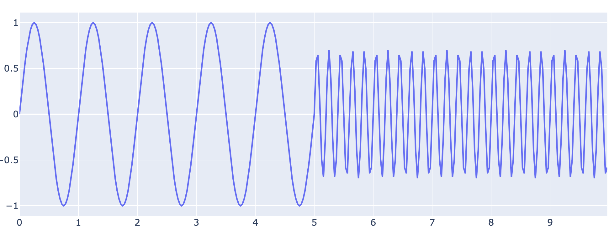
&nbsp;

Utilizzando una lunghezza della finestra di $N = 64$ campioni e un hop size di $H = 32$ campioni, otteniamo lo spettrogramma mostrato di seguito. Nell'immagine, la tonalità codifica l'ampiezza di un coefficiente spettrale, dove colori più chiari corrispondono a valori maggiori. Tramite la formula sopra, l'$m$-esimo frame corrisponde alla posizione temporale fisica $T_m = 1 \, \text{sec}$. In altre parole, la STFT ha una risoluzione temporale di un frame per secondo. Inoltre, tramite la formula per la risoluzione in frequenza, il $k$-esimo coefficiente di Fourier corrisponde alla frequenza fisica $f_k=k/2 \,\text{Hz}$. In altre parole, si ottiene una risoluzione in frequenza di due coefficienti per Hertz. Il grafico dello spettrogramma con assi temporali e di frequenza sono mostrati in figura (sono esclusi gli estremi in cui la sovrapposizione non è completa).

&nbsp;
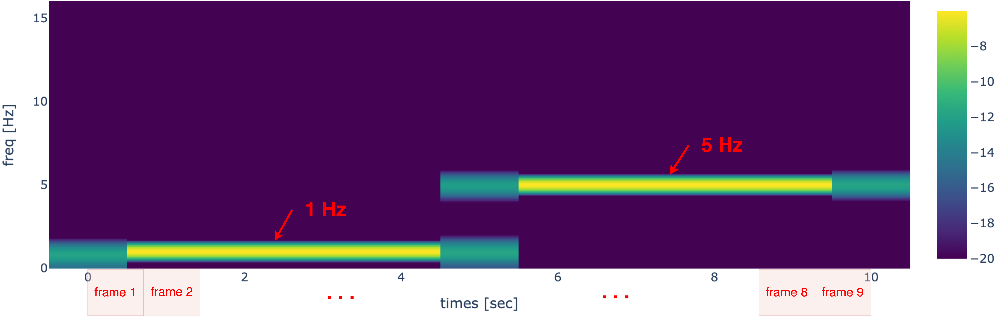
&nbsp;

Più in dettaglio il significato della visualizzazione grafica. L’asse verticale rappresenta la frequenza, mentre l’asse orizzontale rappresenta il tempo. I colori o le sfumature indicano l’ampiezza delle frequenze in ogni istante. Le aree scure rappresentano il silenzio o l’assenza di suono, mentre quelle più chiare indicano la presenza di suoni. Le interruzioni nelle aree chiare corrispondono a pause o spazi tra i suoni emessi. Analizzando la distribuzione delle aree chiare e scure, si possono distinguere i pattern del parlato, comprese le variazioni di intonazione e la tempistica dei singoli suoni.

Parametri importanti nell’analisi dello spettrogramma:

- **Frequenza positiva massima** $F_s/2$: in uno spettrogramma, possiamo rappresentare accuratamente frequenze fino a metà della frequenza di campionamento. Questa è nota come frequenza di Nyquist. Pertanto, nell’analisi dei segnali audio, è importante assicurarsi che la frequenza di campionamento sia sufficientemente alta da catturare i componenti di frequenza più alti di interesse.
- **Risoluzione in frequenza** $F_s/N$: la risoluzione in frequenza è la più piccola differenza di frequenza distinguibile nell’analisi, determinata dal rapporto tra la frequenza di campionamento e la lunghezza della finestra $N$. Una finestra più ampia offre una maggiore risoluzione in frequenza, ma una risoluzione temporale ridotta, poiché richiede più tempo per essere analizzata.
- **Ampiezza degli intervalli temporali** $N\,T_s$:
L’ampiezza degli intervalli temporali corrisponde alla durata di ciascun segmento temporale analizzato nella STFT, determinata dal prodotto tra la lunghezza della finestra $N$ e l’intervallo tra i campioni $T_s$. Una maggiore risoluzione temporale è essenziale per catturare segnali che cambiano rapidamente, come il parlato, ma riduce la risoluzione in frequenza.

L’uso della trasformata di Fourier a breve termine (STFT) per l’analisi dei segnali audio richiede attenzione a diversi fattori cruciali che influenzano la qualità dell’analisi tempo-frequenza e il compromesso tra risoluzione temporale e frequenziale.

La prima è l'ampiezza della finestra di analisi: la STFT è soggetta a un compromesso tra risoluzione temporale e frequenziale, dovuto alla scelta della lunghezza e della forma della finestra, in conformità con il principio di indeterminazione della trasformata di Fourier.
- **Analisi a banda larga (finestra stretta)**: con una finestra stretta, la STFT offre una risoluzione temporale più alta, consentendo di catturare cambiamenti rapidi nel segnale audio. Questo è particolarmente utile per analizzare suoni transitori o in rapida evoluzione, come il parlato o gli strumenti a percussione. Tuttavia, una finestra corta riduce la risoluzione in frequenza, rendendo difficile distinguere componenti di frequenza vicine.
- **Analisi a banda stretta (finestra ampia)**: una finestra lunga offre una risoluzione in frequenza più alta, permettendo di identificare piccole differenze di frequenza nel segnale audio. Questo è utile per analizzare suoni stazionari, come note musicali sostenute o rumori costanti di fondo. Tuttavia, una finestra lunga riduce la risoluzione temporale, rendendola meno adatta per catturare eventi che cambiano rapidamente.

La scelta della lunghezza e della forma della finestra dipende dai requisiti specifici dell’analisi e dal compromesso desiderato tra risoluzione temporale e frequenziale. In pratica, è spesso necessario sperimentare con diverse lunghezze e forme di finestra per trovare il miglior equilibrio per un’applicazione specifica. Inoltre, tecniche avanzate come le trasformate wavelet o i metodi di riassegnazione tempo-frequenza possono essere impiegate per migliorare la rappresentazione tempo-frequenza in scenari specifici.

La quantità di sovrapposizione tra finestre consecutive può influenzare la qualità dell’analisi STFT. Finestre sovrapposte aiutano a ridurre la perdita di informazioni ai bordi delle finestre, offrendo una rappresentazione più fluida e continua delle caratteristiche tempo-frequenza del segnale audio. Il grado di sovrapposizione dipende dall'applicazione specifica, ma valori tipici variano dal 50% al 75%. Tuttavia, un aumento della sovrapposizione può comportare una maggiore complessità computazionale, poiché occorre elaborare un numero maggiore di finestre.

Tutti questi aspetti sono ben riconoscibili nel seguente esempio, in cui un segnale sinusoidale a frequenza variabile nel tempo, viene campionato con $F_s=20$ Hz per 50 sec, producendo $n=1000$ campioni. Con una finestra di Hamming di $N=50$ e hop size $H=N/2=25$ campioni, si ottiene lo spettrogramma sotto che mette in evidenza i 41 frames definiti con questi parametri (20 per parte e uno centrale).

&nbsp;
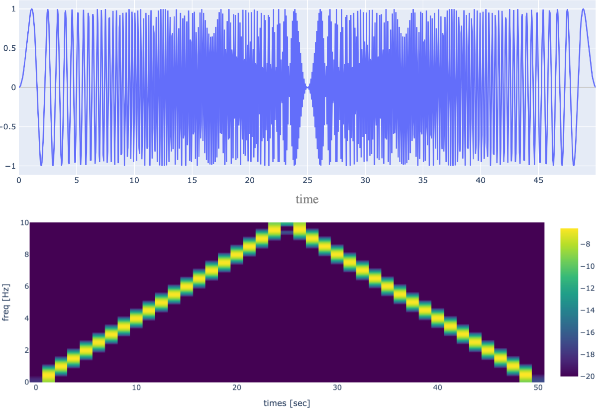
&nbsp;


Per concludere, alcune impostazioni tipiche riscontrate nell'elaborazione di segnali musicali. Ad esempio, nel caso di registrazioni su CD, si ha una frequenza di campionamento di $F_s = 44100 \, \text{Hz}$. Utilizzando una lunghezza della finestra di $N = 4096$ e un hop size di $H = N/2$, questo risulta in una risoluzione temporale di $\frac{H}{F_s} \approx 46.4 \, \text{ms}$ e una risoluzione in frequenza di $\frac{F_s}{N} \approx 10.8 \, \text{Hz}$. Per ottenere una migliore risoluzione in frequenza, si può aumentare la lunghezza della finestra $N$. Questo, tuttavia, porta a una minore localizzazione temporale, riducendo la capacità della STFT di catturare fenomeni locali nel segnale.

Di seguito l'esempio dell'analisi spettrale completa per le note della scala di Do maggiore: Do, Re, Mi, Fa, Sol, La, Si, Do (parte ascendente) compresa di spettro e spettrogramma. Da quest'ultimo si nota il crescendo della fondamentale per ogni nota (semitoni della scala) e le relative armoniche presenti in ogni istante di tempo e per ogni semitono.

&nbsp;
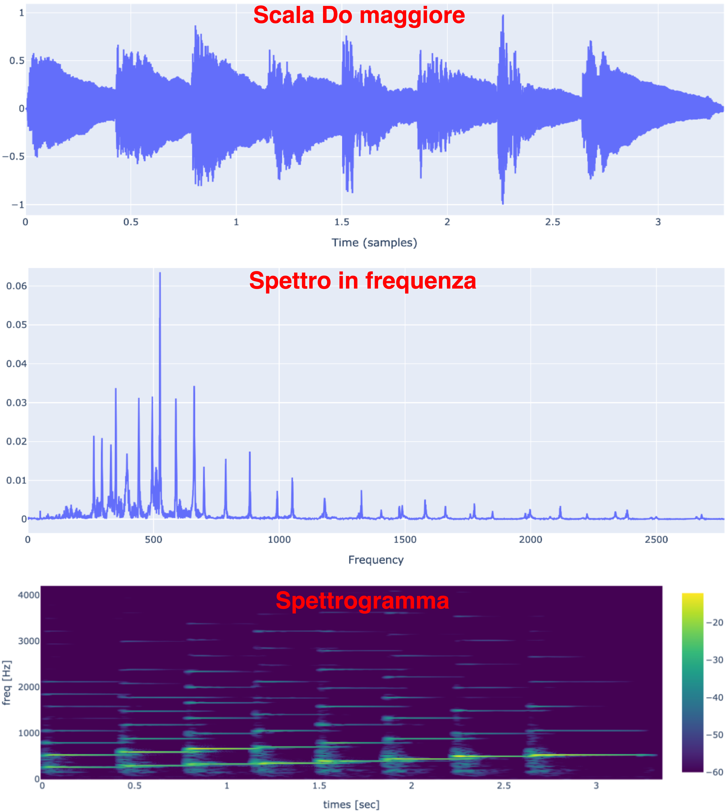
&nbsp;