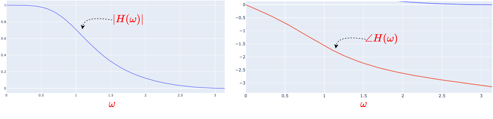
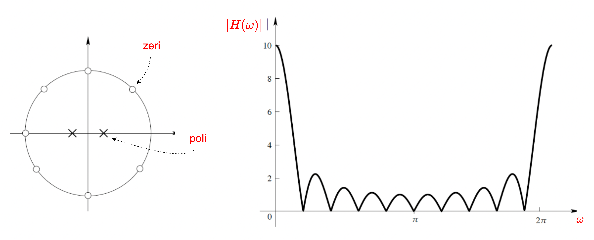
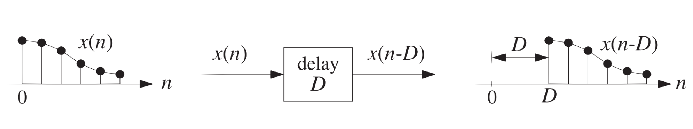
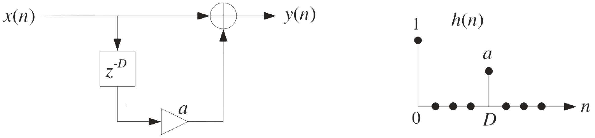
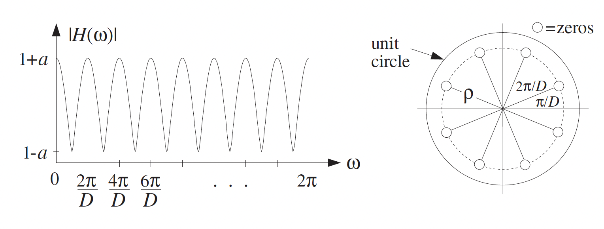
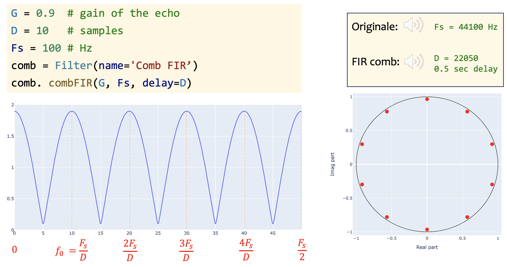
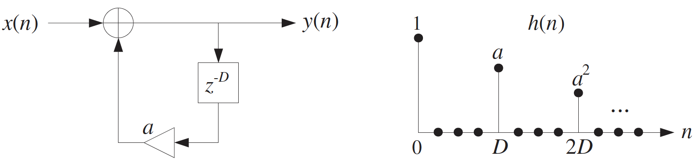
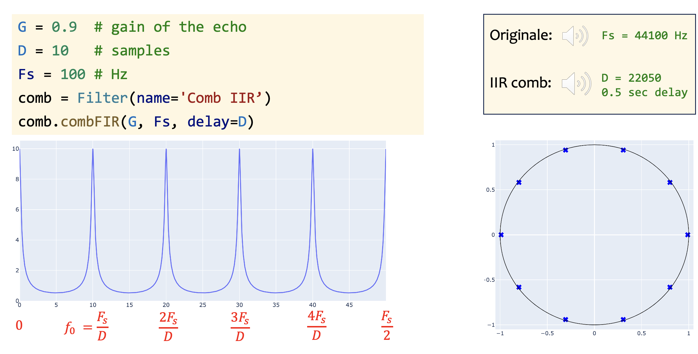
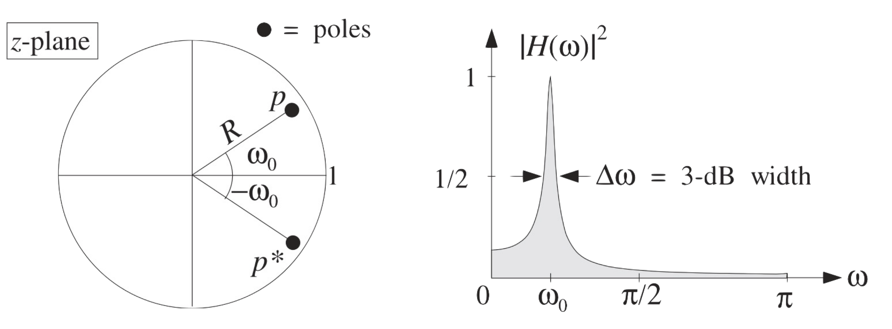

Filtri audio
====

---

## Introduzione

La forma più semplice di elaborazione audio è il filtraggio, e con i filtri è possibile fare molte cose interessanti con i segnali audio. In questo capitolo, esploreremo cosa sono i filtri, cosa fanno e forniremo alcuni esempi di filtri relativamente semplici. Quelli che comunemente chiamiamo filtri sono, tecnicamente, filtri lineari e invarianti nel tempo. Lineari significa che i filtri obbediscono a proprietà associate alla linearità dei sistemi, mentre invariante nel tempo implica che i filtri non cambiano nel tempo, il che ci consente di analizzarli più facilmente e di comprenderli indipendentemente dal tempo. Un filtro digitale è quindi un qualsiasi sistema lineare e invariante nel tempo che opera su segnali discreti. Un sistema di questo tipo è completamente descritto dalla sua risposta impulsiva o dalla sua funzione di trasferimento (razionale). Affronteremo il problema di progettare risposte impulsive o funzioni di trasferimento che soddisfino specifiche nel dominio del tempo o della frequenza. Esistono anche filtri non invarianti nel tempo, di cui vedremo alcuni esempi sotto forma di effetti audio.

Tradizionalmente, i filtri digitali sono stati classificati in due grandi famiglie: quelli la cui funzione di trasferimento non ha il denominatore e quelli la cui funzione di trasferimento ha il denominatore. Poiché i filtri della prima famiglia ammettono una realizzazione in cui l’uscita è una combinazione lineare di un numero finito di campioni di ingresso, sono talvolta chiamati filtri non ricorsivi. Per questi sistemi, è più consueto e corretto riferirsi alla risposta impulsiva, che ha un numero finito di campioni non nulli, definendoli quindi filtri a risposta impulsiva finita (FIR). D’altra parte, i filtri della seconda famiglia ammettono solo realizzazioni ricorsive, il che significa che il segnale di uscita viene sempre calcolato utilizzando campioni precedenti di se stesso. La risposta impulsiva di questi filtri è infinitamente lunga, giustificando il nome di filtri a risposta impulsiva infinita (IIR). Un modo tradizionale di modellare le due famiglie di filtri digitali FIR e IIR è sotto forma di equazioni alle differenze, che nella forma che tratteremo qui, sono per l'appunto somme di versioni ritardate dell’ingresso e dell'uscita. Ognuna di queste versioni ritardate viene scalata da un numero reale chiamato coefficiente del filtro. 

È interessante notare che i filtri digitali sono molto più semplici dei loro equivalenti analogici. Mentre il risultato dei filtri digitali è determinato dalle equazioni alle differenze, il risultato dei filtri analogici dipende da equazioni differenziali e integrali. La matematica coinvolta nel secondo caso è dunque molto più complessa rispetto al primo. Inoltre, con i filtri digitali è possibile realizzare elaborazioni molto più complesse rispetto ai filtri analogici. Vi sono quindi vari motivi per preferire i filtri digitali rispetto a quelli analogici.

Riassumendo, nel Digital Audio Signal Processing (DASP), il filtraggio è uno degli elementi fondamentali per l’elaborazione dei segnali audio. Il filtraggio permette di manipolare le componenti di frequenza di un segnale in modi che consentono applicazioni estremamente varie, come l’eliminazione del rumore, la separazione delle bande di frequenza, la modellazione del suono, e la creazione di effetti audio. Le tipologie di Filtri nel DASP che vedremo sono i seguenti:

- FIR (Finite Impulse Response): Questi filtri hanno una risposta all’impulso finita, e possono essere implementati in modo non ricorsivo (il che significa che l’output dipende solo da un numero finito di campioni di ingresso). Sono stabili e a fase lineare spesso usati in applicazioni dove è richiesta la precisione della fase, come nel missaggio audio.
- IIR (Infinite Impulse Response): sono più efficienti dei FIR a parità di ordine, hanno una risposta infinita all'impulso e ammettono una realizzazione ricorsiva (l’output dipende anche dai campioni passati dell’output stesso). Possono modellare più accuratamente sistemi analogici, ma richiedono una maggiore attenzione per evitare instabilità.
- Filtri Comb: I filtri a pettine introducono ritardi nel segnale per enfatizzare o attenuare specifiche frequenze e sono usati, ad esempio, per creare riverberi. 
- Filtri All-Pass: Detti anche filtri universali a pettine, mantengono inalterate le ampiezze delle frequenze, alterando solo la fase. Sono spesso usati per manipolare le proprietà temporali di un segnale senza modificarne il contenuto spettrale.
- Linee di Ritardo: Sono importanti per l’elaborazione di effetti basati su ritardo e modulazione di fase. 


## Filtri FIR (feedforward)

I filtri digitali si presentano sotto forma delle cosiddette `equazioni alle differenze`, equazioni cioè che implicano la moltiplicazione e l'addizione di un certo numero di versioni ritardate dell'ingresso e dell'uscita. Un semplice esempio di equazione alle differenze è

$$\label{eq:fir}
y(n) = x(n) + a x(n-1)
$$

dove $ x(n) $ è l'ingresso al tempo $ n $ e $y(n)$ è l'uscita, anch'essa al tempo $n$. Nel termine $ax(n-1)$ il fattore $a$ è il coefficiente del filtro e $x(n-1)$ è l'ingresso ritardato di un campione. Un segnale digitale è semplicemente una sequenza di numeri, pertanto, qualunque sequenza di numeri appaia in ingresso $x(n)$ apparirà nella forma di $x(n-1)$ un campione dopo. I filtri in cui l'ingresso è ritardato, eventualmente scalato, e aggiunto sono anche chiamati `filtri FIR` (feedforward). Un diagramma a blocchi del filtro è mostrato in figura, dove si può vedere che il segnale passa attraverso un blocco contenente un $z^{-1}$. Questo significa un ritardo di un campione e viene chiamato ritardo unitario.  

&nbsp;
```{image} images/FIR1.png
:width: 400px
:align: center
```
&nbsp;

Studiamo ora il comportamento che il filtro in risposta a un segnale sinusoidale, cioè quando in ingresso viene posto una sinusoide sotto forma di fasore, avente quindi modulo unitario e frequenza $\omega$,  e scritto come 

$$ \label{fasore}
z^n = e^{j \omega n}.
$$

Ora, se poniamo il fasore in ingresso al filtro, cioè impostiamo $x(n) = z^n$, allora otteniamo un'uscita

\begin{align}
y(n) &= x(n) + a x(n-1)\\ 
&= z^n + a z^{n-1}\\
&= \left( 1 + a z^{-1} \right) z^n. 
\end{align}

Questo ci mostra che il fasore, $z^n$, viene modificato da una moltiplicazione per $1+az^{-1}$ nel suo percorso verso l'uscita quando lo facciamo passare attraverso il filtro, così ora abbiamo una comprensione iniziale di cosa faccia [](#eq:fir). In realtà, abbiamo anche appena appreso che l'uscita del filtro sarà anch'essa un fasore, ma uno che è stato modificato! Se sostituiamo $z^n $con $z^n = e^{j\omega n}$, il risultato, che chiamiamo $H(\omega)$, è

\begin{align}
H(\omega) &= 1 + a z^{-1} \Big|_{z=e^{j\omega}} \\
&= 1 + a e^{-j\omega}. 
\end{align}

La quantità $H(\omega)$ è un numero complesso che dipende dalla variabile $\omega$, cioè dalla frequenza del fasore che mettiamo in ingresso. Se pensiamo a $z^n$ come a un segnale di prova che possiamo mettere in ingresso a un sistema, possiamo pensare a $H(\omega)$ come alla modifica moltiplicativa a cui il fasore è soggetto. Possiamo variare la frequenza del fasore per osservare come $H(\omega)$ dipenda dalla frequenza. $H(\omega)$ è quindi chiamata `risposta in frequenza` del filtro. Poiché $H(\omega)$ è complesso, possiamo dividerlo in una parte reale e una parte immaginaria, ma è più informativo pensarlo come costituito da una magnitudine $|H(\omega)|$ e un angolo $\angle H(\omega)$. L'angolo è spesso scritto come

$$
\angle H(\omega) = \theta(\omega).
$$

Questo è illustrato nella figura sotto. 

&nbsp;
```{image} images/FIR1-AF.png
:width: 500px
:align: center
```
&nbsp;

Va notato che, sebbene possiamo derivare la risposta in frequenza di filtri semplici abbastanza facilmente con carta e penna, questo nella pratica non viene quasi mai fatto, specialmente per filtri più complessi. Si utilizzano invece librerie sw specializzate, come quelle scritte in Python (e mostrate nelle esercitazioni), per calcolare numericamente la risposta in frequenza. Pertanto, le nostre derivazioni qui servono solo a illustrare i concetti e a esplorare il comportamento dei filtri.

Procediamo ora a esplorare un filtro un po' più complesso. Invece di considerare solo il termine ritardato singolo in [](#eq:fir), possiamo aggiungere più termini di questo tipo, ciascuno scalato da un valore diverso, ovvero:

$$\label{eq:firMtap}
y(n) = b_0 x(n) + b_1 x(n-1) + b_2 x(n-2) + \cdots + b_M x(n-M).
$$

Questa è ancora un'equazione alle differenze e un filtro, solo che ora ha più coefficienti del filtro, ovvero $b_k$  per $k= 0,1,\ldots, M$, e ci sono più ritardi coinvolti, il più grande dei quali è di $M$  campioni. Diciamo che il filtro ha ordine $M$. Si noti che, mentre ci sono $M$  ritardi unitari coinvolti, ci sono $M+1$  coefficienti del filtro, e che possiamo scrivere l'equazione in forma compatta come

$$
y(n) = \sum_{k=0}^M b_k x(n-k). 
$$

Nella figura sotto, è mostrato un filtro di ordine 3. Come si può vedere, esso comprende tre ritardi dell'ingresso, sotto forma di tre ritardi unitari in cascata. 

&nbsp;
```{image} images/FIR3.png
:width: 400px
:align: center
```
&nbsp;

La progettazione del filtro (`filter design`) riguarda quindi la determinazione della collezione di coefficienti del filtro, $\{b_k\}$, che ci fornisce un comportamento desiderato, più spesso specificato in termini della risposta in ampiezza risultante. Di seguito un esempio di filtro con $M=40$ coefficienti, progettato mediante l'uso di libreria.

&nbsp;
```{image} images/FIR40.png
:width: 600px
:align: center
```
&nbsp;

##### Analisi del filtro

Esploreremo ora come analizzare i filtri in modo più approfondito. Consideriamo il filtro con la seguente equazione alle differenze:

$$\label{eq:MA}
y(n) = a_0 x(n) + a_1 x(n-1).
$$

Con $a_0 = 0.5$ e $a_1 = 0.5$, questo filtro calcola semplicemente la media (o media aritmetica) di due campioni consecutivi. Abbiamo visto come possiamo comprendere i filtri osservando come modificano un fasore di una certa frequenza, che viene fatto passare attraverso il filtro. Abbiamo anche visto che possiamo considerare l'effetto di un ritardo di un campione come una moltiplicazione di un fasore per $z^{-1}$. Possiamo, in effetti, usare questo modo di pensare indipendentemente da quale sia il nostro ingresso. Questo perché possiamo considerare qualsiasi segnale come composto da un certo numero (eventualmente infinito) di fasori! Ciò significa che non abbiamo nemmeno bisogno di sapere quale sia l'ingresso per comprendere come sarà influenzato da un filtro: possiamo semplicemente immaginare che sia composto da fasori. Possiamo pensare colloquialmente a questo come a una sorta di rappresentazione in fasori del nostro ingresso. Scriviamo questo come $x(n) \to X(z)$. Come abbiamo anche visto, l'uscita di un filtro sarà anch'essa un fasore quando l'ingresso è un fasore, sebbene modificato. Pertanto, quando l'ingresso è costituito da un numero di fasori, anche l'uscita sarà costituita da un numero di fasori. Questo deriva dalla linearità dei filtri—ne parleremo più avanti. Possiamo quindi scrivere l'uscita come $y(n) \to Y(z)$. $X(z)$ e $Y(z)$ sono, tecnicamente parlando, le trasformate z delle sequenze $x(n)$ e $y(n)$, rispettivamente, e diciamo che stiamo calcolando (o derivando) la trasformata $z$ quando facciamo questo. Ammettiamo che, a questo punto, il concetto sia un po' abbozzato, ma approfondiremo la trasformata $z$ più avanti. Tornando al filtro nella [](#eq:MA), possiamo sostituire $x(n)$ con $X(z)$ e $y(n)$ con $Y(z)$, ottenendo:

$$
Y(z) = \left( a_0 + a_1 z^{-1} \right) X(z).
$$

dove abbiamo utilizzato il fatto che $x(n-1) \to z^{-1} X(z)$. 

Analogamente a come abbiamo definito la risposta in frequenza, possiamo ora definire una funzione $H(z)$ che mette in relazione l'uscita con l'ingresso come:

$$
Y(z) = H(z) X(z)
$$

Quando analizziamo i filtri utilizzando la nostra rappresentazione in fasori dell'ingresso e dell'uscita, la funzione $H(z)$ è chiamata `funzione di trasferimento` del sistema ed è definita a partire da $X(z)$ e $Y(z)$ come:

$$
H(z) = \frac{Y(z)}{X(z)}.
$$

Intuitivamente, questo può essere compreso nel seguente modo. Se mettiamo l'ingresso $X(z)$ all'ingresso del sistema e misuriamo $Y(z)$ in qualche modo, e desideriamo dire qualcosa sul sistema indipendentemente dall'ingresso $X(z)$, possiamo dividere l'uscita $Y(z)$ per l'ingresso, ottenendo così la funzione di trasferimento $H(z)$. La ragione per cui possiamo farlo è legata alla rappresentazione in fasori dell'ingresso. Nel caso del filtro [](#eq:MA), la funzione di trasferimento è data da:

$$\label{eq:FT}
H(z) = a_0 + a_1 z^{-1}. \quad (4.21)
$$

Se sostituiamo $z$ con $e^{j\omega}$, otteniamo la risposta in frequenza $H(\omega)$. Per comprendere meglio i filtri, è utile pensare alle funzioni di trasferimento come a polinomi. La funzione di trasferimento in [](#eq:FT) può essere scritta anche come:

$$
H(z) = \frac{a_0 z + a_1}{z}, 
$$

moltiplicando numeratore e denominatore per $z$. Notiamo che abbiamo un polinomio di primo ordine al numeratore, cioè $A(z) = a_0 z + a_1$. Come sappiamo, i polinomi hanno radici, cioè valori per cui il polinomio si annulla. Nel caso del numeratore in [](#eq:FT), possiamo facilmente vedere che abbiamo una radice per $z=-\frac{a_1}{a_0}$. Cosa significa questo per il nostro filtro? Come menzionato prima, otteniamo la risposta in frequenza di un filtro sostituendo $z$ con $e^{j\omega}$. Facendo ciò, stiamo essenzialmente valutando i polinomi al numeratore e al denominatore della funzione di trasferimento sul cerchio unitario. Se i valori per cui valutiamo il polinomio sono vicini alla radice del polinomio al numeratore, la funzione di trasferimento tenderà a zero e sarà esattamente zero se la radice si trova sul cerchio unitario. Questo significa che qualsiasi segnale in ingresso sarà attenuato o persino annullato a frequenze vicine alle radici del polinomio. Per questa ragione, le radici del polinomio al numeratore di una funzione di trasferimento sono chiamate `zeri`. Generalizzando, possiamo osservare che il filtro più grande in [](#eq:firMtap) ha la funzione di trasferimento:

$$\label{eq:firM}
H(z) = b_0 + b_1 z^{-1} + b_2 z^{-2} + \cdots + b_M z^{-M}.
$$

cioè un polinomio di ordine $M$ che ha $M$ radici.

Fino ad ora, abbiamo analizzato i filtri inserendo fasori, che sono generalizzazioni complesse delle sinusoidi, come segnale in ingresso. Un altro modo utile di analizzare i filtri è quello di utilizzare un segnale diverso come ingresso, ovvero un `impulso unitario`. Un impulso è un segnale con tutta la sua energia concentrata in un istante temporale specifico. Un impulso digitale, per il quale useremo il simbolo $\delta(n)$, può essere definito come:

$$\label{eq:delta}
\delta(n) =
\begin{cases} 
1 & \text{per } n = 0, \\
0 & \text{altrimenti}.
\end{cases} 
$$

Come segnale, possiamo pensare a questa funzione come alla sequenza infinita di numeri:

$$
0, \ldots, 0, 1, 0, \ldots, 0, 
$$

dove l'1 si trova all'istante temporale 0, oppure, se iniziamo la sequenza con $n=0$, la sequenza diventa semplicemente $1, 0, \ldots$. Forse possiamo imparare qualcosa di utile inserendo un tale impulso nell'ingresso di un filtro. In effetti, il segnale che otteniamo mettendo $\delta(n)$ come ingresso è chiamato `risposta all'impulso`, ed è un concetto molto importante nella teoria dei filtri.  Partendo dal semplice filtro in [](#eq:fir), possiamo osservare che quando mettiamo l'impulso in ingresso al tempo $n = 0$ (supponendo che l'ingresso sia zero per $n < 0$), la sequenza in uscita è semplicemente 

$$
1, a, 0, \ldots.
$$ 

Possiamo vedere questo seguendo i numeri, in ordine, attraverso il diagramma a blocchi. Al tempo $n = 0$, $x(n-1)$ è 0, e l'impulso passa direttamente all'uscita. Al tempo $n = 1$, $x(n)$ è ora 0 ma $x(n-1)$ è 1. Pertanto, otteniamo $1 \cdot a$ all'uscita. Al tempo $n = 2$ e da allora in poi, sia $x(n)$ che $x(n-1)$ sono zero, e nessun segnale passa attraverso il filtro.  Analogamente, possiamo facilmente osservare che il filtro in [](#eq:MA) produce $a_0, a_1, 0, \ldots$ quando $\delta(n)$ è posto come ingresso. Nel caso più complicato del filtro più grande in [](#eq:firM), possiamo vedere che l'uscita è $b_0, b_1, b_2, \ldots, b_M$ quando $x(n)=\delta(n)$. Pertanto, possiamo osservare i coefficienti del filtro all'uscita di tale filtro quando mettiamo un impulso in ingresso. Questo, tuttavia, è vero solo per i filtri a reazione diretta (feedforward filters). Possiamo anche osservare che la risposta all'impulso sarà zero per $n>M$, cioè quando l'indice temporale supera il massimo ritardo. Per questo motivo, i filtri della forma [](#eq:firM) sono anche chiamati filtri a risposta impulsiva finita (FIR). La conclusione di tutto ciò è che possiamo effettivamente imparare qualcosa su un filtro osservando la sua uscita quando un impulso è posto in ingresso. 

---

## Filtri IIR

Filtri più potenti dei filtri FIR considerati finora possono essere costruiti con l'uso della retroazione (feedback), in cui non solo versioni ritardate dell'ingresso ma anche dell'uscita vengono utilizzate. Un semplice esempio di filtro che impiega la retroazione è dato da

$$\label{eq:IIR}
y(n) = ay(n-1)+x(n) 
$$

Un diagramma a blocchi di questo filtro è mostrato nella figura sotto. Come si può osservare, l'uscita viene retroazionata e aggiunta all'ingresso, da cui il nome feedback. Questi tipi di filtri sono anche conosciuti col nome `IIR` (`infinite impulse response`), ovvero filtri con risposta impulsiva infinita. 

&nbsp;
```{image} images/IIR.png
:width: 400px
:align: center
```
&nbsp;

Per comprendere questo nome, consideriamo il caso in cui l'ingresso del filtro sia un impulso, cioè $x(n)=\delta(n)$. Tracciando l'impulso attraverso il filtro, possiamo vedere che l'uscita è la sequenza 

$$
1, a, a^2, a^3, a^4, \ldots.
$$

Per un coefficiente del filtro $a \neq 0$, la risposta impulsiva sarà diversa da zero per tutti $n = 0, 1, \ldots$. Per $a = 0.5$, possiamo osservare che la risposta impulsiva è la sequenza

$$
1, \frac{1}{2}, \frac{1}{4}, \frac{1}{8}, \ldots,
$$

quindi i valori diventano sempre più piccoli ma non raggiungono mai esattamente lo zero. Tuttavia, se scegliamo $a=2$, allora la risposta impulsiva diventa

$$
1, 2, 4, 8, 16, \ldots!
$$

Questo non è un comportamento desiderabile. I valori della sequenza crescono continuamente. Questo non è mai stato un problema per i filtri a reazione diretta che abbiamo considerato finora. Si tratta infatti di una proprietà speciale dei filtri con retroazione. Diciamo che il filtro è instabile. In questo caso semplice, possiamo osservare che finché $|a| < 1$, la risposta impulsiva decadrà verso zero. Tuttavia, per filtri con più ritardi nella parte di retroazione, non è immediato capire se il filtro sia stabile. 

La risposta in frequenza del filtro [](#eq:IIR) quando sollecitato in ingresso dal fasore $z^{n}=e^{j\omega n}$ è

\begin{align}
H(\omega) &= \frac{1}{1 -a z^{-1}} \Big|_{z=e^{j\omega}} \\
&= \frac{1}{1 -a e^{-j\omega}}. 
\end{align}

Nella figura sono rappresentate la risposta in ampiezza e fase del filtro al primo ordine. Si può notare subito che la fase non è lineare e in generale non lo può essere mai per questa famiglia di filtri.

&nbsp;

&nbsp;

Questo semplice filtro presenta una forma passa-basso. Rispetto al filtro FIR del primo ordine, il filtro con un polo fornisce una curva della risposta in frequenza con una pendenza maggiore. Il fatto che, per un dato ordine del filtro, i filtri IIR forniscano una risposta in frequenza più ripida (o, in generale, più complessa) è una proprietà generale che può essere considerata un vantaggio nel preferire i filtri IIR ai filtri FIR. D'altra parte, i filtri IIR non possono avere una fase perfettamente lineare. Inoltre, i filtri IIR possono produrre artefatti numerici, soprattutto nelle implementazioni a punto fisso.

In generale, un filtro IIR è rappresentato da un'equazione alle differenze in cui il segnale di uscita in un dato istante è ottenuto come una combinazione lineare di campioni dei segnali di ingresso e di uscita a istanti di tempo precedenti. Inoltre, una dipendenza istantanea dell'uscita dall'ingresso è solitamente inclusa nei filtri IIR. L'equazione alle differenze che rappresenta un filtro IIR è data da

$$\label{eq:diff}
y(n) = -\sum_{m=1}^{N} a_m y(n - m) + \sum_{k=0}^{M} b_k x(n - k).
$$


##### Analisi del filtro

Possiamo analizzare i filtri con feedback in modo molto simile a come abbiamo fatto per i filtri feedforward, utilizzando la rappresentazione fasoriale. Procedendo come fatto per i filtri con feedback, otteniamo

$$
Y(z) = X(z) + aY(z)z^{-1}.
$$

Questo è di natura diversa rispetto a quanto visto finora. Riordinando i termini, si ha:

\begin{align}
X(z)&=Y(z) - aY(z)z^{-1}\\
&=(1 - az^{-1}) Y(z)
\end{align}

Possiamo quindi dedurre che la funzione di trasferimento deve essere

\begin{align}
H(z) &= \frac{Y(z)}{X(z)} \\
&= \frac{1}{1 - az^{-1}}
\end{align}

A differenza del caso feedforward, ora appare un polinomio non banale al denominatore. Abbiamo visto in precedenza che le radici del polinomio al numeratore causano l'attenuazione o addirittura l'annullamento del segnale di ingresso a frequenze vicine alle radici. Cosa fanno, invece, le radici al denominatore? Se moltiplichiamo per $z$ sia al numeratore che al denominatore della funzione di trasferimento, il polinomio al denominatore diventa $A(z) = z - a$. È ovviamente nullo per $z = a$. Quando $z$ si avvicina ad $a$, divideremo per un numero piccolo al denominatore, il che farà crescere la magnitudine. Quindi, se $z = e^{j\omega}$ si avvicina alle radici per qualche frequenza $\omega$, si avrà un'amplificazione di quel fasore. Se il fasore coincide esattamente con la radice, si divide per zero e possiamo pensare che la risposta in magnitudine tenda all'infinito. Come il lettore potrebbe aver intuito, questo fenomeno è strettamente legato alla questione della stabilità. Infatti, un filtro che ha tutte le radici del polinomio al denominatore all'interno del cerchio unitario è garantito essere stabile. Queste radici sono chiamate `poli`.

Applicando la trasformata zeta ad entrambi i membri della [](#eq:diff) si ottiene una funzione di trasferimento razionale con un polinomio $B(z)$ al numeratore e un altro $A(z)$ al denominatore, ovvero:

$$
H(z) = \frac{B(z)}{A(z)}.
$$

Cominciamo a rilevare che, essendo $H(z)$ una funzione razionale in $z^{-1}$, possiamo esprimere il numeratore e il denominatore come prodotto di binomi di primo grado in $z^{-1}$ ottenendo:

$$
H(z)=\frac{B(z)}{A(z)}
=G\frac{\prod_{k=1}^M(1-z_kz^{-1})}{\prod_{k=1}^N(1-p_kz^{-1})}
=Gz^{N-M}\frac{\prod_{k=1}^M(z-z_k)}{\prod_{k=1}^N(z-p_k)},
$$

dove i valori per cui $B(z) = 0$ sono gli zeri, $\{z_k\}$, e i valori per cui $A(z) = 0$ sono i poli, $\{p_k\}$, del filtro e $G$ una costante reale positiva, che rappresenta il guadagno del filtro. Gli zeri annullano il contenuto del segnale, mentre i poli lo amplificano, quindi gli zeri non rappresentano mai un problema in termini di stabilità, ma i poli sì. Se i poli si trovano all'interno del cerchio unitario, ovvero $|p_k| < 1$, il filtro è garantito essere stabile. Dunque, dato un insieme di coefficienti del filtro, è necessario calcolare le radici del polinomio al denominatore per assicurarsi che il filtro sia stabile. Si noti che i poli o gli zeri all'origine sono equidistanti da tutti i punti del cerchio unitario e quindi non hanno alcun impatto — è per questo che il termine $z$ al denominatore non ha importanza. I filtri vengono spesso analizzati rappresentando graficamente i loro poli e zeri nel piano complesso $z$. 

Per concludere l'impatto di zeri e poli sulla risposta in frequenza si osserva che il modulo della risposta in frequenza $|H(\omega)|$ è una funzione non negativa e periodica di periodo $2\pi$. Alcune considerazioni geometriche possono essere utili per ottenere il comportamento qualitativo di $H(\omega)$ definita a partire dalla funzione di trasferimento sopra descritta:

$$
H(\omega)=G\frac{\prod_{k=1}^M(1-z_ke^{-j\omega})}{\prod_{k=1}^N(1-p_ke^{-j\omega})}
$$

Possiamo allora osservare:
- al numeratore, se $q_k\approx 0$, allora  $|1-q_ke^{-j\omega}|\approx 1$, quindi poli $p_k=q_k$ o zeri $z_k=q_k$ vicini all'origine non portano nessun rilevante contributo a $H(\omega)$;
- al denominatore, se lo zero $z_k$ è "vicino" alla circonferenza unitaria, cioè $z_k\approx e^{-j\omega_k}$ per un opportuno $\omega_k$, allora $|1-z_ke^{-j\omega_k}|\approx 0$ e per le frequenze $\omega\approx \omega_k$ corrispondenti a zeri "vicini" alla circonferenza unitaria si ha che $H(\omega)$ è vicina a zero.
- al denominatore, se il polo $p_k$ è "vicino" alla circonferenza unitaria, cioè $p_k\approx e^{-j\omega_k}$ per un opportuno $\omega_k$, allora $|1-p_ke^{-j\omega_k}|\approx 0$ e per le frequenze $\omega\approx \omega_k$ corrispondenti a zeri "vicini" alla circonferenza unitaria si ha che $H(\omega)$ tende a diventare arbitrariamente grande.

In figura sono rappresentati con una crocetta i poli e con un
cerchietto gli zeri di una funzione razionale $H(z)$; nella stessa figura si mostra il modulo della risposta in frequenza del filtro con funzione di trasferimento $H(z)$.

&nbsp;

&nbsp;

Per quanto riguarda la fase, si osserva che:

$$
\angle H(\omega)=\sum_{k=1}^M \angle (1-z_ke^{-j\omega}) -\sum_{k=1}^L \angle (1-p_ke^{-j\omega}).
$$

Essa può quindi essere ottenuta considerando separatamente i contributi $\angle (1-qe^{-j\omega})$ per ogni polo o zero $q$, sommando i contributi dovuti agli zeri e sottraendo i contributi dovuti ai poli.

--- 

## Filtri Comb

I suoni, propagandosi nell’aria, entrano in contatto con superfici e oggetti di vario genere, e questa interazione produce fenomeni fisici come riflessione, rifrazione e diffrazione. Un fenomeno semplice e molto importante è la riflessione del suono su una superficie piana. A causa di una riflessione di questo tipo, l’ascoltatore riceve due copie ritardate dello stesso segnale. Se il ritardo è superiore a circa cento millisecondi, la seconda copia viene percepita come un eco distinto; se invece il ritardo è inferiore a circa dieci millisecondi, l’effetto di una singola riflessione è percepito come una colorazione spettrale. Questo fenomeno è ben rappresentato da un tipo specifico di filtro chiamato filtro comb e dal suo inverso. Il filtro comb costituisce la base per molti effetti audio che verranno trattati in dettaglio più avanti in questa dispensa, come l’effetto eco, il chorus e il flanger. Inoltre, i filtri comb sono componenti fondamentali per strutture più complesse, come i riverberatori artificiali, i pitch estimator e i sintetizzatori.

In un filtro comb, una versione ritardata e scalata dell’uscita viene sommata all’ingresso per produrre una nuova uscita. Se il ritardo è sufficientemente ampio, si ottiene un numero infinito di echi dell’ingresso originale; se invece è ridotto, l’uscita non viene percepita come echi. La risposta in frequenza del filtro comb ricorda i denti di un pettine, da cui il nome. La sua risposta all’impulso è diversa da zero solo a intervalli regolari, determinati dal ritardo, mentre la scalatura definisce se i valori diversi da zero (gli echi) aumentano, decadono o rimangono costanti nel tempo. Se gli echi decadono lentamente o restano costanti, la risposta all’impulso appare e suona periodica, con un’altezza determinata dal ritardo. In questo modo, possiamo generare suoni di qualsiasi altezza desiderata stimolando un filtro comb e regolando il ritardo. Introduciamo qui il filtro comb come prima cosa, il suo stretto parente, l’inverso del filtro comb, e mostreremo come il filtro comb possa essere utilizzato per sintetizzare suoni simili a quelli prodotti da strumenti a corde pizzicate. 

##### Linea di ritardo (delayline)

La `linea di ritardo` è un elemento fondamentale nei filtri per l'elaborazione audio e si basa sulla capacità di trattenere temporaneamente un segnale prima di rimandarlo in uscita. Essa permette di creare effetti audio, come eco, riverbero e flanger, attraverso la manipolazione della temporizzazione delle onde sonore.

Una linea di ritardo introduce un ritardo definito in campioni (ad esempio, un ritardo di $D$ campioni) tra l’ingresso e l’uscita del segnale, con il valore di $D$ che determina la durata del ritardo. A seconda del tipo di filtro, il ritardo può essere combinato con attenuazione e/o con una frazione di feedback del segnale ritardato per ottenere effetti specifici. Le tipologie possono essere riassunte come segue.

1.	Linea di Ritardo Semplice: In questo caso, il segnale viene semplicemente ritardato di un numero fisso di campioni. Questo tipo di linea è utilizzato spesso nei filtri a pettine (comb filter), che combinano il segnale originale con una versione ritardata per creare una serie di picchi spettrali.
2.	Linea di Ritardo con Attenuazione: Qui, il segnale ritardato viene anche attenuato con un fattore $a$ (spesso un valore tra 0 e 1), permettendo di controllare l’intensità dell’eco generato. Questa struttura consente di simulare fenomeni acustici reali come riflessioni su superfici, dove ogni riflessione successiva diventa meno intensa.
3.	Linea di Ritardo Frazionaria: È utilizzata quando è necessario un ritardo più preciso, che non sia esattamente un numero intero di campioni. Si ottiene tramite interpolazione FIR o filtri all-pass, consentendo un controllo più fine per gli effetti di fase e di alta risoluzione.
4.	Linea di Ritardo a Feedback e a Feedforward: In molte applicazioni avanzate, il segnale ritardato viene reimmesso nel sistema (feedback) o combinato con l’input (feedforward). Questi approcci permettono di ottenere effetti come chorus e flanger, in cui la sovrapposizione delle versioni ritardate con l’originale crea modulazioni e variazioni di tono.

Applicazioni della Linea di Ritardo

1. Effetto Eco: Una linea di ritardo con feedback può essere usata per creare echi ripetuti, simili a quelli di un’eco naturale.
2. Effetto Flanger e Chorus: La combinazione del segnale diretto e del segnale ritardato crea interferenze che generano variazioni di fase e di tonalità, tipiche di questi effetti.
3. Sintesi di Suoni: Le linee di ritardo sono usate anche in algoritmi di sintesi, come il Karplus-Strong, per simulare strumenti a corde pizzicate.

Formalmente, se $x(n)$ è il segnale di ingresso e $y(n)$ il segnale di uscita della linea di ritardo, la relazione ingresso/uscita del sistema è data da:

$$
y(n)=x(n-D)
$$

dove $n$  è l’indice del campione temporale, $D$  è il numero di campioni di ritardo, ed è un numero intero positivo che determina l’entità del ritardo applicato. Il ritardo di $D$ campioni implica che il segnale originale $x(n)$ apparirà all’uscita solo dopo $D$ campioni, introducendo così una latenza precisa e riproducibile. Quando $D$ non è un numero intero, il ritardo frazionario può essere realizzato tramite interpolazione, come l’interpolazione FIR, o con un filtro all-pass, che permette di ottenere ritardi intermedi mantenendo la continuità temporale del segnale. Un'applicazione utile di questo sistema e un'analisi più approfondita del suo comportamento nel tempo e in frequenza, è data nella prossima sezione dove la linea di ritardo si vede come parte costitutiva dei filtri comb che modellano i ritardi in modo più completo e aderente alla realtà della fisica acustica. Il sistema ritardo temporale assieme alla sua relazione tra segnale di ingresso e quello di uscita è illustrato in figura.

&nbsp;

&nbsp;

##### Filtro comb FIR

Un modello semplice di riflessione singola può essere costruito partendo dai blocchi di base realizzati come una linea di ritardo di m campioni collegata in cascata a un coefficiente di attenuazione $a$, eventualmente sostituito da un filtro nel caso in cui si voglia simulare un’assorbimento dipendente dalla frequenza. L’uscita di questa linea di ritardo con attenuazione viene sommata al segnale diretto. 

Il filtro `FIR-comb` non ricorsivo ha la struttura mostrata nella figura sottostante, in cui $D$ è un numero intero e $a$ una costante positiva, in cui la relazione ingresso-uscita è espressa dalla seguente equazione alle differenze

$$\label{eq:eco}
y(n)=x(n)+ax(n-D)
$$

&nbsp;

&nbsp;

Il ritardo $D$ rappresenta il tempo di andata e ritorno dalla sorgente a una parete riflettente e il coefficiente $a$ è una misura delle perdite di riflessione e propagazione, in modo che $|a|\leq 1$. La funzione di trasferimento e la risposta all'impulso di questo filtro sono:
$$
H(z)=1+az^{-D}, \qquad\qquad  h(n)=\delta(n)+a\delta(n-D)
$$

La risposta in frequenza è ottenuta dalla precedente equazione ponendo $z=e^{j\omega}$:

$$
H(\omega)=1+ae^{-j\omega D}, \qquad\qquad  |H(\omega)|=\sqrt{1+2\cos(\omega D) +a^2}.
$$

Un tale filtro agisce come un filtro comb FIR la cui risposta in frequenza mostra picchi a multipli della frequenza fondamentale $f_0 = \frac{F_s}{D}$. Gli zeri della funzione di trasferimento $H(z)$ sono le soluzioni dell'equazione (assumendo $0 < a \leq 1$):

$$
1 + a z^{-D} = 0 \Rightarrow z_k = \rho e^{\pi j \frac{(2k+1)}{D}}, \quad k = 0, 1, \dots, D - 1
$$

dove $\rho = a^{\frac{1}{D}}$. La risposta in ampiezza e il pattern degli zeri sono mostrati nella figure che segue, per il caso $D = 8$. Se $a = 1$, allora $\rho = 1$, e gli zeri si trovano sulla circonferenza unitaria corrispondendo a zeri esatti nella risposta in frequenza.

&nbsp;

&nbsp;

Alle frequenze di dip $\omega_k = \frac{(2k + 1)\pi}{D}$, abbiamo $e^{j\omega_k D} = e^{j\pi} = -1$, ottenendo:

$$
H(\omega_k) = 1 - a.
$$

Tra le frequenze di dip, cioè per $\omega_k = \frac{2\pi k}{D}$, si osservano picchi con valore $H(\omega_k) = 1 + a$, poiché $e^{j\omega_k D} = 1$. In unità di Hz, queste frequenze di picco sono:

$$
f_k = \frac{k F_s}{D} = k f_0, \quad k = 0, 1, \dots, D - 1.
$$

I grafici sulla destra mostrano il modulo della risposta in frequenza per un dato valore di $a$, a dimostrazione della sua periodicità. Alcune importanti proprietà sono:
Il modulo decade periodicamente ad un minimo locale (in inglese conosciuto come notch) e ricresce periodicamente ad un massimo locale (in inglese conosciuto come peak cioè picco).
I livelli di massimo e di minimo sono sempre equidistanti da 1.
Quando  $a=\pm 1$ il minimo assume il valore di ampiezza zero. Il massimo, per valori positivi di $a$, coincide con il minimo per valori negativi di $a$ e viceversa.

##### Esempio

Nell'esempio che seguente si mostra il codice del notebook python per un filtro comb FIR con guadagno $G=0.9$, numero di campioni di ritardo $D=10$ e frequenza di campionamento $F_s=100$ Hz. In questo caso la fondamentale è $f_0=F_s/D=10$ Hz. Nella figura sono anche indicati gli zeri, in numero pari a $D$, della funzione di trasferimento con un raggio $\rho=\sqrt[D]{G}=\sqrt[10]{0.9}\approx 0.9895$. Se il filtro viene applicato a un segnale audio CD con $F_s=44100$ Hz e $D=F_s/2$ si ottiene un segnale audio dato dalla somma di se stesso con se stesso ritardato di 5 secondi. 

&nbsp;

&nbsp;

##### Filtro comb IIR

Sommare un numero infinito di echi successivi imita la natura riverberante di una stanza e dà origine a un filtro `comb IIR`, cioè un filtro con retroazione, in cui una versione del segnale di uscita ritardata di $D$ campioni viene aggiunta al segnale di ingresso:

$$
y(n) = x(n) + ax(n - D) + a^2 x(n - 2D) + \cdots
$$

che ha come risposta impulsiva:

$$
h(n) = \delta(n) + a \delta(n - D) + a^2 \delta(n - 2D) + \cdots 
$$

e come funzione di trasferimento:

$$
H(z) = 1 + a z^{-D} + a^2 z^{-2D} + \cdots
$$

che può essere sommata tramite la serie geometrica nella forma:

$$\label{eq:Hcomb}
H(z) = \frac{1}{1 - a z^{-D}} 
$$

L'equazione I/O  può quindi essere riscritta in forma ricorsiva come

$$
y(n)=ay(n-D)+x(n)
$$

Una realizzazione del diagramma a blocchi è mostrata nella figura seguente. Il ritardo nel feedback causa una riverberazione dell'impulso unitario di ingresso a multipli di $D$, ovvero per $n = 0, D, 2D, \dots$. Filtri comb ricorsivi semplici come questi costituiscono i blocchi elementari di processori di riverbero più complessi, che verranno discussi ulteriormente nella prossime sezioni.

&nbsp;

&nbsp;

La funzione di trasferimento ha poli in

$$
p_k = \rho e^{j \omega_k}, \quad k = 0, 1, \dots, D - 1,
$$

dove $\omega_k = \frac{2 \pi k}{D}$ e $\rho = a^{1/D}$. Questi poli sono distribuiti uniformemente attorno al cerchio di raggio $\rho$, come mostrato nella prossima figura, per $D = 8$. Alle frequenze di polo $\omega_k$, la risposta in frequenza sviluppa picchi, simili a quelli del filtro comb FIR. In questo caso, l'accentuazione dei picchi dipende dalla prossimità del raggio $\rho$ al cerchio unitario.

La ripetizione degli echi ogni $D$ campioni corrisponde alla frequenza fondamentale di ripetizione di $f_0 = \frac{F_s}{D}$ Hz, o $\omega_0 = \frac{2 \pi}{D}$. Nella performance musicale, a volte si desidera sincronizzare la frequenza degli echi decadenti con una frequenza esterna, come il battito di un tamburo.


##### Esempio

Nell'esempio che seguente si mostra il codice del notebook python per un filtro comb IIR, analogo al caso FIR, con guadagno $G=0.9$, numero di campioni di ritardo $D=10$ e frequenza di campionamento $F_s=100$ Hz. Anche in questo caso la fondamentale è $f_0=F_s/D=10$ Hz. Nella figura sono invece indicati i poli, in numero pari a $D$, della funzione di trasferimento con un raggio $\rho=\sqrt[D]{G}=\sqrt[10]{0.9}\approx 0.9895$. In mode del tutto analog, se il filtro viene applicato a un segnale audio CD con $F_s=44100$ Hz e $D=F_s/2$ si ottiene un segnale audio dato dalla somma di se stesso con se stesso ritardato di 5 secondi. 

&nbsp;

&nbsp;

## Filtro risuonatore

Un picco nella risposta in frequenza di un filtro (o di un sistema meccanico) è chiamato `risonanza`. Di seguito, esamineremo come progettare un `filtro di risonanza`, o `risuonatore`, ovvero un filtro che produce una tale risonanza. Con le nozioni date sui filtri, possiamo costruire un tale picco ipotizzando di utilizzare un filtro a retroazione e posizionando i suoi poli nelle vicinanze del cerchio unitario, con un angolo corrispondente alla frequenza in cui desideriamo avere il picco.

La frequenza al centro di tale picco è chiamata `frequenza centrale` e la larghezza del picco è detta `larghezza di banda`. La risposta in frequenza desiderata per tale filtro è mostrata in figura, con frequenza centrale $\omega_0$ e larghezza di banda $B$. Supponiamo di utilizzare una coppia di poli con raggio $R$ e angolo $\pm \omega_0$, cioè i poli sono

$$
p = R e^{j \omega_0} \quad \text{e} \quad p^* = R e^{-j \omega_0}
$$

dove $^*$ indica il complesso coniugato. La posizione dei poli è mostrata in figura. La funzione di trasferimento per un filtro del secondo ordine è quindi:

$$
H(z) = \frac{1}{(1 - p z^{-1})(1 - p^* z^{-1})}.
$$

&nbsp;

&nbsp;

La magnitudine del polo è $0 < R < 1$. Insieme al polo coniugato $p^* = R e^{-j \omega_0}$, espandiamo la funzione di trasferimento come segue:

$$
H(z)=\frac{G}{(1 - R e^{j \omega_0} z^{-1})(1 - R e^{-j \omega_0} z^{-1})}
= \frac{G}{1 + a_1 z^{-1} + a_2 z^{-2}} 
$$

dove $a_1$ e $a_2$ sono legati a $R$ e $\omega_0$ da:

$$
a_1 = -2 R \cos \omega_0, \quad a_2 = R^2.
$$

Il guadagno $G$ può essere fissato in modo da normalizzare il filtro a $1$ in $\omega_0$, cioè $|H(\omega_0)| = 1$, che porta a definire 

$$
G = \frac{1 - R}{1 - 2R \cos(2 \omega_0) + R^2}
$$

La risposta in ampiezza al quadrato può anche essere espressa nella forma:

$$
|H(\omega)|^2 = G^2 \left( (1 - 2R \cos(\omega - \omega_0) + R^2)(1 - 2R \cos(\omega + \omega_0) + R^2) \right)
$$

La larghezza a 3 dB, $\Delta \omega$, del picco è definita come la larghezza completa alla metà del massimo della risposta al quadrato in magnitudine. Può essere trovata risolvendo l'equazione:

$$
|H(\omega)|^2 = \frac{1}{2} |H(\omega_0)|^2 = \frac{1}{2}
$$

In dB, questa condizione diventa:

$$
20 \log_{10} \left( \frac{|H(\omega)|}{|H(\omega_0)|} \right) = 10 \log_{10} \left( \frac{1}{2} \right) = -3 \, \text{dB}
$$

Questa equazione ha due soluzioni, diciamo $\omega_1$ e $\omega_2$, la prima a sinistra di $\omega_0$ e la seconda a destra. La larghezza totale è definita come $\Delta \omega = \omega_2 - \omega_1$. Queste due frequenze sono chiamate le frequenze a 3 dB. Si può dimostrare che, quando $p$ è vicino al cerchio unitario, cioè $R \approx 1$, la larghezza totale è approssimativamente data da:

$$
\Delta \omega \approx 2(1 - R).
$$
