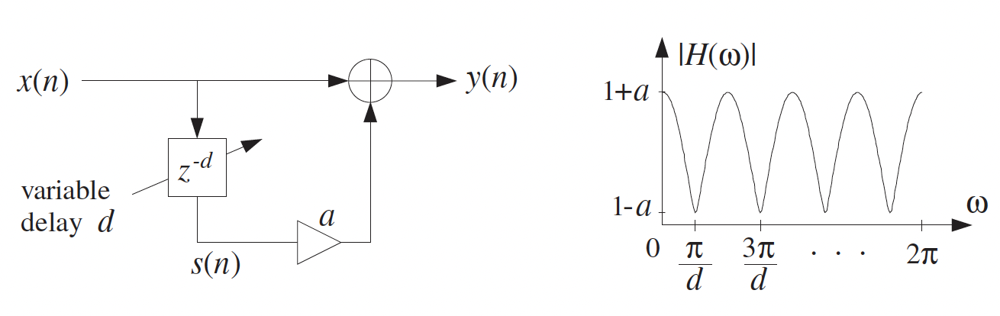
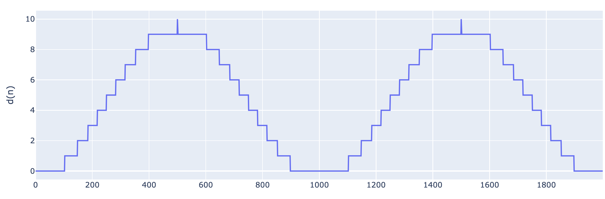
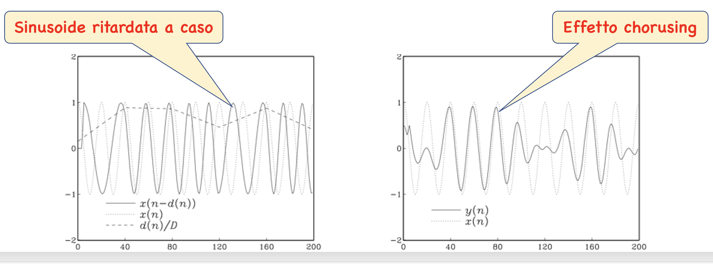
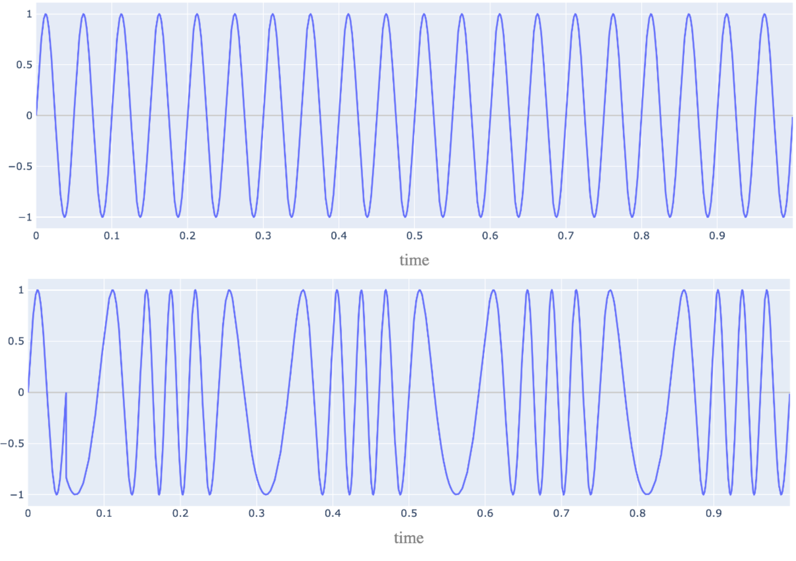
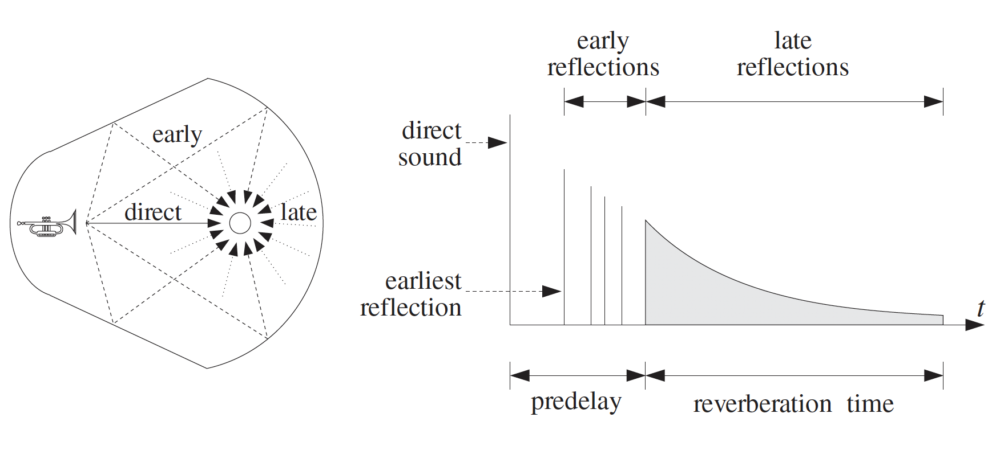
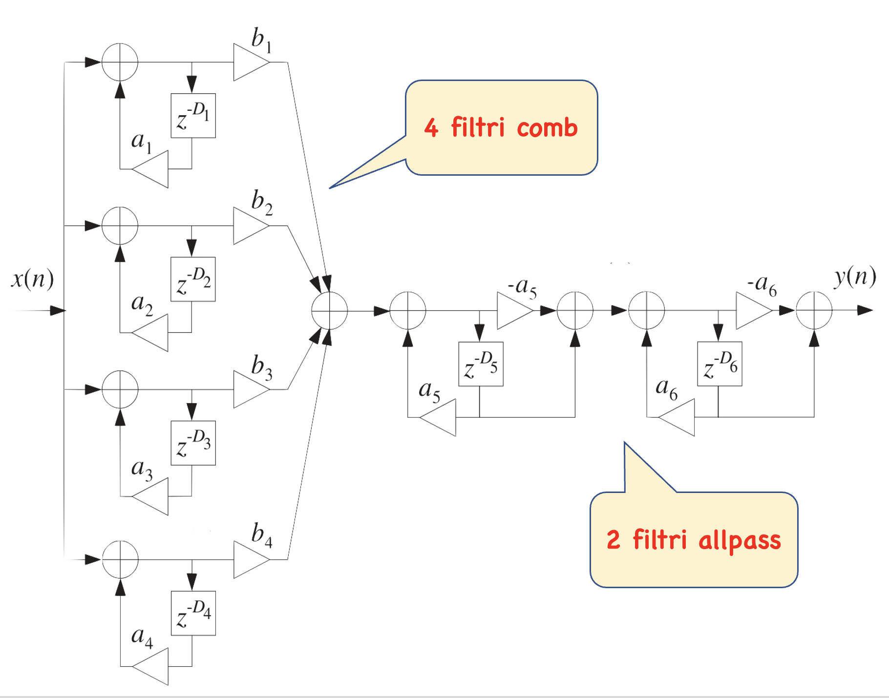
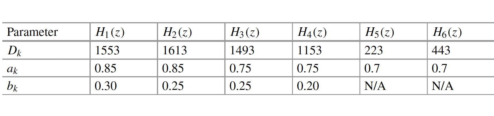
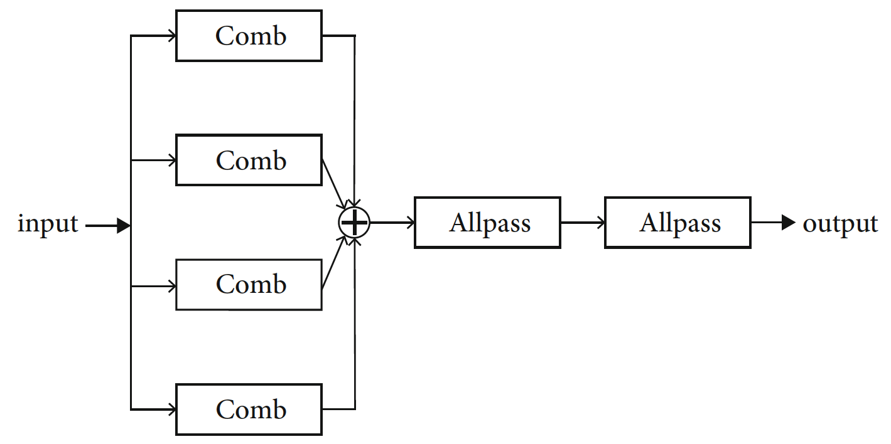

Effetti audio
====

---

##### Introduzione

Gli effetti audio sono utilizzati in molte applicazioni diverse, tra cui la produzione cinematografica, la produzione musicale e la musica dal vivo. Il loro impiego è più diffuso in alcuni ambiti rispetto ad altri. Ad esempio, i chitarristi elettrici fanno spesso affidamento su una varietà di effetti, e i chitarristi rappresentano quindi un grande mercato per i produttori di effetti audio, come TC Electronic, Strymon, Boss ed Eventide. Gli effetti per chitarra sono spesso integrati in pedali che contengono uno o pochi effetti. Gli effetti sono controllati tramite manopole e interruttori montati sulla parte superiore del pedale, che possono anche essere attivati e disattivati con uno di questi interruttori. I chitarristi combinano poi diversi effetti collegandoli tra loro con dei cavi. La disposizione e la posizione esatta degli effetti nella catena del segnale è oggetto di dibattito. La maggior parte degli effetti è in realtà piuttosto semplice dal punto di vista teorico e anche piuttosto simile, poiché molti si basano sostanzialmente sugli stessi filtri e principi di base. Qui esamineremo più da vicino alcuni degli effetti più comuni, come il vibrato, il tremolo, l’eco (o delay), il flanger e il chorus. Molti di questi effetti hanno in comune il fatto di essere essenzialmente basati su filtri comb (o inversi) e di ottenere l’effetto tramite il ritardo di tali filtri comb. In questo senso, possono essere considerati effetti basati sul ritardo, sebbene, ovviamente, tutti i filtri si basino sui ritardi in qualche misura.


## Effetti audio

Molti degli effetti comunemente utilizzati nella musica elettroacustica sono ottenuti tramite la composizione di linee di ritardo variabili nel tempo, ovvero linee la cui lunghezza è modulata da segnali a variazione lenta. Per evitare discontinuità nei segnali, è necessario interpolare in qualche modo le linee di ritardo. L'interpolazione tramite filtri allpass è applicabile solo per modulazioni molto lente o per modulazioni di ampiezza ridotta, poiché cambiamenti improvvisi nello stato dei filtri allpass danno origine a transienti che possono essere percepiti come distorsioni del segnale riferimento.

La terminologia utilizzata per gli effetti audio non è uniforme, poiché termini come flanger, chorus e phaser sono spesso associati a una vasta gamma di effetti, che possono essere molto diversi tra loro. Un flanger è solitamente definito come un filtro comb FIR la cui lunghezza del ritardo è modulata sinusoidalmente tra un valore minimo e uno massimo. Ciò ha l'effetto di espandere e contrarre la serie armonica di notch nella risposta in frequenza. Il nome flanger deriva da una pratica utilizzata in passato negli studi di registrazione analogici, dove si rallentava alternativamente la velocità di due registratori a nastro o di due giradischi che riproducevano la stessa traccia musicale premendo un dito sui bordi (flanges).

##### Flanging

Il valore del ritardo $D$ in campioni, o in secondi $T_D = DT$, può avere un effetto drastico sul suono percepito. Ad esempio, se il ritardo è maggiore di circa $100$ millisecondi nel processore di eco, il segnale ritardato può essere percepito come una rapida ripetizione, uno "slap" dopo l'altro. Se il ritardo è inferiore a circa 10 millisecondi, l'eco si mescola con il suono diretto e, poiché solo alcune frequenze sono enfatizzate dal filtro comb, il suono risultante può avere una qualità "cavernosa".

I ritardi possono anche essere utilizzati per modificare l'immagine stereo della sorgente sonora (percezione spaziale del suono in un sistema audio stereofonico) e sono strumenti indispensabili nel mixaggio stereo. Ad esempio, un ritardo di pochi millisecondi applicato a uno degli altoparlanti può causare uno spostamento e un allargamento dell'immagine stereo. Allo stesso modo, un segnale mono applicato a due altoparlanti con un piccolo ritardo temporale sarà percepito come stereo.

Effetti audio più interessanti, come il flanging e il chorusing, possono essere creati consentendo al ritardo $D$ di variare nel tempo. Ad esempio, l'Eq. [](eq:eco) del filtro eco può essere sostituita dal cosiddetto processore di flanging:

$$\label{eq:flang}
y(n) = x(n) + ax\left(n - d(n)\right) .
$$

Un effetto di flanging può essere creato variando periodicamente il ritardo $d(n)$ tra $0$ e $10$ millisecondi con una bassa frequenza, come $1$ Hz. Ad esempio, un ritardo che varia sinusoidalmente tra i limiti $0 \leq d(n) \leq D$ sarà:

$$\label{eq:delay}
d(n) = \frac{D}{2} \left(1 - \cos(2\pi f_d n)\right)
$$

dove $f_d$ è una bassa frequenza (normalizzata alla frequenza di campionamento), in unità di [cicli/campione].

La sua realizzazione è mostrata in figura sotto. I picchi della risposta in frequenza del filtro comb variabile nel tempo, che si verificano a multipli di $F_s/d$, e i suoi notch a multipli dispari di $F_s/2d$, si sposteranno su e giù lungo l'asse delle frequenze, producendo il caratteristico suono di tipo "whooshing" (fruscio) chiamato `flanging`. Il parametro $a$ controlla la profondità dei notch. In unità di [radianti/campione], i notch si verificano a multipli dispari di $\pi/d$. Nei primi anni, l'effetto di flanging veniva creato suonando contemporaneamente il brano musicale tramite due registratori a nastro e rallentando alternativamente ciascun nastro premendo manualmente il bordo della bobina del nastro.



Poiché il ritardo variabile $d(n)$ può assumere valori non interi all'interno dell'intervallo $0 \leq d \leq D$, l'implementazione dell'Eq. [](eq:flang) richiede il calcolo dell'output $x(n - d)$ di una linea di ritardo a tali valori non interi. Ciò può essere facilmente realizzato tramite troncamento, arrotondamento o interpolazione lineare.

Nell'esempio che segue, eseguiamo il flanging di un semplice segnale sinusoidale

$$\label{eq:sin}
x(n)=\sin(2\pi f n T_s)
$$

di frequenza $f=5$ Hz, campionato con $F_s=1000$ Hz o $f/F_s=0.005$ [cicli/campione] e con lunghezza $N=2000$ campioni (durata $T=2$ sec), in modo che ci siano $fN=10$ cicli nell'intervallo. Usando la [](eq:flang) e la [](eq:delay), il segnale flangiato è calcolato come:

$$
y(n)=\sin\left(2\pi \frac{f}{F_s} n\right)+a\sin\left(2\pi \frac{f}{F_s} \big(n-d(n)\big)\right)
$$ 

dove $a=0.7$, $D = 20$ e $f_d=1$ Hz o $f_d/F_s=0.001$ [cicli/campione], in modo che ci siano $f_dN = 2$ cicli nei $2000$ campioni. L'immagine sotto mostra il segnale originale $x(n)$ (colore blu), il segnale con ritardo variabile $x(n-d(n))$ (colore rosso) e il ritardo $d(n)/D$ (colore verde) ridimensionato all'unità per un plot visibile. In particolare il segnale $x(n-d(n))$ mostra i pattern tipici della modulazione in frequenza, in cui si nota che l’ampiezza resta costante mentre la frequenza varia in funzione dell’ampiezza del modulante $d(n)$.


Nella figura successiva si mostra invece in dettaglio il segnale ritardo variabile $d(n)$ (definito sopra anche modulante) espresso in [](eq:delay), dopo l'arrotondamento a intero, dato effettivamente utilizzato e modulato dalla cosinusoide per introdurre i ritardi variabili con effetto smooth come richiesto dal modello. Il massimo del ritardo è $D=10$ in questo caso e 2 sono i cicli complessivi, distribuiti nei $2000$ campioni visualizzati e interpolati linearmente.



##### Chorusing

L'effetto chorus imita l'effetto di diversi strumenti musicali che suonano, o cantanti che cantano, la stessa parte senza essere completamente sincronizzati e suonando a volumi diversi. Quando applicato a singoli strumenti, produce un suono più pieno e ricco. È spesso utilizzato su parti di chitarra elettrica pulita in generi dal ritmo sostenuto (e ad alto volume) ed è stato estremamente popolare negli anni '80. Per emulare diversi strumenti che suonano la stessa cosa, potremmo aggiungere più versioni del segnale a sé stesso. Questo, tuttavia, aumenterebbe solo il volume del suono senza modificarne il timbro. Invece, possiamo introdurre un ritardo che varia lentamente per ciascuna copia e moltiplicarlo per guadagni diversi. 

Per emulare due strumenti che suonano insieme, potremmo farlo in questo modo: 

$$
y(n) = x(n) + a x(n-d(n)),
$$

dove $a$ è il parametro di guadagno (o mix) e $d(n)$ è la funzione di ritardo variabile nel tempo che usiamo per controllare e variare la quantità di ritardo. 

Un diagramma a blocchi dell'effetto chorus è mostrato in figura. Possiamo riconoscerlo come un filtro comb e il filtro di base è quindi simile a quello di un eco. Tuttavia, i ritardi coinvolti sono così piccoli che non vengono percepiti come eco distinti, e variano nel tempo!

```{image} images/chorus.png
:width: 500px
:align: center
```

Possiamo immaginare l'effetto del ritardo variabile nel tempo sul comb come le valli dello spettro di magnitudine che si spostano lentamente, con la loro distanza che aumenta e diminuisce nel tempo man mano che il ritardo cambia. Un altro modo di pensarlo è che $x(n-d(n))$ corrisponde all'uscita dell'effetto vibrato, il che significa che l'uscita dell'effetto chorus è il segnale di ingresso mescolato con l'uscita di un effetto vibrato!

Per emulare il suono di più strumenti che suonano insieme, potremmo aggiungere più termini, corrispondenti alla connessione di più filtri comb in parallelo, ovvero:

$$
y(n) = x(n) + a_1 x(n-d_1(n)) + a_2 x(n-d_2(n)) + a_3 x(n-d_3(n)) + \ldots
$$

Ci si riferisce a ciascuno di questi termini come a un ramo, e ogni ramo contiene quindi un diverso effetto vibrato. La funzione $d_k(n)$ rappresenta la funzione di ritardo per il $k$-esimo ramo, mentre $a_k$ è il suo parametro di mix. Le funzioni di ritardo per i diversi rami dovrebbero essere scelte o inizializzate in modo leggermente diverso. Una scelta comune per simulare il ritardo temporale e le variazioni delle ampiezze è facendo variare entrambi lentamente e in modo casuale. Un ritardo temporale casuale a bassa frequenza $d_k(n)$ nell'intervallo $0 \leq d(n)\leq D$ può essere generato da:

$$\label{eq:chorus}
d(n)= D (0.5 + v(n))
$$

o, se il ritardo deve essere limitato nell'intervallo $D_1 \leq d_k(n)\leq D_2$, da:

$$
d(n)= D1 + (D2 - D1) (0.5 + v(n)).
$$

Il segnale $v(n)$ è un segnale casuale a bassa frequenza con media zero che varia tra $[-0.5, 0,.5]$. Dato un tasso di variazione desiderato $f_r$ in [cicli/campione] per $v(n)$, si ottiene il periodo $D_r = 1/f_r$ del generatore random. Esistono diverse implementazioni dell'effetto chorus da parte di vari produttori, che possono differire, ad esempio, per il numero di rami, i tipi di funzioni di ritardo utilizzate, il modo in cui i ritardi vengono implementati e così via. Inoltre, può essere aggiunta anche una quantità fissa di feedback, oltre alla parte feedforward a ritardo variabile.


Come esempio pratico, si consideri nuovamente il segnale $y(n)$ definito in [](eq:sin), ma con $d(n)$ che varia secondo l'eq. [](eq:chorus). L'ingresso è la stessa sinusoide di frequenza $f=5$ Hz e lunghezza $N=2000$ campioni. La frequenza del segnale casuale $v(n)$ è assunta pari $f_r= 0.025$ [cicli/campione], corrispondente a $Nf_r = 5$ variazioni casuali nei 2000 campioni. 
il periodo del generatore è $𝐷_𝑟=1/f_r =40$ campioni, come in figura.




##### Vibrato

Un effetto che può essere implementato utilizzando ritardi, almeno nella sua forma più semplice, è il `vibrato`. Il vibrato si riferisce a variazioni periodiche nella frequenza che i musicisti usano come ornamenti nelle esecuzioni musicali. Può essere replicato con dei filtri facendo passare il segnale in ingresso attraverso un ritardo variabile nel tempo, ovvero:

$$
y(n) = x(n-D(n)).
$$

Questo è anche chiamato modulazione, o più specificamente modulazione della frequenza. Il ritardo $D(n)$ (che è scritto come funzione di $n$ per enfatizzare che cambia nel tempo) è tipicamente nell'intervallo di 0–10 ms, mentre varia con una frequenza di $0.1-5$ Hz. Non può essere inferiore a zero, poiché ciò implicherebbe una previsione del futuro (cioè, non sarebbe causale). Se il ritardo fosse mantenuto fisso a un determinato valore, non si produrrebbe alcun effetto udibile. La funzione di ritardo può essere implementata con una funzione sinusoidale come:

$$
D(n) = \frac{D}{2} \left(1 - \cos\left(2\pi \frac{f_d}{F_s} n\right)\right),
$$

dove $f_d$ Hz è la frequenza, o `velocità` (`speed`), del ritardo variabile nel tempo, e $D$ rappresenta quella che viene chiamata  la `profondità` (`depth`), qui misurata in campioni. La funzione di ritardo, $D(n)$, varia tra $0$ e $D$.

L'effetto del ritardo variabile nel tempo su una sinusoide è illustrato nella figura seguente. In alto si mostra l'ingresso, una sinusoide di ampiezza $A=1$ e frequenza $f=5$ Hz campionata con $F_s=1000$ Hz. L'uscita dell'effetto vibrato (figura in basso) è ottenuta impostando il ritardo tra $0$ e $D=50$ ms a una frequenza $f_d=1$ Hz. Come si può notare, il risultato è che la frequenza della sinusoide varia periodicamente, creando la percezione del vibrato.



---

## Effetti audio spaziali

La musica viene di solito registrata a secco (dry) e con un solo microfono, cioè con un microfono posizionato vicino allo strumento con la minore influenza possibile dall'ambiente circostante. Quando vengono riprodotti senza ulteriori modifiche, i segnali registrati in questo modo tendono in modo naturale poiché mancano del suono di un ambiente acustico circostante e riconoscibile. Per ovviare a questo problema, di solito si applica un riverbero artificiale a questi segnali prima della riproduzione. Ciò avviene non solo nella produzione musicale, ma anche in quella televisiva e cinematografica. Il riverbero artificiale fa sembrare che il suono venga riprodotto in un ambiente desiderato, come una grande sala da concerto, un centro congressi, una cattedrale o uno studio di registrazione musicale di alta qualità. In questa sezione verranno illustrati alcuni semplici metodi per realizzare il riverbero artificiale. Inoltre, anche se la musica e anche altro materiale audio vengono normalmente registrati con un singolo microfono, l'insieme viene spesso riprodotto in configurazioni speciali di diffusori multicanale, come il suono stereo o surround, e non solo in mono.  Ciò rende possibile controllare le caratteristiche spaziali delle diverse sorgenti, ad esempio posizionandole a diversi angoli rispetto all'ascoltatore. Questo non solo rende il suono più naturale, ma facilita anche la distinzione tra le varie sorgenti sonore. Questo risultato può essere ottenuto utilizzando semplici tecniche di panoramica (non trattati qui). In un certo senso, i due argomenti, riverbero e panoramica, sono strettamente collegati, poiché entrambi riguardano la creazione artificiale della percezione dello spazio e dell'ambiente, e potrebbero essere considerati effetti spaziali.

### Risposta all'impulso

Come abbiamo visto nei capitoli precedenti, l'effetto di un sistema lineare tempo-invariante su un segnale può essere compreso in termini della risposta impulsiva del sistema. Questo vale anche per gli spazi di ascolto, come soggiorni, studi di registrazione musicale, cinema, e così via. L'effetto della convoluzione di un segnale con una risposta impulsiva può essere interpretato come un ritardo, una scalatura e una somma di molteplici echi diversi. La risposta impulsiva di uno spazio di ascolto normale può solitamente essere descritta bene come composta da tre parti, ovvero il suono diretto, le prime riflessioni e le riflessioni tardive. Il suono diretto è la parte che viaggia direttamente dalla sorgente all'ascoltatore (o al microfono). Questo suono può essere attenuato (cioè scalato) e può esserci un effetto di filtraggio passa-basso per tener conto della propagazione delle onde attraverso l'aria, a seconda della distanza. Le prime riflessioni sono i suoni che hanno rimbalzato su oggetti o pareti poche volte prima di raggiungere l'ascoltatore. Questa parte tende ad essere piuttosto rarefatta per natura. Le riflessioni tardive, invece, sono più stocastiche (cioè simili a rumore), poiché derivano da molteplici echi che hanno rimbalzato più volte sulle pareti, apparendo provenire da tutte le direzioni simultaneamente.

La risposta impulsiva dipende da molti fattori, come la posizione della sorgente e dell'ascoltatore, la geometria della stanza, il materiale delle superfici, la temperatura e l'umidità. L'obiettivo della riverberazione artificiale è produrre, in modo semplice, un metodo per replicare l'effetto degli ambienti di ascolto naturali. Forse il metodo concettualmente più semplice per applicare la riverberazione artificiale è il cosiddetto metodo della convoluzione. L'idea è che, se conosciamo la risposta impulsiva, possiamo semplicemente applicarla a qualsiasi segnale tramite convoluzione, e il risultato suonerà come l'ambiente in cui è stata registrata. Come è ben noto, la convoluzione può essere scritta come

$$\label{eq:conv}
y(n) = \sum_{k=0}^{M-1} h(k)x(n-k),
$$

dove $y(n)$ è il segnale in uscita, $x(n)$ è il segnale in ingresso, $h(n)$ è la risposta impulsiva e $M$ è la lunghezza della risposta impulsiva che si ipotizza consista in $M$ campioni consecutivi ritardati nel tempo. Per utilizzare questo metodo, dobbiamo conoscere la risposta all'impulso $h(n)$, il che significa che dobbiamo ricavarla da un semplice modello matematico, simularla o misurarla in un ambiente acustico reale. Come si fa quindi a misurare la risposta all'impulso di uno spazio d'ascolto come, ad esempio, una cattedrale? La definizione di risposta all'impulso è che si tratta dell'uscita di un sistema lineare tempo-invariante quando un impulso viene applicato all'ingresso. Un impulso è un evento di durata molto breve. Formalmente, un impulso digitale è definito come funzione delta di Kronecker:

$$
\delta(n)=\begin{cases}
1, & n=1\\
0, & \text{altrimenti}
\end{cases}.
$$

Se impostiamo $x(n)$ uguale a $\delta(n)$ e lo inseriamo nell'espressione per la convoluzione in [](eq:conv), possiamo vedere che il risultato è semplicemente $y(n)=h(n)$, nota come risposta all'impulso. Nel mondo analogico, tuttavia, è un po' più complicato, poiché l'equivalente analogico della funzione delta è la funzione delta di Dirac, che è una cosiddetta funzione generalizzata o distribuzione, e non una funzione definita in senso standard. Può essere pensata in modo euristico come una funzione che è infinita al tempo zero e nulla ovunque altrove. Una funzione del genere è difficile, se non impossibile, da replicare meccanicamente, e quindi devono essere trovati altri metodi. In termini semplici, la risposta impulsiva di una stanza può essere pensata come il suono che si sente quando si battono le mani una volta.

Nella figura seguente, è mostrato un esempio di risposta impulsiva misurata in una cattedrale. Le prime riflessioni possono essere chiaramente viste sotto forma di picchi molto distinti all'inizio. Inoltre, si può anche osservare che la risposta impulsiva decade, anche se risulta piuttosto lunga. Si nota inoltre che la parte finale della risposta impulsiva contiene meno picchi distinti. Questo aspetto legato alle dinamiche di riverberazione di un ambiente viene discusso più approfonditamente nella sezione seguente.


```{figure} images/risp_impulso.png
:label: impulso
:alt: Sunset at the beach
:align: center
:width: 400px

Impulso (sparo) campionato con $F_s=44.1$ kHz ▶ <audio src="sound/gunshot.wav" />
```


### Riverbero

La riverberazione di uno spazio d'ascolto è tipicamente caratterizzata da tre periodi di tempo distinti: il suono diretto, le prime riflessioni (early) e le riflessioni tardive (late), come illustrato nella figura sotto. Le prime riflessioni corrispondono alle prime riflessioni sulle pareti della stanza; man mano che le onde continuano a rimbalzare sulle pareti, la loro densità aumenta e si disperdono, arrivando all'ascoltatore da tutte le direzioni. La costante di tempo di riverberazione è il tempo necessario affinché la risposta all'impulso della stanza decada di $60$ dB. Le tipiche sale da concerto hanno costanti di tempo di circa $1.8-2$ secondi.



La qualità del suono di una sala da concerto dipende dai dettagli della risposta all'impulso del riverbero, che dipende dalla posizione relativa della sorgente sonora e dell'ascoltatore. Pertanto, simulare digitalmente le caratteristiche di riverbero di una determinata sala è un compito quasi impossibile. Come compromesso, i processori di riverbero digitali tentano di simulare la tipica risposta all'impulso del riverbero di una sala e offrono all'utente la possibilità di modificare alcuni parametri, come la durata delle prime riflessioni (il tempo di ritardo) o il tempo complessivo di riverbero. 

I filtri di riverbero semplici della famiglia comb (illustrata nel capitolo precedente) sono troppo semplici per produrre una risposta di riverbero realistica. Tuttavia, come suggerito da Schroeder, può essere utilizzato come elemento costitutivo di processori di riverbero più realistici, in grado di esibire le prime riflessioni discrete e le ultime riflessioni diffuse. Nella maggior parte delle applicazioni del DSP, siamo interessati alla risposta allo stato stazionario dei nostri filtri. La riverberazione è un'eccezione. In questo caso, è la risposta transitoria di una sala a conferirle le sue particolari caratteristiche di riverberazione. Le proprietà allo stato stazionario, tuttavia, hanno un effetto sul suono complessivo percepito. I picchi nello spettro allo stato stazionario del filtro riverberatore semplice di Eq. [](eq:Hcomb), tendono ad accentuare le frequenze del segnale di ingresso che si trovano in prossimità dei picchi. Per evitare questa colorazione del suono in ingresso, Schroeder ha proposto anche una versione allpass del riverberatore semplice, che ha una risposta di magnitudine piatta per tutte le frequenze.


##### Filtro Allpass

Come detto sopra, il filtro comb è uno degli elementi di base del riverbero di Schroeder. In questo contesto, viene spesso chiamato “riverberatore semplice”. Per costruire un riverbero a partire da filtri comb, è sufficiente collegarne in parallelo un certo numero con ritardi diversi e possibilmente anche guadagni diversi e sommare le uscite dei filtri. Tuttavia, questo non ha un suono molto naturale o molto buono, a causa dei picchi molto forti nella risposta in frequenza del filtro comb. I denti del filtro a pettine causano correlazioni innaturali nel segnale in uscita. 

Visti tutti i limiti del riverberatore semplice, spesso si ricorre a un altro blocco costruttivo, il `riverberatore allpass`. In pratica, un filtro è allpass se la risposta in ampiezza è una qualsiasi costante non nulla, anche se spesso ci si riferisce al guadagno unitario a ciascuna frequenza.


Questo filtro ha l'equazione alle differenze

$$
y(n)=ay(n-D)-ax(n)+x(n-D).
$$

Questa porta alla seguente funzione di trasferimento

$$
H(z)=\frac{-a+z^{-D}}{1-az^{-D}}.
$$

Lo schema a blocchi del riverberatore allpass è mostrato in figura.

```{image} images/allpass.png
:width: 400px
:align: center
```

La risposta all'impulso è data da:

$$
h(n) = −a\delta(n)+(1−a^2)\delta(n-D) +(1−a^2)a\delta(n-2D)+(1−a^2)a^2\delta(n-3D)+\dots
$$

che dà luogo alla seguente sequenza di numeri
$$
−a, 0, \dots, 0, 1 − a^2, 0,\dots , 0, (1 − a^2)a, 0,\dots , 0, (1 − a^2)a^2,\dots,
$$

con $D-1$ zeri tra i valori non nulli. Come nel caso del filtro comb, è facile notare che il filtro è stabile quando $|a| < 1$, poiché la risposta all'impulso diventa sempre più piccola in funzione di $n$. Un esempio tipico della risposta all'impulso di un filtro passa-tutto di questo tipo è rappresentato nella figura5 per $a=-0.95$ e $D=10$.


Le risposte in frequenza e in magnitudine si ottengono imponendo $z = e^{j\omega}$

$$
H(ω)=\frac{-a + e^{-j\omega D}}{1 - ae^{-j\omega D}}\quad \Rightarrow\quad |H(\omega)|= 1,\quad \forall \omega 
$$

La risposta in magnitudine è costante in $\omega$ perché il numeratore e il denominatore di $H(\omega)$ hanno la stessa grandezza, come si evince dalla semplice identità:

$$
|-a + e^{-j\omega D}| = \sqrt{1-2a \cos(\omega D)+a^2 }= |e^{-j\omega D}|
$$

Anche se la sua risposta in magnitudine è piatta, la sua risposta transitoria presenta lo stesso andamento a decadimento esponenziale degli echi del riverbero semplice, come si vede dalla figura (risposta in magnitudo blu e risposta in fase rossa). 


```{image} images/allpass_risp_freq.png
:width: 400px
:align: center
```

Si può dimostrare che la risposta di fase di qualsiasi filtro allpass è sempre negativa e monotonamente decrescente (come si vede anche in figura). I ritardi di fase sono sempre funzioni che assumono valori positivi. Questo fatto ci permette di pensare ai filtri allpass come a mezzi in cui i segnali si propagano con un ritardo dipendente dalla frequenza, senza essere soggetti ad alcun assorbimento o amplificazione. Nella figura sotto è mostrata una frequenza critica (o di turnover), cioè quell'insieme di valori di frequenza in cui le fasi vengono invertite e quindi in cui si ha la massima azione del filtro. Questo accade in corrispondenza dei multipli dispari della frequenza fondamentale $f_0=F_s/(2D)$, cioè $f_k=kf_0$, con $k$ dispari (mostrato sopra).

```{image} images/frequenza_critica_allpass.png
:width: 500px
:align: center
```


##### Riverberatore di Schroeder

Manfred Schroeder introdusse l'idea della riverberazione artificiale e successivamente propose un semplice design basato su una combinazione di riverberatori semplici comb e allpass. Non solo è concettualmente semplice, ma è anche computazionalmente efficiente, ed è stato, ed è tuttora, una soluzione molto pratica. Sebbene oggi disponiamo di molte più risorse e possiamo realizzare soluzioni più complesse, il riverbero di Schroeder rimane un classico e i riverberi progettati da lui o ispirati al suo design sono ancora in uso. Qui lo utilizziamo principalmente come esempio per dimostrare i principi della riverberazione artificiale.

Il design di Schroeder si basa su un numero di filtri comb, qui quattro, combinati in parallelo seguiti da un certo numero, qui due, di filtri allpass in serie. Gli output dei filtri comb vengono sommati e successivamente inviati attraverso il primo filtro allpass e poi attraverso il successivo.

Siano $H_1(z), H_2(z), H_3(z)$, e $H_4(z)$ le funzioni di trasferimento dei quattro filtri comb. Ognuna di queste è data da:

$$
H_k(z) = \frac{b_k }{1 - a_k z^{-D_k}}, \quad \text{per } k = 1, 2,3, 4
$$

dove $D_k$ è il ritardo, $a_k$ il coefficiente di feedback, e $b_k$ un parametro di miscelazione. Il parametro di miscelazione, che non era presente nei filtri comb fino ad ora, è utile quando si combinano gli output di più filtri connessi in parallelo. Il parametro di miscelazione determina quanto forte sarà l'output di quel particolare filtro nel segnale combinato.  Analogamente, siano $H_5(z)$ e $H_6(z)$ le funzioni di trasferimento dei due filtri allpass, le cui funzioni di trasferimento sono date da:

$$
H_k(z) = \frac{-a_k + z^{-D_k}}{1 - a_k z^{-D_k}}, \quad \text{per } k = 5, 6.
$$

Poiché i quattro filtri comb sono applicati in parallelo, la funzione di trasferimento combinata è:

$$
H_1(z) + H_2(z) + H_3(z) + H_4(z),
$$

e poiché l'output di questo filtro combinato viene poi inviato attraverso i due filtri allpass, che sono connessi in serie, la funzione di trasferimento dell'intero riverbero di Schroeder è:

$$
H(z) = \Big(H_1(z) + H_2(z) + H_3(z) + H_4(z)\Big)\,H_5(z)\,H_6(z).
$$

L'intero riverbero di Schroeder è mostrato in figura. Può essere considerato come un unico grande filtro lineare e tempo invariante. 



Nella tabella sono riportati alcuni parametri suggeriti per i quattro filtri comb e i due filtri allpass dello schema sottostante, per una frequenza di campionamento specificata di $44.1$ kHz. Questi possono essere utilizzati come punto di partenza per la sperimentazione. Si noti che i ritardi dei filtri comb e all-pass devono essere scelti in modo che siano numeri primi reciproci, cioè che non abbiano fattori comuni.



