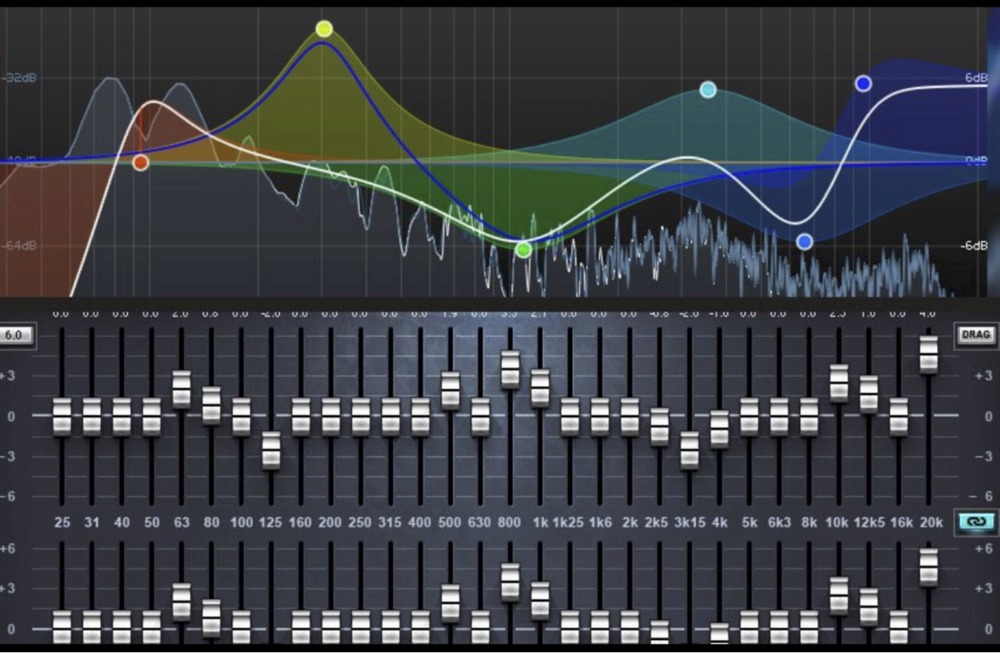
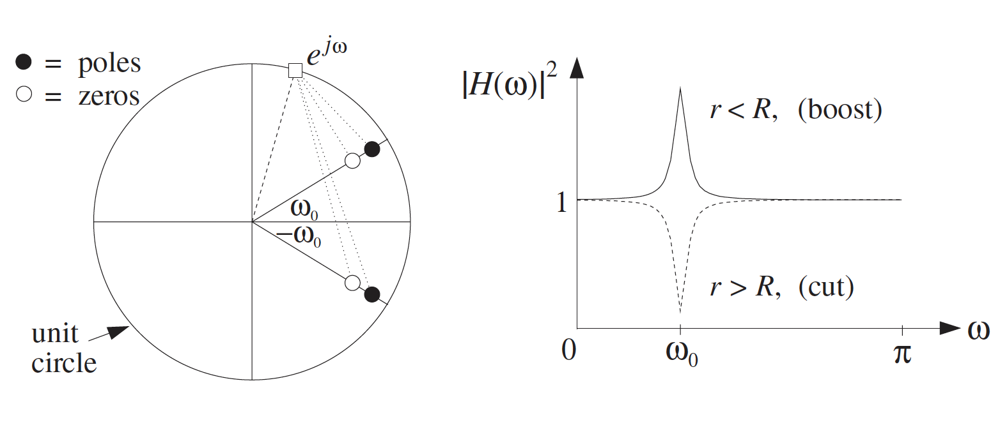
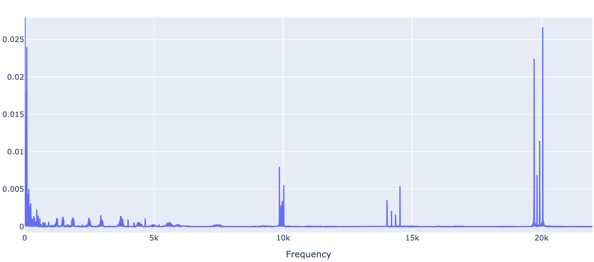
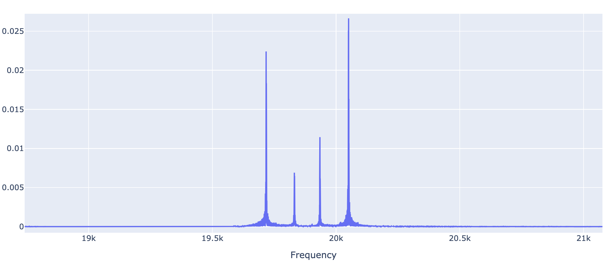
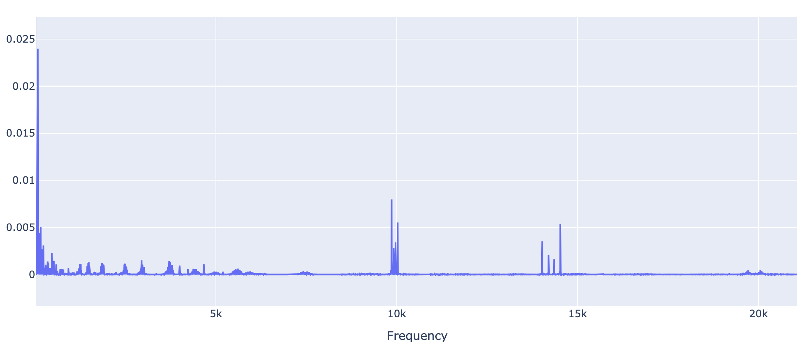
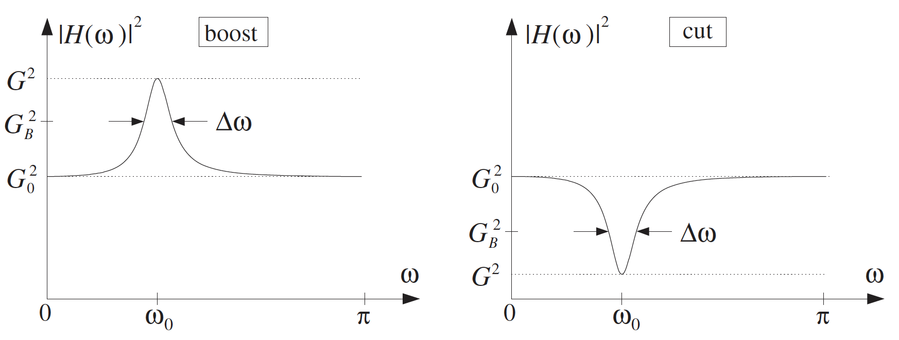
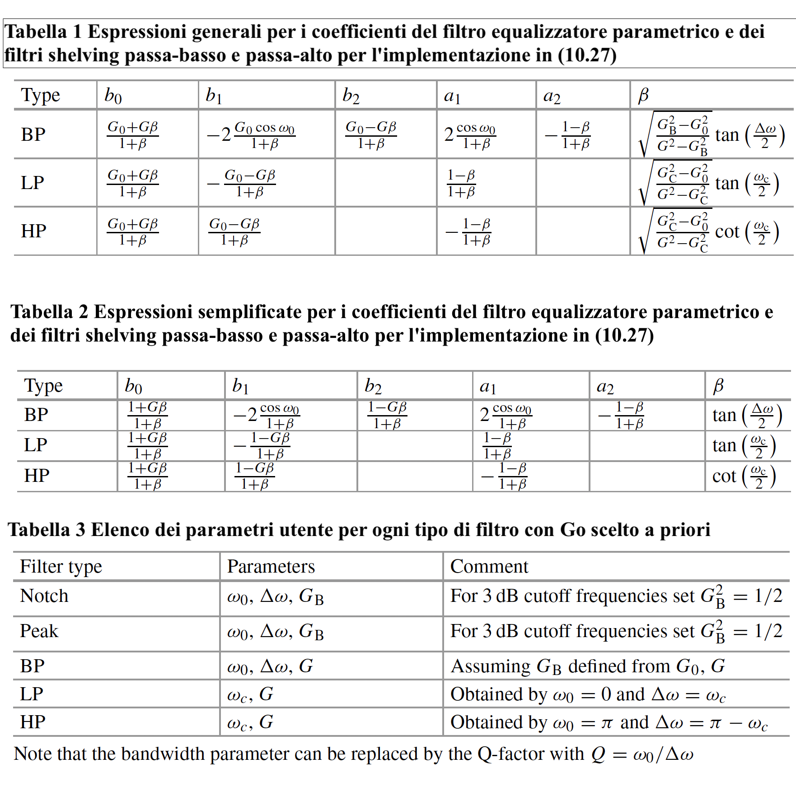

Equalizzazione
====

---

## Introduzione

L'equalizzazione audio si riferisce al processo di modellazione delle frequenze di un segnale audio. Con l'equalizzatore è possibile utilizzare dei filtri per aumentare o ridurre selettivamente determinate frequenze al fine di ottenere il suono desiderato. Il processo di equalizzazione è sia una scienza che un'arte: un'attenta regolazione può eliminare i rumori indesiderati, aggiungere ariosità e chiarezza alle voci, enfatizzare il suono di una grancassa o ridurre la confusione causata da più strumenti che si scontrano nella stessa gamma di frequenze. Inoltre, l'equalizzazione può essere utilizzata per effetti creativi, come l'emulazione del suono distinto di una telefonata nella voce. La versatilità dell'equalizzatore è vastissima ed esploreremo alcune sue applicazioni proprio a partire dai sistemi che la metto in atto, cioè il filtri equalizzatori.

Gli equalizzatori (EQ) sono onnipresenti negli apparecchi audio, che si tratti di un semplice controllo dei toni su uno stereo, un equalizzatore grafico multibanda hi-fi, una banda di equalizzazione parametrica in un pedale per chitarra, oppure si tratti di sistemi audio analogici, digitali, domestici, automobilistici, pubblici o di registrazione/mixaggio in studio.
Sebbene basati sugli stessi principi, gli equalizzatori hanno scopi diversi a seconda del contesto. Nei sistemi di riproduzione, gli equalizzatori servono a cancellare eventuali effetti di filtraggio indesiderati dovuti all'attrezzatura coinvolta (altoparlanti, amplificatori, ecc.) o all'acustica della stanza. I musicisti utilizzano gli equalizzatori per modellare il proprio suono, ovvero come parte di un'espressione musicale. Gli equalizzatori sono costruiti utilizzando filtri lineari tempo-invarianti (a condizione che i controlli non vengano modificati). Esistono due tipi di equalizzatori: `grafici` e `parametrici`. 
 
 ```{card}
:header: EQ Grafici
:footer: 
Gli equalizzatori grafici sono il tipo più comune, in cui la banda audio è divisa in un numero fisso di bande di frequenza e la quantità di equalizzazione in ciascuna banda è controllata da un filtro passa-banda il cui guadagno può essere variato verso l'alto e verso il basso. Le frequenze centrali delle bande e le larghezze 3-dB del filtro sono fisse e l'utente può variare solo il guadagno complessivo di ciascuna banda. In genere, i filtri passa-banda del secondo ordine sono adeguati per le applicazioni audio. Negli equalizzatori grafici, pertanto, una risposta in frequenza desiderata (ovvero l'attenuazione e l'amplificazione di determinate frequenze) si ottiene modificando il guadagno su un insieme di frequenze centrali fisse.
```

```{card}
:header: EQ Parametrici
:footer: 
Negli equalizzatori parametrici, la risposta in frequenza desiderata viene ottenuta utilizzando un certo numero di bande, ognuna delle quali può essere controllata tramite una frequenza centrale, una larghezza di banda e un guadagno (o altri parametri simili). Collegando in cascata quattro o cinque filtri di questo tipo è possibile ottenere quasi tutti gli effetti di equalizzazione desiderati.
```

---

## Equalizzazione grafica

Nell'equalizzatore grafico, il segnale di ingresso viene inviato a un gruppo di filtri. Ogni filtro fa passare la porzione di segnale presente nella propria gamma di frequenza o banda. L'ampiezza passata da ciascun filtro viene regolata mediante un comando a slitta per aumentare o ridurre le componenti di frequenza passate da quel filtro. La posizione verticale di ciascun cursore indica quindi il guadagno applicato a quella banda di frequenza, in modo che i cursori assomiglino a un grafico della risposta dell'equalizzatore tracciato in funzione della frequenza.  Questo processo è generalmente semplice e può influire sulla qualità dell'audio. I musicisti o i tecnici audio utilizzano gli equalizzatori per bilanciare i diversi elementi di una canzone e creare maggiore chiarezza nell'audio.

Gli equalizzatori grafici si trovano comunemente nei sistemi di altoparlanti audio per auto, negli home theater, negli studi di registrazione e nei sistemi audio stereofonici di fascia media e alta. Sono disponibili anche programmi di equalizzazione grafica da utilizzare per la regolazione fine del suono in un PC. Sono particolarmente indicati per gli ambienti sonori dal vivo, dove un tecnico può prendere decisioni rapide grazie a cursori chiaramente contrassegnati.

Il numero di canali di frequenza può essere adattato ai requisiti dell'applicazione prevista. Un equalizzatore audio per auto potrebbe avere un totale di cinque-dieci bande di frequenza. Un equalizzatore per l'amplificazione professionale dal vivo ha in genere da 25 a 31 bande, per un controllo più preciso dei problemi di retroazione e per l'equalizzazione dei modi della stanza. Un equalizzatore di questo tipo è chiamato equalizzatore a 1/3 d'ottava (informalmente “EQ a terzo d'ottava”) perché le frequenze centrali dei suoi filtri sono distanziate di un terzo d'ottava, tre filtri per ottava. Gli equalizzatori con un numero di filtri per ottava pari alla metà sono comuni quando è richiesto un controllo meno preciso: questo design è chiamato equalizzatore a 2/3 ottave.
 
Gli equalizzatori grafici funzionano potenziando o riducendo bande predeterminate per migliorare la qualità del suono. Le bande sono impostate all'interno di un intervallo fisso. Gli EQ grafici inviano l'audio in ingresso a una serie di filtri che passano l'audio in base alla banda assegnata. L'utente sposta verso l'alto o verso il basso i controlli a scorrimento etichettati in decibel per aumentare o ridurre l'energia passata attraverso ciascuna banda. I potenziometri a scorrimento per ciascun canale sono affiancati, con la frequenza più bassa a sinistra e quella più alta a destra. In questo modo, le posizioni dei pulsanti sembrano seguire una curva grafica. Esistono anche vari tipi di EQ, di cui uno è l'EQ grafico.

Un tipico equalizzatore grafico è costituito da diversi filtri o amplificatori audio, ciascuno centrato su una frequenza specifica della gamma audio. La maggior parte degli equalizzatori grafici ha due serie identiche di filtri o amplificatori, uno per ogni canale di un sistema audio stereofonico. L'audio in ingresso viene inviato a una serie di filtri che lo passano in base alla gamma di frequenze. L'utente può aumentare o ridurre l'energia passata da ciascuna banda utilizzando i controlli a scorrimento. Se gli acuti sono troppo forti in una traccia, ad esempio, tagliando una delle bande di frequenza più alte è possibile attenuarli. Allo stesso modo, se i bassi sono eccessivi, l'abbassamento di un cursore su una delle bande di frequenza più basse può risolvere il problema. In ogni caso, anche solo piccole regolazioni possono cambiare il suono in modo significativo.

I filtri passa-alto e passa-basso vengono utilizzati per definire i limiti. I filtri passa-alto tagliano le basse frequenze lasciando passare le alte, mentre i filtri passa-basso tagliano le alte frequenze lasciando passare le basse. Quindi, ad esempio, i produttori possono usare i filtri passa-alto per tagliare i bassi, mentre usano i filtri passa-basso per evitare l'emorragia di suoni a frequenza più alta, come i piatti. L'emorragia si verifica quando l'uscita di una sorgente audio si riversa nell'ingresso di un'altra sorgente audio.

La differenza principale tra equalizzatori grafici ed equalizzatori parametrici è la flessibilità, ma anche la complessità, di quest'ultimi.  Gli equalizzatori parametrici sono equalizzatori variabili a più bande che consentono all'utente di controllare l'ampiezza, la frequenza centrale e la larghezza di banda di ciascuna banda. Gli equalizzatori parametrici aumentano e tagliano l'ampiezza, spostano la frequenza centrale verso l'alto o verso il basso e allargano o restringono la larghezza di banda di ciascuna banda. Questo tipo di equalizzatore consente regolazioni precise e i tecnici audio possono individuare frequenze particolari negli studi di registrazione e missaggio.

Gli equalizzatori parametrici sono più complessi degli equalizzatori grafici, in quanto possono effettuare regolazioni più precise e specifiche. Mentre un equalizzatore grafico ha il controllo solo su un insieme fisso di frequenze, gli equalizzatori parametrici possono controllare quanto segue:
- la frequenza esatta,
- l'aumento o la riduzione dei decibel,
- l'ampiezza di banda o la gamma di ciascuna frequenza, definita anche quoziente di variazione, o semplicemente Q.

Nella figura si vede come l'apparato consenta all'utente di far scorrere i controlli (in decibel) per aumentare o ridurre l'energia che passa attraverso ciascuna banda e, di conseguenza, mettere in azione l'equalizzazione con più o meno vigore.

&nbsp;

&nbsp;

---

## Equalizzazione parametrica

L’equalizzazione è uno strumento fondamentale nella produzione audio e svolge ruoli diversi a seconda delle fasi di lavorazione. Può essere considerato il “coltellino svizzero” dell’audio, capace sia di realizzare regolazioni sottili che di apportare cambiamenti radicali in vari momenti della produzione. In ogni contesto, l’EQ risponde a esigenze specifiche: creare nuovi suoni, bilanciare le tracce o perfezionare il mix finale per gli ascoltatori. Di seguito una panoramica:

**Equalizzazione nel Sound Design**

Nel sound design, l’equalizzazione è uno strumento estremamente versatile che va oltre il semplice miglioramento o pulizia dell’audio. Viene usato per modellare creativamente i suoni in modo da adattarli al contesto narrativo o evocare atmosfere specifiche. Ad esempio, l’EQ può simulare ambienti diversi, come far sembrare che un suono provenga da dietro una porta chiusa attenuando le alte frequenze. Un’altra tecnica comune è l’effetto “telefono”, ottenuto con un filtro passa-banda per imitare la risposta in frequenza limitata di un vecchio telefono. I sound designer utilizzano frequentemente l’EQ per creare illusioni di distanza o riprodurre l’acustica di spazi differenti, rendendolo essenziale nella costruzione di ambienti audio immersivi.

**Equalizzazione nel Mixing**

Durante la fase di mixaggio, l’equalizzazione viene utilizzato principalmente per bilanciare le singole tracce all’interno di una canzone. Permette di ritagliare uno spazio unico per ogni strumento o parte vocale, evitando che si sovrappongano nello stesso intervallo di frequenze. Con l’EQ, si può migliorare la chiarezza, rimuovere le frequenze “fangose” e modellare il tono di ciascun elemento per contribuire in modo efficace al mix complessivo. L’obiettivo è creare coesione tra i vari componenti, assicurandosi che ognuno sia udibile chiaramente senza sovrastare gli altri.

**Equalizzazione nel Mastering**

Nel mastering, l’equalizzazione assume un ruolo leggermente diverso. Viene utilizzato per perfezionare il suono complessivo di una traccia o di un album. L’obiettivo è ottenere una risposta in frequenza bilanciata sull'intero mix, garantendo che suoni bene su tutti i sistemi di riproduzione. L’equalizzazione nel mastering implica regolazioni sottili per migliorare il tono generale del mix, correggere piccoli squilibri e garantire coerenza tra i brani di un album.

Come abbiamo visto, l’equalizzazione è uno strumento imprescindibile per qualsiasi produttore musicale, essenziale per modellare e perfezionare il suono delle tracce. Dall'analisi delle bande di frequenza all’utilizzo dei parametri e delle tecniche dell’equalizzazione, si rammenta che l’efficacia dell’equalizzazione si basa su equilibrio e sottigliezza. Non si tratta solo di far suonare bene gli elementi singolarmente, ma di garantire che lavorino insieme per creare un mix coeso e armonioso. Che si stia aumentando le frequenze per aggiungere brillantezza o tagliando per ridurre le frequenze indesiderate, ogni regolazione dovrebbe servire il fine ultimo di migliorare il paesaggio sonoro complessivo.

Di seguito vengono presentati, in linea teorica, i principali modelli di filtro utilizzati per questo scopo, tra cui i filtri peak e notch, l’EQ parametrico e i filtri shelving passabasso e passaalto.

##### Filtri peak e notch del II ordine

Nel capitolo precedente abbiamo visto il progetto del filtro risonatore utilizzando la tecnica del posizionamento di poli e zeri. L'idea base del filtro è quella di collocare una coppia di poli con raggio $R$ e angolo $\pm \omega_0$ all'interno della circonferenza unitaria, cioè 

$$
p = R e^{j \omega_0} \quad \text{e} \quad p^* = R e^{-j \omega_0}
$$

dove $^*$ indica il complesso coniugato. Una leggera generalizzazione del filtro a risonatore consiste nel posizionare anche una coppia di zeri vicino ai poli lungo le stesse direzioni dei poli, cioè in corrispondenza delle posizioni:

$$
\rho=r e^{j \omega_0} \quad \text{e} \quad \rho^* = r e^{-j \omega_0}
$$

dove $r$ è ristretto al range $0 \leq r \leq 1$. La funzione di trasferimento (cella del secondo ordine, dato la grado dei polinomi coinvolti) diventa così:

\begin{align}
H(z) &= \frac{(1 - \rho z^{-1})(1 - \rho^* z^{-1})}{(1 - p z^{-1})(1 - p^* z^{-1})}\\
&=\frac{(1 - r e^{j \omega_0} z^{-1})(1 - r e^{-j \omega_0} z^{-1})}{(1 - R e^{j \omega_0} z^{-1})(1 - R e^{-j \omega_0} z^{-1})}\\
&= \frac{1 + b_1 z^{-1} + b_2 z^{-2}}{1 + a_1 z^{-1} + a_2 z^{-2}} 
\end{align}

dove i coefficienti del filtro sono dati in funzione dei parametri $r$, $R$ e $\omega_0$:

\begin{align}
&b_1=-2r\cos(\omega_0),&\qquad &b_2=r^2&\\
&a_1=-2R\cos(\omega_0),&\qquad &a_2=R^2&
\end{align}

La posizione di zeri e poli è mostrata figura (caso boost, nel caso cut si invertono le posizioni di poli e zeri, con zeri più esterni). 

&nbsp;

&nbsp;

La figura mostra il comportamento del filtro per un dato fasore $e^{j\omega}$ in relazione alla sua prossimità o lontananza dalle coppie polo/zero. Si hanno i seguenti casi:
- quando $r < R$, il polo “vince” sullo zero, nel senso che è più vicino al cerchio unitario rispetto allo zero, dando luogo a un picco nella risposta in frequenza a $\omega= \omega_0$. Il caso del risonatore può essere considerato come un caso speciale con $r = 0$. 
- quando $r > R$, lo zero vince sul polo, dando luogo a una caduta nella risposta in frequenza. In particolare, se $r = 1$, si ottiene uno zero esatto, una tacca, in corrispondenza di $\omega= \omega_0$. 

Quando il polo e lo zero sono molto vicini, cioè $r\approx R$, la risposta in frequenza rimane essenzialmente piatta per frequenze lontane da $\omega=±\omega_0$, perché le distanze del fasore $e^{j\omega}$ dalle coppie polo/zero sono pressoché uguali, il che fa pensare che un filtro di questo tipo può essere considerato un semplice equalizzatore parametrico, che fornisce un “boost” se $r < R$, o un “cut” se $r > R$. L'altezza del boost o del cut rispetto a 1 è controllata dalla vicinanza di $r$ a $R$. L'ampiezza dei picchi o delle cadute è controllata dalla vicinanza di $R$ al cerchio unitario.

&nbsp;

```{tip} Uso del filtro notch (*python*)

In questo esempio si mostra il filtro notch o elimina banda in azione, mettendo in evidenza come questo sia uno strumento molto preciso in grado di agire su bande di frequenza estremamente sottili. Per rifarsi a un esempio classico, si può citare il feedback nella chitarra acustica che si presenta durante l’amplificazione. Poiché il feedback si verifica a una frequenza precisa, è necessario utilizzare filtri elimina banda, più mirati rispetto ai normali equalizzatori, per intervenire senza alterare significativamente il suono. Un altro caso è la necessità di eliminare il picco in frequenza a 50 Hz dato dalla corrente elettrica negli apparati elettronici.

Nel caso qui di seguito, con lo stesso spirito, si vuole invece eliminare un rumore fastidioso molto acuto, cioè alle alte frequenze non lontane dalla frequenza di Nyquist, artatamente introdotto in una clip campionata a 44.1 kHz (in figura). 

&nbsp;

&nbsp;

Più in dettaglio, si osserva che in un range di frequenze che va da 19.700 Hz a 20.050 Hz circa, emergono 4 picchi corrispondenti ad altrettante frequenze generate da toni puri che introducono un sibilo estremamente fastidioso all'ascolto (figura sotto). 

&nbsp;

&nbsp;

Posto che l'eliminazione di questo rumore possa essere effettuata con opportuni filtri passabasso senza apparente timore di cancellazione di segnale utile, mostriamo qui come applicare con altrettanta efficacia una sequenza di filtri notch puntuali sulle frequenze emergenti, in particolare con frequenze centrali analogiche 

$$
f_0\in\{19717,\quad 19831,\quad 19935,\quad 20050\}
$$

come si può dedurre dallo spettro mostrato sopra e recepito chiaramente dalla risposta in frequenza congiunta dei quattro notch radunati nella figura sotto. I parametri dei filtri sono i seguenti: $Fs = 44100$ Hz, $R= 0.998$, $r =0.999$ e le frequenze $f_0$ indicate sopra.

&nbsp;

&nbsp;

A valle dell'applicazione del filtro si nota dallo spettro del segnale puntualmente filtrato che le frequenze sono del tutto sparite e assieme as esse il sibilo più acuto da cui la clip è affetta (in figura).


```
&nbsp;

I filtri qui descritti sono semplici, offrono un'dea chiara su come il filtro opera, tuttavia la tecnica che li origina è adeguata solo nel caso di larghezza di banda ridotta, cioè quando li si utilizzano per cancellare frequenze date dal rumore puntuale in frequenza, come negli esempi precedenti. Ma diventa complicata per larghezze di picco maggiori, come quelle che vengono invece richieste negli equalizzatori audio grafici e parametrici. A differenza di quello mostrato sopra, il metodo della `trasformazione bilineare` (non discusso qui) offre un controllo preciso sulle specifiche desiderate per tali filtri. Descriviamo di seguito pertanto una famiglia di filtri notch e peak ottenuti con detta tecnica e che, combinati assieme, rivelano caratteristiche più adeguate all'equalizzazione generale.  

Se indichiamo con $H_{\text{notch}}(z)$ e $H_{\text{peak}}(z)$ le funzioni di trasferimento dei filtri `notchEQ` e `peakEQ`, la trasformazione bilineare permette di mettere in evidenza i guadagni alle varie frequenze, denotati con $G_0$, $G$ e $G_B$ rispettivamente, dove:
- $G_0$ è spesso scelto come costante negli equalizzatori e può essere semplicemente impostato a 1, ovvero $G_0 = 1$, e viene talvolta chiamato `livello`,
- $G$ rappresenta l'amplificazione o `guadagno` alla frequenza centrale del filtro rispetto al riferimento $G_0$,
- $G_B$ è il `guadagno` alle frequenze di taglio del filtro (come spiegato di seguito).

Si ottiene un `boost` selezionando $G > G_0$ e un `cut` con $G < G_0$. Come mostrato figura, i guadagni relativi devono essere scelti come segue, a seconda che si tratti di un boost o di un cut:

$$G^2_0 < G^2_B < G^2 \text{ (boost)}$$ 
$$G_2 < G^2_B < G^2_0 \text{ (cut)}$$ 

&nbsp;

&nbsp;

I filtri peakEQ e notchEQ condividono un certo numero di parametri (da qui il termine parametrico), ovvero la larghezza di banda $\Delta \omega$, la frequenza centrale $\omega_0$ e $G$ (mentre $G_B$ viene calcolato da questi), che possono essere regolati dall'utente. Queste quantità digitali sono legate a quelle analogiche secondo le relazioni:

$$\label{eq:omega}
\omega_0 = 2\pi \frac{f_0}{F_s} \qquad \text{e} \qquad \Delta \omega = 2\pi \frac{\Delta f}{F_s},
$$

dove $F_s$ è la frequenza di campionamento e $f_0$ e $\Delta f$ sono la frequenza centrale e la larghezza di banda (in Hz). In un equalizzatore grafico, queste quantità sono fissate per ogni banda e l'utente può solo modificare $G$. La frequenza centrale e la larghezza di banda sono legate ai bordi della banda, chiamati frequenze di taglio $\omega_1$ e $\omega_2$ (con $\omega_2 > \omega_1$), come segue:

$$
\omega_0 = \sqrt{\omega_1 \omega_2} \quad \text{e} \quad \Delta \omega = \omega_2 - \omega_1, 
$$

cioè, la frequenza centrale è la media geometrica di $\omega_1$ e $\omega_2$, mentre la larghezza di banda è semplicemente la differenza tra le due. In figura sotto sono indicati gli equivalenti analogici di queste quantità, ovvero $f_1$ e $f_2$, derivati da $\omega_1$ e $\omega_2$, e $\Delta f$ derivata da $\Delta\omega$, secondo quanto indicato nella [](eq:omega).

&nbsp;
```{image} images/gain_EQ.png
:alt: long
:class: bg-primary mb-1
:width: 350px
:align: center
```
&nbsp;

Pertanto, secondo la tecnica della trasformazione bilineare, un filtro notchEQ con frequenza centrale $\omega_0$ ha la seguente:

```{card}
:header: *Funzione di trasferimento filtro notchEQ*
:footer: 
$$
H_{\text{notch}}(z)=b\,\frac{1 - 2 \cos \omega_0 z^{-1} + z^{-2}}{1 - 2b \cos \omega_0 z^{-1} + (2b - 1)z^{-2}}, 
$$
```

che può essere visto come un filtro IIR di secondo ordine. Il valore $b$, che rappresenta il guadagno generale del filtro, è dato da:

$$
b = \frac{1}{1 + \beta},\qquad \text{con}\qquad \beta = \frac{\sqrt{1 - G_B^2}}{G_B} \tan \frac{\Delta \omega}{2},
$$

mentre $G_B$ è il guadagno alle frequenze di taglio $\omega_1$ e $\omega_2$. Per ottenere frequenze di taglio a $-3$ dB, possiamo semplicemente scegliere $G_B^2 = 0.5$. 

Per quanto riguarda la risposta del filtro nel tempo $n$, da $H_{\text{notch}}(z)$ del filtro notchEQ ricaviamo (per semplice ispezione) la seguente equazione alle differenze:

$$
y(n) = b x(n) - 2b \cos \omega_0 x(n-1) + b x(n-2) + 2b \cos \omega_0 y(n-1) - (2b - 1)y(n-2). 
$$

Per implementarlo, è sufficiente scegliere $\omega_0$ e calcolare $b$, che viene determinato selezionando una larghezza di banda $\Delta \omega$ desiderata. In figura sono mostrati alcuni esempi di risposte in modulo di filtri notchEQ. Questi sono rappresentati per una frequenza centrale di $\omega_0 = \pi / 2$ e per larghezze di banda variabili con $G_B^2 = 0.5$.


Una analoga descrizione può essere data per il filtro peakEQ. Esso  amplifica il segnale a una determinata frequenza, che corrisponde alla frequenza centrale $\omega_0$ del filtro. La sua funzione di trasferimento è la seguente:

```{card}
:header: *Funzione di trasferimento filtro peakEQ*
:footer: 
$$
H_{\text{peak}}(z) =(1 - b)\, \frac{1 - z^{-2}}{1 - 2b \cos \omega_0 z^{-1} + (2b - 1)z^{-2}},
$$
```

dove, similmente al filtro notchEQ, il guadagno $b$ è dato da:

$$
b = \frac{1}{1 + \beta},\qquad \text{con}\qquad 
\beta = G_B \frac{\sqrt{1 - G_B^2}}{\tan \frac{\Delta \omega}{2}}.
$$

Come si può vedere, il filtro peakEQ è anch'esso un filtro IIR di secondo ordine. Si noti che il termine $z^{-1}$ non compare nel numeratore di questo filtro. Il parametro $\Delta \omega$ rappresenta, come nel caso del filtro notch, la larghezza di banda del filtro peakEQ alla frequenza centrale $\omega_0$, e $G_B$ è il guadagno alle frequenze di taglio, che può essere scelto come $G_B^2 = 0.5$ per ottenere frequenze di taglio a -3 dB. 

Anche il filtro peakEQ è ottenuto da un filtro analogico tramite la cosiddetta trasformazione bilineare $z$. Esso soddisfa la seguente equazione alle differenze:

$$
y(n) = (1 - b)x(n) - (1 - b)x(n-2) + 2b \cos \omega_0 y(n-1) - (2b - 1)y(n-2), 
$$

che può essere facilmente implementata una volta scelte $\Delta \omega$ e $\omega_0$, e calcolato $b$ a partire dall'espressione sopra. 

In figura sono mostrati alcuni esempi di risposte in modulo per il filtro peak.


Le risposte dei filtri peakEQ sono mostrate. Sono rappresentate le risposte per una frequenza centrale di $\omega_0=\pi/2$ e per larghezze di banda variabili con $G_B^2 = 0.5$.

```{note} Differenza tra filtro notch e notchEQ (*python*)

Nella tabella seguente si fa una comparazione diretta tra i due i due modelli di filtro notch descritti sopra: il filtro `notch risonatore` e il filtro `notchEQ equalizzatore`. Si riporta il codice python dei due filtri e l'analisi in frequenza a parità di parametri di definizione dei filtri

::::{tab-set}
:::{tab-item} notchR
:sync: tab1

filtro 1 
:::

:::{tab-item} spettro
:sync: tab2
filtro due 

:::


:::{tab-item}  notchEQ
:sync: tab2
filtro due 
:::


:::{tab-item} spettro
:sync: tab2
filtro due 
:::


::::


```


##### Filtro Equalizzatore Parametrico

Per definire il `filtro equalizzatore parametrico`, si combiniamo i filtri peak e notch che abbiamo appena introdotto nel modo seguente: 

```{card}
:header: Funzione di trasferimento filtro EQ
:footer: 

$$
H_{\text{eq}}(z) = G_0 H_{\text{notch}}(z) + G H_{\text{peak}}(z),
$$
```

La prima proprietà che è interessante notare, è che ponendo $G_0 = 1$ e $G = 1$ si ha 

$$
H_{\text{notch}}(z) + H_{\text{peak}}(z) = 1.
$$

Questo significa che la composizione dà luogo a un sistema neutro, tale per cui i due filtri non alterano il segnale in ingresso. I filtri sono quindi detti complementari. Se scegliamo $G_0 = 0$ e $G = 1$, otteniamo un filtro peak. Viceversa, impostando $G_0 = 1$ e $G = 0$, otteniamo un filtro notch dal filtro equalizzatore parametrico. Questo fatto denota la flessibilità del filtro il quale include, come casi speciali, i filtri peak e notch.

Prima di procedere alla combinazione dei due filtri, dobbiamo considerare come scegliere il parametro di guadagno $G_B$. Esistono diversi modi per farlo. Tuttavia, è utile (e comune) impostarlo in relazione a $G$ e $G_0$ come media aritmetica o media geometrica delle due, cioè:

$$
G_B^2 = \frac{G^2 + G_0^2}{2}\quad \text{ (media aritmetica)}
$$

oppure

$$
G_B^2 = G G_0\qquad \text{ (media geometrica)}.
$$

Utilizzando il principio menzionato in precedenza per combinare i due filtri, otteniamo:

$$
H_{\text{eq}}(z) = 
\frac{
\frac{G_0 + G \beta}{1 + \beta} 
- \frac{2 G_0 \cos \omega_0}{1 + \beta} z^{-1} 
+ \frac{G_0 - G \beta}{1 + \beta} z^{-2}
}{
1 - \frac{2 \cos \omega_0}{1 + \beta} z^{-1} 
+ \frac{1 - \beta}{1 + \beta} z^{-2}
}, 
$$

dove $\beta$ è ora definito come

$$
\beta = 
\frac{G_B^2 - G_0^2}{G^2 - G_B^2} 
\tan \frac{\Delta \omega}{2}. 
$$

Se $G_0^2 < G_B^2 < G^2$, abbiamo un boost alla frequenza $\omega_0$, mentre se $G^2 < G_B^2 < G_0^2$, abbiamo un cut. 

Se utilizziamo la media aritmetica in (10.16) per la definizione di $G_B$, si può facilmente vedere che:

$$
\frac{G_B^2 - G_0^2}{G^2 - G_B^2} = 1, 
$$

in tal caso si ha che $\beta = \tan \frac{\Delta \omega}{2}$. Una volta scelti $\omega_0$ e $\Delta \omega$, è relativamente semplice calcolare i coefficienti del filtro. La differenza risultante è data da:

$$
y(n) = \frac{G_0 + G \beta}{1 + \beta} x(n) 
- \frac{2 G_0 \cos \omega_0}{1 + \beta} x(n-1).
$$

$$
y(n) = \frac{G_0 + G \beta}{1 + \beta} x(n) 
- \frac{2 G_0 \cos \omega_0}{1 + \beta} x(n-1) 
+ \frac{G_0 - G \beta}{1 + \beta} x(n-2) 
+ \frac{2 \cos \omega_0}{1 + \beta} y(n-1) 
- \frac{1 - \beta}{1 + \beta} y(n-2).
$$

In figura sono mostrati alcuni esempi di risposte in frequenza di filtri equalizzatori parametrici per diversi valori di guadagno, $G$. I filtri mostrati hanno tutti una frequenza centrale di $\omega_0 = \pi/2$, una larghezza di banda di $\Delta \omega = \pi/4$ con $G_B = \sqrt{G G_0}$ e $G_0 = 1$.


##### Filtro Shelving 

Per trattare le frequenze molto basse e molto alte nel segnale audio, è utile introdurre i cosiddetti filtri shelving. Questi sono filtri che presentano una risposta piatta e un guadagno regolabile rispettivamente a basse o alte frequenze. Il filtro con risposta piatta alle basse frequenze è spesso chiamato `low-pass shelving filter`, mentre quello per le alte frequenze è chiamato `high-pass shelving filter`. Questi possono essere ottenuti dal filtro equalizzatore parametrico generale in (10.17) sostituendo la frequenza centrale, $\omega_0$, con $0$ o $\pi$.

Per il filtro `low-pass (LP) shelving`, inseriamo $\omega_0 = 0$ in (10.17). Poiché $\cos \omega_0 = 1$, otteniamo un filtro più semplice, cioè:

$$
H_\text{lp}(z) = 
\frac{G_0 + G \beta}{1 + \beta} 
- \frac{G_0 - G \beta}{1 + \beta} z^{-1} 
\Bigg/ 
\left( 1 - \frac{1 - \beta}{1 + \beta} z^{-1} \right),
$$

che è un filtro del primo ordine. Al posto della larghezza di banda $\Delta \omega$, ora abbiamo una singola frequenza di taglio, che chiamiamo $\omega_c$, e un corrispondente guadagno $G_C$, che sostituisce $G_B$ ma viene calcolato allo stesso modo usando (10.16). La quantità $\beta$ nelle equazioni sopra è quindi determinata da questa relazione:

$$
\beta = 
\frac{G_C^2 - G_0^2}{G^2 - G_C^2} 
\tan \frac{\omega_c}{2}.
$$

Tuttavia, come in precedenza, con la definizione di $G_C$ in (10.16), questa espressione si semplifica a qualcosa di più semplice che dipende solo dalla larghezza di banda. Va sottolineato che il filtro equalizzatore parametrico generale in (10.17) può essere utilizzato direttamente con le modifiche sopra descritte.

Le sostituzioni descritte qui permettono di non dover utilizzare una implementazione separata per i filtri shelving. Per il filtro low-pass shelving, l'equazione alle differenze risultante è quindi:

$$
y(n) = \frac{G_0 + G \beta}{1 + \beta} x(n) 
- \frac{G_0 - G \beta}{1 + \beta} x(n-1) 
+ \frac{1 - \beta}{1 + \beta} y(n-1).
$$

Per il filtro high-pass shelving (HP), inseriamo $\omega_0 = \pi$ in (10.17). Considerando che $\cos \omega_0 = -1$, si ottiene:

$$
H_\text{hp}(z) = 
\frac{G_0 + G \beta}{1 + \beta} 
+ \frac{G_0 - G \beta}{1 + \beta} z^{-1} 
\Bigg/ 
\left( 1 + \frac{1 - \beta}{1 + \beta} z^{-1} \right).
$$

La definizione della larghezza di banda è leggermente diversa in questo caso. Qui è data da $\Delta \omega = \pi - \omega_c$. Considerando che $\tan \frac{\pi - \omega_c}{2} = \cot \frac{\omega_c}{2}$, $\beta$ per il filtro high-pass shelving risulta:

$$
\beta = 
\frac{G_C^2 - G_0^2}{G^2 - G_C^2} 
\cot \frac{\omega_c}{2}.
$$

Infine, l'equazione alle differenze per il filtro high-pass shelving è:

$$
y(n) = \frac{G_0 + G \beta}{1 + \beta} x(n) 
+ \frac{G_0 - G \beta}{1 + \beta} x(n-1) 
- \frac{1 - \beta}{1 + \beta} y(n-1).
$$

Infine, in Fig. 10.6 sono mostrati alcuni esempi di risposte in frequenza di filtri shelving per guadagni $G$ variabili. Sono mostrati sia i filtri low-pass che high-pass. Per il filtro low-pass shelving, la frequenza di cutoff è $\omega_c = \frac{\pi}{4}$, mentre per il filtro high-pass shelving è $\omega_c = \frac{3\pi}{4}$. In entrambi i casi, il guadagno $G_C$ è dato da:

$$
G_C = \sqrt{G G_0},
$$

con $G_0 = 1$.

---

##### Riassunto parametri

Tutti i filtri che abbiamo considerato in questo capitolo sono casi speciali di un filtro IIR generale del secondo ordine, della forma:

$$
y(n) = b_0 x(n) + b_1 x(n-1) + b_2 x(n-2) + a_1 y(n-1) + a_2 y(n-2).
$$

L'unica differenza tra i vari filtri risiede nella scelta dei coefficienti.

Un diagramma a blocchi della struttura del filtro che può essere utilizzata per implementare i filtri equalizzatori è mostrato in figura. 


Nella Tabella 1, sono elencati i coefficienti dei filtri per i vari casi insieme alla definizione appropriata di $\beta$. Se scegliamo la definizione:

$$
G_B^2 = \frac{G^2 + G_0^2}{2},
$$

le varie definizioni di $\beta$ risultano semplificate. Inoltre, con una scelta del livello unitario, ossia $G_0 = 1$, l'espressione è ulteriormente semplificata, e i coefficienti risultanti del filtro sono riportati in Tabella 2. Per un rapido riferimento, i parametri utente dei vari filtri sono elencati in Tabella 3.

Si noti che, invece della larghezza di banda, $\Delta \omega$, è possibile utilizzare il cosiddetto fattore $Q$, definito come:

$$
Q = \frac{\omega_0}{\Delta \omega},
$$




un approccio utilizzato in alcune implementazioni di equalizzatori parametrici. Il fattore \(Q\) controlla la selettività del filtro rispetto alla frequenza centrale. Ciò significa che per una bassa frequenza centrale, un valore costante di \(Q\) risulterà in una larghezza di banda inferiore rispetto alle frequenze più alte. Questo è ben in linea con le proprietà del sistema uditivo umano, in particolare il modo in cui la larghezza di banda è percepita in funzione della frequenza centrale.

Per concludere, osserviamo che, come già detto, i filtri progettati in base ai principi qui descritti devono essere collegati in serie. Se vengono collegati in parallelo, i filtri non daranno il risultato desiderato a causa dell'effetto della risposta di fase dei filtri. Esistono tuttavia altri tipi di filtri equalizzatori che possono essere collegati in parallelo. Inoltre, esistono anche progetti di equalizzatori FIR per l'audio, sebbene i filtri IIR qui presentati siano in genere più efficienti dal punto di vista computazionale.