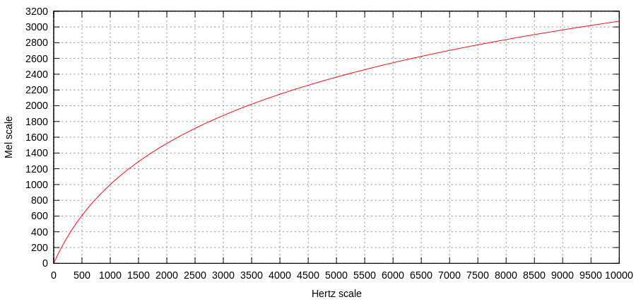
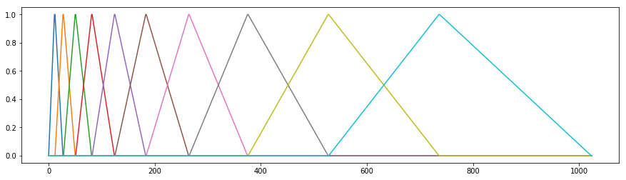
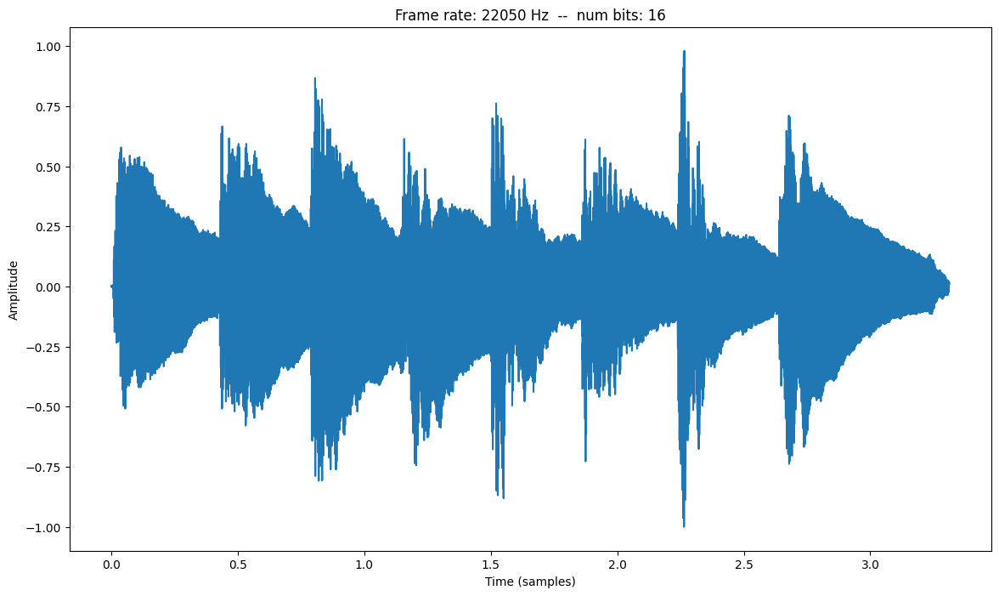
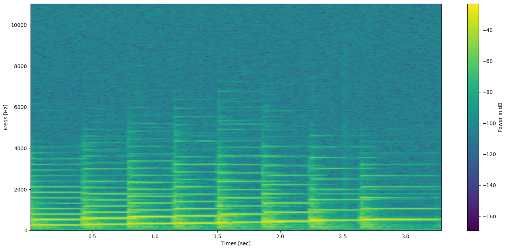
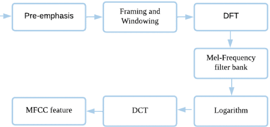
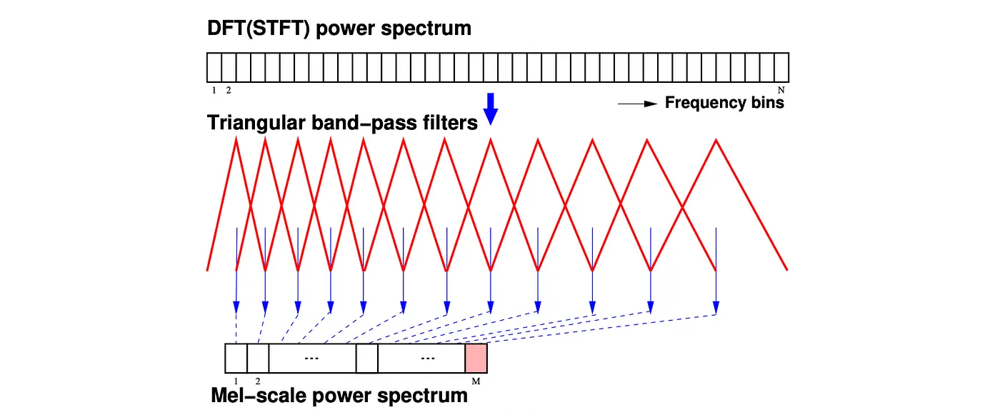

Feature audio
====

---

## Introduzione

# Spettrogramma e MFCC 

Lo spettrogramma e i coefficienti cepstrali in scala Mel - Mel Frequency Cepstral Coefficients (MFCC) rappresentano una tecnica per l'estrazione di feature da un segnale audio e, con maggiore efficacia, da segnali che catturano la voce umana.  In sostanza, si fornisce una rappresentazione dello spettro di potenza a breve termine di un suono basata sulla trasformata coseno dello spettro di potenza logaritmico su una scala di frequenza non lineare, detta scala Mel.  Quest'ultima mira a replicare la risoluzione in frequenza tipica degli esseri umani, adeguando l'analisi a cogliere le differenza che sussistono nel percepire frequenze basse e frequenze alte nei suoni che arrivano all'udito. 

L'estrazione di feature è un processo di elaborazione e trattamento delle informazioni latenti o nascoste nel segnale rappresentato da dati raw, catturati direttamente da un sensore. Lo scopo di estrazione di feature è quello di eliminare ridondanze e rumore, o addirittura componenti che renderebbero inefficaci la rappresentazione dell'informazione presente nei campioni del segnale, senza far perdere quella utile. Inoltre, le feature estratte aiutano a sviluppare modelli di elaborazione o apprendimento più efficaci e veloci rispetto ai dati raw.

### Scala Mel

La scala Mel è una scala di percezione dell'altezza di un suono. È stata proposta da Stanley Smith Stevens, John Volkman e Edwin Newman nel 1937 nel Journal of the Acoustical Society of America. La scala Mel è una funzione definita a tratti che divide la banda di frequenza di un segnale in sottobande e quindi estrae i coefficienti cepstrali usando la trasformata coseno discreta (DCT) a valle di una trasformazione logaritmica delle frequenze del segnale stesso. L'idea centrale di questa trasformazione è che i suoni di uguale distanza sulla scala Mel sono percepiti come di uguale distanza dagli umani.

Gli studi hanno dimostrato che gli umani non percepiscono le frequenze su una scala lineare. Siamo più bravi a rilevare differenze nelle frequenze più basse rispetto alle frequenze più elevate. Ad esempio, possiamo facilmente dire la differenza tra 500 e 1000 Hz, ma difficilmente saremo in grado di dire una differenza tra 10.000 e 10.500 Hz, anche se la distanza tra le due coppie è la stessa. 

Quindi, anche se la distanza tra le due serie di suoni è la stessa, la nostra percezione della distanza non lo è. Questo è ciò che rende la scala Mel fondamentale nelle applicazioni di signal processing e machine learning per l'audio, poiché mira a riprodurre la nostra percezione del suono.

La trasformazione dalla scala Hertz alla scala Mel è la seguente:

$$
\begin{equation}
   m=2595\cdot \log_{10} (1+𝑓/700)
\end{equation}
$$

dove $f$ è la frequenza espressa in Hz ed $m$ è la frequenza espressa in Mel, per l'appunto. Come mostrato in eq. (1), la formula per la scala Mel è una trasformazione logaritmica della frequenza in Hz di un segnale, visualizzata di seguito



**Calcolo dei punti del filtro**

Innanzitutto costruiamo punti di filtro che determinano l'inizio e fine del range di frequenze coperto dai filtri. Per fare ciò, convertiamo prima i due estremi del range nello spazio Mel. Successivamente costruiamo un array di punti equidistanziati tra le due frequenze estreme. con l'aiuto della curva logaritmica convertiamo l'array di frequenze Mel nello spazio di frequenza in Hz e infine normalizziamo l'array alla dimensione FFT, cioè numero di campioni usati nel calcolo della FFT, e scegliamo i valori FFT associati. Questo processo è mostrato nell'immagine qui sotto:


**Costruzione del filterbank**

Dopo che abbiamo i punti del filtro, costruiamo i filtri.

```python
def get_filters(filter_points, FFT_size):
    filters = np.zeros((len(filter_points)-2,int(FFT_size/2+1)))
    
    for n in range(len(filter_points)-2):
        filters[n, filter_points[n] : filter_points[n + 1]] = np.linspace(0, 1, filter_points[n + 1] - filter_points[n])
        filters[n, filter_points[n + 1] : filter_points[n + 2]] = np.linspace(1, 0, filter_points[n + 2] - filter_points[n + 1])
    
    return filters

# plot
filters = get_filters(filter_points, FFT_size)
plt.figure(figsize=(15,4))
for n in range(filters.shape[0]):
    plt.plot(filters[n])    
```


**Lo spettrogramma Mel**
Uno spettrogramma Mel è uno spettrogramma in cui le frequenze vengono convertite nella scala Mel. 

Vediamone un esempio. Se applichiamo lo spettrogramma al seguente segnale (scala di Do maggiore)



otteniamo l'immagine seguente:




Lo spettrogramma Mel può essere implementato solo in un paio di righe di codice della libreria `librosa`, come segue

```python
mel_spect = librosa.feature.melspectrogram(y=y, sr=sr, n_fft=2048, hop_length=1024)
mel_spect = librosa.power_to_db(spect, ref=np.max)
librosa.display.specshow(mel_spect, y_axis='mel', fmax=8000, x_axis='time');
```
da cui si ottiene 


### Il processo di estrazione di MFCC
MFCC è una delle feature più comunemente usate in una varietà di applicazioni, in particolare nell'elaborazione del segnale vocale come l'analisi del segnale audio, il riconoscimento vocale e l'identificazione di genere. MFCC possono essere calcolati conducendo cinque passi consecutivi, vale a dire preprocessing e miglioramento del segnale, il calcolo dello spettro di potenza, applicazione di un banco filtri MEL agli spettri di potenza ottenuti, calcolo del logaritmo dello spetto filtrqto e infine applicando il DCT .La seguente figura illustra i processi del calcolo MFCC.



#### A. Pre-emphasis (preprocessing)
 
La pre-enfasi si riferisce al filtro che enfatizza le frequenze più elevate. Il suo scopo è bilanciare lo spettro dei suoni espressi che hanno un ripido decadimento nella regione ad alta frequenza (a volte viene soppressa durante processi di elaborazione o cattura del segnale). Per esempio, un segnale vocale se registrato con un microfono ad una certa distanza arriva a perdere +6dB/ottava rispetto al vero spettro del tratto vocale. Pertanto, la pre-enfasi rimuove alcuni degli effetti glottali dai parametri del tratto vocale. Il filtro pre-enfasi più comunemente usato è dato dalla seguente funzione di trasferimento

$$
H(z) = 1 − bz^{−1} 
$$

che rappresenta un filtro passa-alto a cui vengono spesso associati i coefficienti $[1, -0.97]$.

#### B. Framing (windowing) del segnale
L'idea alla base della partizione in "frame" del segnale raw è quella di avere segmenti brevi in cui il segnale tende ad essere più stazionario al fine di avere proprietà acustiche stabili. Per quanto riguarda il segnale vocale, il periodo di 20-30 ms è riferito come segmento quasi stazionario (QSS) dal momento che il tempo tra due eventi glottali è di circa 20 ms. In aggiunta, la sovrapposizione di frame di 10 ms consentono di catturare meglio le feature temporali del segnale vocale. In generale, le finestre di Hanning e Hamming sono tra le più usate. Queste finestre possono migliorare le armoniche, e la riduzione dell'effetto di bordo durante il calcolo della DFT sul segnale. La figura seguente illustra le finestre rettangolari di Hamming e Hanning in entrambi i domini temporali e di frequenza.

#### C. Spettro di potenza
Lo spettro di potenza può essere descritto come la distribuzione della potenza dei componenti alle varie frequenze di cui è composto il segnale.Tradizionalmente, la trasformata discreta di Fourier (DFT) viene utilizzata per calcolare lo spettro di potenza. Lo spettro di potenza di ciascun frame $x(n)$ è ottenuto elevando al quadrato il valore assoluto della risposta in frequenza della DFT, cioè:

$$
|X(k)|^2=\left|\sum \limits _{n=0}^{N-1} {x\left ({n }\right)} e^{-j\frac{2\pi}{N}nk}\right|^2 \quad k=1,2,3\ldots N-1\tag{1}
$$

#### D. Banco di filtri Mel
Il filtro Mel Band-Pass è un banco di filtri definito in base alla percezione del pitch. Il filtro Mel è stato originariamente sviluppato per l'analisi del linguaggio sulla base di come l'orecchio umano percepisce il linguaggio, mira a estrarre la rappresentazione non lineare del segnale vocale. Il banco di filtri Mel è  convenzionalmente costituito da $M=40$ filtri triangolari. La funzione di trasferimento $H_m(k)$ del filtro $m$-esimo può essere calcolata come segue:

$$
\begin{align*} H_m(k)=\begin{cases} \displaystyle 0 ,& k < f\left ({m-1 }\right)\\ \displaystyle \frac {k-f\left ({m-1 }\right)}{f\left ({m }\right)-f\left ({m-1 }\right)}, & f\left ({m-1 }\right)\le k < f\left ({m }\right)\\ \displaystyle 1 & k=f\left ({m }\right)\\ \displaystyle \frac {f\left ({m+1 }\right)-k}{f\left ({m+1 }\right)-f(m)}, & f\left ({m }\right) < k\le f\left ({m+1 }\right)\\ \displaystyle 0 & k>f(m+1) 
\end{cases}
\end{align*}
$$

dove $f(m)$ è la frequenza centrale del filtro triangolare, e  $\sum_{m=1}^{M−1} H_m(k)=1$. Qui di seguito è mostrato l'uso del banco di filtri che trasforma lo spettro di potenza in spettro di potenza su scala mel. L'output per ogni slot dello spettro di potenza su scala Mel rappresenta l'energia del senale ristretto alla banda di frequenza che ogni filtro copre. Questa mappatura si chiama Mel Binning. Le equazioni per lo slot $m$ sono:




#### E. Discrete Cosine Transform (DCT)

La DCT esprime una sequenza finita di punti dati dalla somma di funzioni coseno oscillanti a frequenze diverse, multiple di una frequenza base. Nel processo MFCC, la DCT viene applicata a valle del banco di filtri Mel per selezionare la maggior parte dei coefficienti utili a catturare l'informazione massima nelle log ampiezze spettrali dei blocchi filtrati. La DCT è calcolata dall'equazione seguente:

$$
X(k)=\sum_{n=0}^{N-1} x_{n} \cos\left({2\pi jnk}/ N\right),\quad k=1,2,3\ldots N-1
$$
