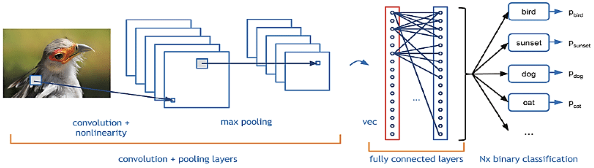

Classificazione audio
====

---

## Introduzione

Come detto nel capitolo precedente, la percezione del suono degli umani è logaritmica nelle frequenze: è molto più difficile per gli umani distinguere tra frequenze più alte e più facilmente per le frequenze più basse. Quindi, anche se la distanza tra le due serie di suoni è la stessa, la nostra percezione della distanza non lo è. Le frequenze nei coefficienti cepstrali di mel-frequenza rispecchiano efficacemente questa caratteristica dell'udito umano usando per l'appunto le frequenze Mel.  Con l'avvento di modelli di deep learning come reti neurali convoluzionali, reti neurali ricorrenti, transformers, ecc., i coefficienti cepstrali di Mel-frequency sono diventati la feature acustica dominante per le attività di analisi audio. Le reti neurali convoluzionali sono popolari nelle attività di elaborazione delle immagini, ma con una modifica intelligente, le CNN possono essere adattate per funzionare anche con coefficienti cepstrali Mel-Frequency. L'input a una CNN è di solito un array 2D di MFCC, che tratta come un'immagine e quindi impara a riconoscere i modelli nello spettrogramma per generalizzare e predire la variabile target. Le reti neurali ricorrenti sono efficaci per le attività che coinvolgono dati sequenziali (come le serie temporali o le frasi) perché possono utilizzare il loro stato interno (memoria) per elaborare sequenze di input. Ciò li rende adatti per i segnali audio rappresentati come sequenze di MFCC. Le RNNs elaborano i dati audio nel tempo, assumendo un frame di MFCC in ogni fase temporale e aggiornando il proprio stato nascosto in base a questo input e al precedente stato nascosto. Ciò consente loro di imparare le dipendenze/correlazioni temporali nei dati audio. I transformers, originariamente introdotti per le attività di elaborazione del linguaggio naturale, possono essere utilizzati anche per le attività di classificazione audio. L'input al transformer sarebbe una sequenza di MFCC, e il meccanismo di self-attention consente al modello di valutare l'influenza di ciascun MFCC di input su ciascun MFCC di output.

## Uso di MFCC come feature audio

Assegnare un'etichetta o una classe a un particolare dato audio è un compito che rientra nella tipica attività di classificazione. Si può voler identificare un soggetto dal suo parlato,  identificare uno strumento musicale, o il tenore emotivo di una dichiarazione. Per creare un efficace classificatore audio è fondamentale estrarre feature significative dai dati audio. Le feature audio possono essere estratte nel dominio del tempo, nel dominio frequenziale o in funzione di tempo e frequenza. La velocità di attraversamento dello zero, l'energia RMS e l'inviluppo di ampiezza sono esempi di feature nel dominio del tempo. Per quanto riguarda il dominio della frequenza invece, si passa attraverso la trasformata di Fourier per estrarre feature legate allo spettro di potenza suddiviso nelle varie bande.  Le feature nel dominio congiunto tempo-frequenza  combinano sia i componenti di tempo che di frequenza del segnale audio. Spettrogrammi di Mel e coefficienti cepstrali di frequenza Mel sono i principali esempi. Quest'ultimi sono particolarmente significativi per le attività relative alla percezione uditiva umana a causa della loro rilevanza percettiva. A causa del loro utilizzo efficace nell'apprendimento basato su reti profonde (CNN), gli MFCC hanno molte applicazioni nel mondo reale. I coefficienti incapsulano informazioni sulla configurazione del tratto vocale, che è distintivo per ogni fonema, oratore e persino stato emotivo dietro ogni parola, rendendole molto utili per questi compiti. Poiché gli MFCC sono robusti al  rumore, sono cruciali in applicazioni del mondo reale in cui diversi tipi di rumore spesso corrompono il segnale audio. infatti il loro uso aiuta a rendere più robusti assistenti vocali come Alexa, Google Home e Siri. Gli MFCC hanno anche la proprietà di decorrelazione dell'energia ripartita nelle varie bande, poiché il calcolo dei coefficienti cepstrali di Mel-Frequency (MFCC) include l'applicazione della trasformazione discreta del coseno (DCT). La DCT viene utilizzata perché ha la proprietà di decorrelare i coefficienti del banco di filtri, che sono altamente correlati. Ciò li rende migliori per i modelli di apprendimento automatico, in particolare quelli che fanno ipotesi indipendenti, come i modelli di miscela gaussiana (GMM) e la linear discriminant analysis (LDA).

# Funzionamento dell CNN
Le reti neurali convoluzionali si distinguono dalle altri reti neurali per le loro prestazioni superiori con immagini, input vocali e segnali audio. Contengono tre tipi di livello principali, ovvero:
- Livello convoluzionale
- Livello di pooling
- Livello completamente connesso (FC, Fully-connected)

Il livello convoluzionale è il primo livello di una rete convoluzionale. Mentre i livelli convoluzionali possono essere seguiti da altri livelli convoluzionali o di raggruppamento, il livello completamente connesso è il livello finale. A ogni livello, la complessità della CNN aumenta, così come la porzione dell'immagine che viene identificata. I primi livelli si concentrano su funzioni semplici, ad esempio i colori e i contorni. Mentre i dati dell'immagine avanzano attraverso i livelli della CNN, vengono riconosciuti elementi o forme più grandi fino a quando, infine, non viene identificato l'oggetto.

## Livello convoluzionale

Il livello convoluzionale è l'elemento costitutivo principale di una CNN ed è il punto in cui si verifica la maggior parte dei calcoli. Richiede pochi componenti, ovvero dati di input, un filtro e una mappa delle funzioni. Supponiamo che l'input sia un'immagine a colori, costituita da una matrice di pixel in 3D. Ciò significa che l'input avrà tre dimensioni: un'altezza, una larghezza e una profondità, che corrispondono all'RGB in un'immagine. Inoltre, è presente un rilevatore di funzioni, definito anche kernel o filtro, che si sposterà attraverso i campi recettivi dell'immagine, verificando la presenza della funzione. Questo processo è noto come convoluzione.

Il kernel è un array bidimensionale (2-D) di pesi, che rappresenta parti dell'immagine. Sebbene possano variare, normalmente le sue dimensioni sono una matrice 3x3; ciò determina anche la dimensione del campo ricettivo. Quindi, il filtro viene applicato a un'area dell'immagine e viene calcolato un prodotto di punti tra i pixel di input e il filtro. Questo prodotto di punti viene quindi inserito in un array di output. Successivamente, il filtro si sposta di un passo, ripetendo il processo fino a quando il kernel non avrà attraversato l'intera immagine. L'output finale della serie di prodotti di punti dall'input e dal filtro è conosciuto mappa di attivazione o feature map.

Dopo ogni operazione di convoluzione, una CNN applica una trasformazione ReLU (Rectified Linear Unit) alla mappa delle funzioni, introducendo la non linearità nel modello.

Come affermato in precedenza, il livello di convoluzione iniziale può essere seguito da un altro livello di convoluzione. Quando ciò si verifica, la struttura della CNN può diventare gerarchica perché i livelli successivi possono vedere i pixel all'interno dei campi ricettivi dei livelli precedenti.  Ad esempio, ipotizziamo di dover determinare se un'immagine contiene una bicicletta. Una bicicletta può essere immaginata come un insieme di parti. È composta da un telaio, un manubrio, due ruote, due pedali, eccetera. Ogni singola parte della bicicletta compone un modello di basso livello nella rete neurale e la combinazione delle parti rappresenta un modello di alto livello, creando una gerarchia di funzioni all'interno della CNN.

Facendo un riassunto prettamente pratico ma anche semplicistico, si può dire che una CNN apprende i valori di questi filtri durante il training e si evince che quanti più filtri si useranno quante più features si estrarranno. La feature map ottenuta dipenderà dalla profondità (Depth) cioè il numero di filtri usati, dallo stride che è il numero di pixel di cui ci sposta con la nostra matrice di filtro sulla matrice di input e dallo zero-padding cioè il numero di zeri di padding usati per completare la matrice di input lungo i bordi (wide convolution).

## Livello di pooling
I livelli di pooling, definiti anche sottocampionamento, eseguono la riduzione della dimensionalità, riducendo il numero di parametri nell'input. In modo simile al livello convoluzionale, l'operazione di pooling applica un filtro sull'intero input, ma la differenza è che a questo filtro non è associato alcun peso. Invece, il kernel applica una funzione di aggregazione ai valori all'interno del campo ricettivo, popolando l'array di output. Vi sono due principali tipologie di pooling:

- Pooling massimo: mentre viene applicato sull'input, il filtro seleziona il pixel con il valore massimo da inviare all'array di output. Per inciso, questo approccio tende ad essere utilizzato più di frequente rispetto al pooling medio.
- Pooling medio: mentre viene applicato sull'input, il filtro calcola il valore medio all'interno del campo ricettivo da inviare all'array di output.

Sebbene il livello di pooling comporti la perdita di molte informazioni, offre una serie di vantaggi alla CNN. Contribuisce alla riduzione della complessità, al miglioramento dell'efficienza e alla limitazione del rischio di sovradattamento. Questo livello, inoltre, rende l’input delle features più piccolo e gestibile riducendo il numero di parametri sulla rete e di conseguenza ottimizzando la computazione; rende inoltre la rete invariante alle piccole trasformazioni quali distorsione o traslazione rispetto all’immagine iniziale.

## Livello completamente connesso
Il nome del livello completamente connesso ne descrive le caratteristiche. Come indicato in precedenza, i valori dei pixel dell'immagine di input non sono direttamente connessi al livello di output nei livelli parzialmente connessi. Tuttavia, nel livello completamente connesso, ogni nodo nel livello di output si connette direttamente a un nodo nel livello precedente.

Questo livello esegue l'attività di classificazione in base alle funzioni estratte tramite i livelli precedenti e i loro diversi filtri. Mentre i livelli convoluzionali e di pooling tendono a utilizzare le funzioni ReLu, i livelli completamente connessi (FC) solitamente fanno leva su una funzione di attivazione softmax per classificare gli input in modo appropriato, producendo una probabilità per le varie classi in output dal modello.

il modello più classico è il MultiLayer Perceptron che usa una funzione di attivazione softmax ed è proprio questa che permette che la somma delle probabilità di un layer di questo tipo sia 1: nello specifico prende un vettore di valori reali arbitrari (punteggi) e offre in uscita un vettore con valori tra 0 e 1 che sommati danno esattamente 1. Il termine fully connected implica che ogni neurone del layer precedente è collegato ai neuroni del layer successivo.
Di seguito un tipico esempio di struttura CNN per classificazione.




## Training Della rete
La fase pratica di apprendimento (learning) è la seguente: vengono prima di tutto inizializzati i filtri, i parametri ed i pesi, e vengono settate tutte le varie opzioni di training in accordo anche con le specifiche della GPU disponibile; fatto questo sarà possibile iniziare ad allenare la rete con il training set scelto. E' una operazione molto dispendiosa a livello computazionale. Il Training però può essere facoltativo in quanto le reti neurali ci propongono diversi scenari di utilizzo: infatti in alcune circostanze ci si può imbattere in passaggi diversi in cui non vi è un allenamento della rete ma viene svolta solo una operazione di Transfer Learning (vengono presi i pesi da un addestramento precedente e trasferiti per testare una rete o per riallenare un modello simile) oppure viene utilizzata una rete pre-allenata della rete. Una rete pre-allenata nello specifico è una rete che è stata allenata sulla stessa tipologia di dati di input e magari sulla stessa applicazione. Quindi diventa fondamentale reperire oltre che il dataset anche delle reti pre-allenate coi relativi parametri, in modo da poterle sfruttare in maniera diretta.

## La fase di addestramento di una rete Neurale

Gli algoritmi di apprendimento supervisionato, categoria in cui sono inquadrati gli algoritmi di classificazione qui usati, lavorano in due fasi: il training (addestramento) che è stato già accennato e il testing in cui ciò che è stato appreso viene sfruttato per classificare nuovi elementi del set di dati. Nella fase di training bisogna stimare i pesi, con delle tecniche di ottimizzazione matematica come quella della discesa del gradiente (gradient descent) mediante back propagation, basata su due fasi cicliche: propagazione e aggiornamento dei pesi. Nella fase di propagazione (forward step) gli elementi di input attraversano l’intera rete per poi recuperare, dopo la propagazione, gli output ottenuti in precedenza. Viene calcolato l’errore di predizione attraverso la loss function, con cui calcolare il gradiente che verrà poi propagato all’indietro nella rete.
La seconda fase di aggiornamento della rete invece prevede che i valori del gradiente vengano passati all’algoritmo di discesa del gradiente che li sfrutterà per aggiornare i pesi di ciascun neurone. L’aggiornamento dei pesi viene fatto usando una costante detta learning rate. L’addestramento è svolto in cicli con due possibili modalità cioè quella stocastica e quella di gruppo: nella prima, ogni passo di propagazione in avanti è seguito immediatamente da un passo di aggiornamento, mentre nella seconda viene effettuata la propagazione per tutti gli esempi del training set e dopo viene fatto l’aggiornamento. Questo secondo approccio porta direttamente al risultato finale ma risulta essere infattibile o comunque computazionalmente esagerato. Si  è trovato in seguito un buon compromesso grazie all’uso di mini-batch cioè dei piccoli insiemi casuali di dati sui cui andare ad allenare la rete.

## Loss Function ed Overfitting
Gli algoritmi di apprendimento supervisionato necessitano di uno strumento per misurare la qualità delle predizioni in funzione dei parametri del modello: le Loss Fuction o funzioni di perdita che sono state presentate in precedenza come una delle scelte libere affidate all’utente quando progetta una architettura di rete neurale e che costituiscono il metodo per valutare le prestazioni della rete in fase di training. Esistono diverse loss function: comunemente ciascuna di esse misura la discrepanza tra valori reali e valori predetti, quindi in base alla scelta fatta si potranno avere diversi risultati.
La loss function $L$ deve essere scelta in base al tipo di task da affrontare poiché non è detto che quella scelta sia adatta per il numero di classi scelte; permette inoltre di creare una sorta di parametro di regolarizzazione che penalizza alcuni errori e conseguentemente modifica ciò che il modello apprende, dal momento che la rete in fase di apprendimento lavora sempre e solo sul training set. Viene fuori in questa fase il rischio di apprendere valori che vanno a interpolare le features estratte rischiando di cadere nella tendenza di memorizzare il training set. Questa condizione appena evidenziata è detta overfitting: si va ad inseguire l’andamento dei dati di training.

## Discesa del Gradiente
Il Gradient Descent o Discesa del Gradiente è un algoritmo mirato ad ottenere la stima dei pesi: viene minimizzata una funzione obiettivo $J(Θ)$ formata da $N$ parametri $Θ$ e viene aggiornato il valore dei parametri in base alla differenza con il gradiente negativo di $J(Θ)$ rispetto al parametro considerato. L’aggiornamento del parametro viene fatto attraverso un valore $\eta$ chiamato learning rate. Sarà quindi in parole povere sfruttata una funzione $J(Θ)$ allo scopo di arrivare ad un valore di massimo o di minimo in cui fermarsi. I modi con cui questo algoritmo si può eseguire sono: la Batch Gradient Descent (BGD), o Discesa del Gradiente a Batch, che comporta la discesa del gradiente su tutto il Training set; lo Stochastic Gradient Descent (SGD), o Discesa del Gradiente Stocastica, che esegue la discesa del gradiente per ogni elemento del Training set e aggiorna il suo valore volta per volta. Infine, si può citare la Mini Batch Gradient Descent (MBGD), o Discesa del Gradiente a Mini Batch, che `e una via di mezzo fra la SGD e la BGD, in quanto effettua degli aggiornamenti ai parametri della funzione con set ridotti, evitando l’uso di tutto il dataset o di singoli valori raggiungendo velocemente i valori di minimo e massimo.

## Batch-Normalization
La tecnica di Batch Normalization è una tecnica che permette di migliorare velocità, performance e stabilità di una rete neurale. E' utilizzata per normalizzare l’input e sembra proprio che possa risolvere il problema dello shift covariato interno, nel quale i parametri di inizializzazione e i cambi di distribuzione degli input portano al cambio del learning rate. Nello specifico, per spiegare bene lo shift di covarianza è possibile presentare questo esempio: passando l’immagine di un gatto colorato ad una rete è chiaro che ci siano problemi di riconoscimento rispetto a quando viene dato in input un tradizionale gatto, visto che la rete ha imparato da un determinato tipo di immagine.
Questa tecnica riduce il problema indicato permettendo ad ogni layer di imparare autonomamente ed in maniera indipendente rispetto agli altri layer.

## Dropout
Il Dropout si riferisce all’ignorare alcune unità neurali durante le fasi di allenamento. Appare come una forma di regolarizzazione che agisce “sganciando” alcuni nodi dalla rete. Tutto ciò viene fatto per ridurre l’overfitting o comunque per prevenirlo. L’applicazione del dropout produce ad ogni iterazione una diversa rete ridotta del modello di partenza, composta da quei nodi che sono sopravvissuti al processo di drop. Di conseguenza viene a crearsi una sorta di combinazione di modelli che tende quasi sempre a migliorare la performance, riducendo l’errore di generalizzazione. L’idea quindi, è quella di utilizzare una singola rete neurale completa, i cui pesi sono le versioni ridimensionate dei pesi calcolati in precedenza.
Il Dropout è implementato per ogni layer all’interno della rete neurale e può essere usato quindi con tutti i tipi di layer ma non nel layer di output.

# Modello CNN con PyTorch

Il set di dati e feature audio basate su immagini MFCC o spettrogrammi Mel viene usato usato per eseguire il training del classificatore di immagini con PyTorch. Per fare questo è necessario completare i passaggi seguenti:
- Caricare i dati. 
- Definire una rete neurale convoluzione.
- Definire una funzione di perdita.
- Eseguire il training del modello sui dati di training.
- Testare la rete sui dati di test.

## Definire una rete neurale convoluzione
Per creare una rete neurale con PyTorch, si userà il package `torch.nn`. Questo pacchetto contiene moduli, classi estendibili e tutti i componenti necessari per creare reti neurali. In questo caso si creerà una rete neurale convoluzione di base (CNN) per classificare le immagini dal set di dati [UrbanSound8K](https://urbansounddataset.weebly.com/urbansound8k.html). Questo set di dati contiene 8732 estratti sonori etichettati (<= 4s) di suoni urbani da 10 classi: `air_conditioner`, `car_horn`, `children_playing`, `dog_bark`, `drilling`, `enginge_idling`, `gun_shot`, `jackhammer`, `siren`, and `street_music`.  La definizione dei parametri contempla:
* `SAMPLE_RATE`: Tasso di campionamento dei file audio.
* `NUM_SAMPLES`: Il numero di campioni audio da prelevare, i segnali audio sono di diverse lunghezze ed è richiesta una lunghezza finale uniforme.

Una CNN è una classe di reti neurali, definite come reti neurali a più livelli progettate per rilevare funzionalità complesse nei dati. Vengono usati più comunemente nelle applicazioni di visione artificiale. La nostra rete sarà strutturata con i 4 livelli convolutivi seguiti da 2 livelli fully connected:
`Conv2d -> ReLU -> MaxPool2d -> Conv2d -> ReLU -> MaxPool2d -> Conv2d -> ReLU -> MaxPool2d -> Conv2d -> ReLU -> MaxPool2d -> Flatten -> Linear -> tanh -> Linear -> softmax`.

## Altri livelli

Nella rete sono coinvolti gli altri livelli seguenti:
- ReLU: è una funzione di attivazione per definire tutte le funzionalità in ingresso da 0 o superiore. Quando si applica questo livello, qualsiasi numero minore di 0 viene modificato in zero, mentre altri vengono mantenuti uguali.
- BatchNorm2d: applica la normalizzazione negli input per avere zero media e varianza unità e aumentare l'accuratezza della rete.
- MaxPool: aiuta a garantire che la posizione di un oggetto in un'immagine non influirà sulla capacità della rete neurale di rilevare le sue caratteristiche specifiche.
- Linear: è il livello finale della rete, che calcola i punteggi di ognuna delle classi. Nel set di dati UrbanSound8K sono disponibili dieci classi di etichette. L'etichetta con il punteggio più alto sarà quella prevista dal modello. Nel livello lineare è necessario specificare il numero di neuroni di input e il numero di neuroni di output che devono corrispondere al numero di classi.

Una funzione forward calcola il valore della funzione di perdita e la funzione indietro calcola le sfumature dei parametri appresi. Quando si crea la rete neurale con PyTorch, è sufficiente definire la funzione forward. La funzione all'indietro verrà definita automaticamente.

Di seguito il modello usato nell'esperimento.
```python
class CNN(nn.Module):
  def __init__(self):
    super().__init__()
    # 4 conv blocks / flatten / linear / softmax
    self.conv1 = nn.Sequential(
      nn.Conv2d(in_channels=1,out_channels=16,kernel_size=3,stride=1,padding=2),
      nn.ReLU(),
      nn.MaxPool2d(kernel_size=2))
    self.conv2 = nn.Sequential(
      nn.Conv2d(in_channels=16,out_channels=32,kernel_size=3,stride=1,padding=2),
      nn.ReLU(),
      nn.MaxPool2d(kernel_size=2))
    self.conv3 = nn.Sequential(
      nn.Conv2d(in_channels=32,out_channels=64,kernel_size=3,stride=1,padding=2),
      nn.ReLU(),
      nn.MaxPool2d(kernel_size=2))
    self.conv4 = nn.Sequential(
      nn.Conv2d(in_channels=64,out_channels=128,kernel_size=3,stride=1,padding=2),
      nn.ReLU(),
      nn.MaxPool2d(kernel_size=2))
    self.flatten = nn.Flatten()
    self.linear1 = nn.Linear(128 * 5 * 6, 128)
    self.tanh = nn.Tanh()
    self.linear2 = nn.Linear(128, 10)
    self.softmax = nn.Softmax(dim=1)

  def forward(self, input_data):
    x = self.conv1(input_data)
    x = self.conv2(x)
    x = self.conv3(x)
    x = self.conv4(x)
    x = self.flatten(x)
    x = self.linear1(x)
    x = self.tanh(x)
    logits = self.linear2(x)
    predictions = self.softmax(logits)
    return predictions
```
```{note} 
Per altre informazioni sulla rete neurale, vedere  la documentazione di PyTorch
```

## Definire una funzione di perdita
Una funzione di perdita calcola un valore che stima la distanza dell'output dalla destinazione. L'obiettivo principale è ridurre il valore della funzione di perdita modificando i valori del vettore di peso tramite backpropagation nelle reti neurali.
Il valore della perdita è diverso dall'accuratezza del modello. La funzione di perdita offre la comprensione del comportamento di un modello dopo ogni iterazione dell'ottimizzazione nel set di training. L'accuratezza del modello viene calcolata sui dati di test e mostra la percentuale della stima corretta.
In PyTorch il pacchetto di rete neurale contiene varie funzioni di perdita che costituiscono i blocchi predefiniti delle reti neurali profonde. In questa esercitazione si userà una funzione di perdita di classificazione basata su Definire la funzione di perdita con la perdita tra entropia di classificazione e Adam Optimizer. La frequenza di apprendimento (lr) imposta il controllo della quantità di peso che si sta regolando i pesi della rete rispetto al gradiente di perdita. Verrà impostato come 0.001. Più basso è, più lento sarà il training.

```python
# initialise loss funtion + optimiser
loss_fn = nn.CrossEntropyLoss()
optimiser = torch.optim.Adam(cnn.parameters(), lr=LEARNING_RATE)

```

## Il training del modello
Per eseguire il training del modello, è necessario eseguire il ciclo sull'iteratore dei dati, inserire gli input nella rete e ottimizzare. PyTorch non ha una libreria dedicata per l'uso della GPU, ma è possibile definire manualmente il dispositivo di esecuzione. Il dispositivo sarà una GPU Nvidia, se presente nel computer, o la CPU in caso contrario.

Ricordiamo che il nucleo della nostra convnet è due loop nidificati: uno esterno sulle epoche e uno interiore del caricatore di dati che produce batch dal nostro set di dati.In ogni ciclo, dobbiamo quindi
1. Alimenta gli ingressi attraverso il modello (il passaggio in avanti).
2. Calcola la perdita (anche parte del passaggio in avanti).
3. Azzera il valori vecchi del gradiente.
4. Chiama `loss.backward()`` per calcolare i gradienti della perdita rispetto a tutti i parametri (il passaggio all'indietro).
5. Chiedi all'ottimizzatore di fare un passo verso una perdita inferiore.


```python
# training

BATCH_SIZE = 32
EPOCHS = 10
LEARNING_RATE = 0.001

train_dataloader = create_data_loader(usd, BATCH_SIZE)

# construct model and assign it to device
cnn.to(device)

# initialise loss funtion + optimiser
loss_fn = nn.CrossEntropyLoss()
optimiser = torch.optim.Adam(cnn.parameters(), lr=LEARNING_RATE)

# train model
train(cnn, train_dataloader, loss_fn, optimiser, device, EPOCHS)

# save model
model_filename = data_dir + "feedforwardnet.pth"
torch.save(cnn.state_dict(), model_filename)
print("Trained feed forward net saved at feedforwardnet.pth")
```

## Misura di accuratezza

Per avere una misura quantitativa della perdita, possiamo dare un'occhiata alle nostre accuratezze sul set di dati di addestramento.

```python
# uncomment to load
model_filename = "/Users/grossi/datasets/UrbanSound8K/metadata/feedforwardnet.pth"  # downloaded model
cnn.load_state_dict(torch.load(model_filename, map_location=torch.device('cpu')))

# test set dataloader
device = "cpu"
usd = UrbanSoundDataset(testing_data, dataset_dir, NUM_SAMPLES, device)
usd.set_mel_spectrogram(SAMPLE_RATE, n_fft=1024, hop_length=512, n_mels=64)

# predict test set
predict(usd, cnn, device, class_mapping)
```